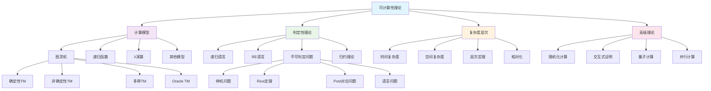

# 可计算性理论深度分析

## 01. 可计算性理论基础

### 01.1 计算模型的数学基础

#### 01.1.1 图灵机模型

**确定性图灵机定义**：
$$M = \langle Q, \Sigma, \Gamma, \delta, q_0, q_{\text{accept}}, q_{\text{reject}} \rangle$$

其中：
- $Q$：有限状态集合
- $\Sigma$：输入字母表，$\Sigma \subseteq \Gamma$
- $\Gamma$：带字母表
- $\delta: Q \times \Gamma \rightarrow Q \times \Gamma \times \{L, R\}$：转移函数
- $q_0 \in Q$：初始状态
- $q_{\text{accept}}, q_{\text{reject}} \in Q$：接受和拒绝状态

**图灵机配置**：
$$C = (q, w_1 \square w_2)$$
其中$q$是当前状态，$w_1 \square w_2$表示带内容和读写头位置

**计算步骤**：
$$C_1 \vdash_M C_2 \iff C_2 \text{ 是 } C_1 \text{ 在 } M \text{ 上的下一配置}$$

#### 01.1.2 非确定性图灵机

**非确定性转移函数**：
$$\delta: Q \times \Gamma \rightarrow \mathcal{P}(Q \times \Gamma \times \{L, R\})$$

**接受条件**：
NTM接受输入$w$当且仅当存在一条从$(q_0, w)$到某个接受配置的计算路径。

**时间复杂度**：
$$\text{NTIME}(f(n)) = \{L : L \text{ 可被时间复杂度 } O(f(n)) \text{ 的NTM判定}\}$$

### 01.2 递归函数理论

#### 01.2.1 原始递归函数

**基础函数**：
1. **零函数**：$\text{zero}(n) = 0$
2. **后继函数**：$\text{succ}(n) = n + 1$  
3. **投影函数**：$\pi_i^n(x_1, \ldots, x_n) = x_i$

**复合运算**：
$$h(x_1, \ldots, x_n) = f(g_1(x_1, \ldots, x_n), \ldots, g_m(x_1, \ldots, x_n))$$

**原始递归运算**：
$$\begin{align}
h(x_1, \ldots, x_n, 0) &= f(x_1, \ldots, x_n) \\
h(x_1, \ldots, x_n, y+1) &= g(x_1, \ldots, x_n, y, h(x_1, \ldots, x_n, y))
\end{align}$$

#### 01.2.2 部分递归函数

**μ算子**：
$$\mu y[P(x_1, \ldots, x_n, y)]$$

是使得$P(x_1, \ldots, x_n, y)$为真的最小$y$值（如果存在）。

**部分递归函数类**：
$$\mathcal{R} = \text{原始递归函数} + \text{μ算子的最小应用}$$

**Church-Turing论题**：
$$\text{有效可计算} \equiv \text{部分递归} \equiv \text{图灵可计算}$$

### 01.3 λ演算与计算

#### 01.3.1 无类型λ演算

**λ项定义**：
$$M ::= x \mid \lambda x.M \mid M N$$

**α等价**：
$$\lambda x.M =_\alpha \lambda y.M[x := y] \quad (y \notin \text{FV}(M))$$

**β规约**：
$$(\lambda x.M)N \rightarrow_\beta M[x := N]$$

#### 01.3.2 λ可定义性

**Church数字编码**：
$$\begin{align}
\overline{0} &= \lambda f.\lambda x.x \\
\overline{n+1} &= \lambda f.\lambda x.f(\overline{n} f x)
\end{align}$$

**算术运算**：
$$\begin{align}
\text{SUCC} &= \lambda n.\lambda f.\lambda x.f(n f x) \\
\text{PLUS} &= \lambda m.\lambda n.\lambda f.\lambda x.m f (n f x) \\
\text{MULT} &= \lambda m.\lambda n.\lambda f.m(n f)
\end{align}$$

**λ可定义函数与递归函数等价**：
$$\text{λ可定义} = \text{部分递归} = \text{图灵可计算}$$

## 02. 判定性与可判定问题

### 02.1 语言的层次分类

#### 02.1.1 递归语言与递归可枚举语言

**递归语言**（判定的）：
$$\text{REC} = \{L : \exists \text{ 图灵机 } M, M \text{ 判定 } L\}$$

**递归可枚举语言**（可识别的）：
$$\text{RE} = \{L : \exists \text{ 图灵机 } M, M \text{ 识别 } L\}$$

**包含关系**：
$$\text{REC} \subsetneq \text{RE}$$

#### 02.1.2 co-RE语言

**co-RE定义**：
$$\text{co-RE} = \{\overline{L} : L \in \text{RE}\}$$

**重要性质**：
$$L \in \text{REC} \iff L \in \text{RE} \cap \text{co-RE}$$

### 02.2 不可判定问题

#### 02.2.1 停机问题

**停机问题定义**：
$$\text{HALT} = \{\langle M, w \rangle : M \text{ 是图灵机且 } M \text{ 在输入 } w \text{ 上停机}\}$$

**停机问题不可判定定理**：
$$\text{HALT} \notin \text{REC}$$

**证明（对角化方法）**：
假设存在图灵机$H$判定HALT，构造图灵机$D$：
```
D(⟨M⟩):
  if H(⟨M,⟨M⟩⟩) accepts:
    loop forever
  else:
    accept
```

考虑$D(\langle D \rangle)$导致矛盾。

#### 02.2.2 Rice定理

**Rice定理**：
设$P$是图灵机的一个非平凡性质（即存在图灵机具有$P$，也存在图灵机不具有$P$），则：
$$\{M : M \text{ 具有性质 } P\} \notin \text{REC}$$

**推论**：以下问题都不可判定：
- 图灵机是否接受空语言
- 图灵机是否接受有限语言
- 图灵机是否接受正则语言

### 02.3 归约理论

#### 02.3.1 多一归约

**定义**：
$$A \leq_m B \iff \exists f \in \text{可计算函数}: x \in A \iff f(x) \in B$$

**性质**：
1. **自反性**：$A \leq_m A$
2. **传递性**：$A \leq_m B \land B \leq_m C \Rightarrow A \leq_m C$
3. **保持递归可枚举性**：$A \leq_m B \land B \in \text{RE} \Rightarrow A \in \text{RE}$

#### 02.3.2 图灵归约

**定义**：
$$A \leq_T B \iff A \text{ 可被使用 } B \text{ 作为oracle的图灵机判定}$$

**相对化复杂度类**：
$$\text{P}^A = \{L : L \text{ 可被多项式时间图灵机在oracle } A \text{ 下判定}\}$$

## 03. 计算复杂度层次

### 03.1 时间复杂度类

#### 03.1.1 基本复杂度类

**P类**：
$$\text{P} = \bigcup_{k \geq 1} \text{DTIME}(n^k)$$

**NP类**：
$$\text{NP} = \bigcup_{k \geq 1} \text{NTIME}(n^k)$$

**EXPTIME类**：
$$\text{EXPTIME} = \bigcup_{k \geq 1} \text{DTIME}(2^{n^k})$$

#### 03.1.2 时间层次定理

**确定性时间层次定理**：
如果$f, g$是时间构造函数且$f(n) \log f(n) = o(g(n))$，则：
$$\text{DTIME}(f(n)) \subsetneq \text{DTIME}(g(n))$$

**非确定性时间层次定理**：
如果$f, g$是时间构造函数且$f(n+1) = o(g(n))$，则：
$$\text{NTIME}(f(n)) \subsetneq \text{NTIME}(g(n))$$

### 03.2 空间复杂度类

#### 03.2.1 基本空间类

**PSPACE类**：
$$\text{PSPACE} = \bigcup_{k \geq 1} \text{DSPACE}(n^k)$$

**NPSPACE类**：
$$\text{NPSPACE} = \bigcup_{k \geq 1} \text{NSPACE}(n^k)$$

**Savitch定理**：
$$\text{NPSPACE} = \text{PSPACE}$$

#### 03.2.2 空间层次定理

**空间层次定理**：
如果$f$是空间构造函数且$f(n) = \Omega(\log n)$，则：
$$\text{DSPACE}(f(n)) \subsetneq \text{DSPACE}(f(n) \log f(n))$$

### 03.3 复杂度类关系

#### 03.3.1 包含关系

**确定的包含关系**：
$$\text{P} \subseteq \text{NP} \subseteq \text{PSPACE} = \text{NPSPACE} \subseteq \text{EXPTIME}$$

$$\text{L} \subseteq \text{NL} \subseteq \text{P} \subseteq \text{PSPACE}$$

#### 03.3.2 已知的严格包含

**已证明的严格分离**：
$$\begin{align}
\text{P} &\subsetneq \text{EXPTIME} \\
\text{NP} &\subsetneq \text{NEXPTIME} \\
\text{PSPACE} &\subsetneq \text{EXPSPACE}
\end{align}$$

## 04. 相对化与Oracle

### 04.1 Oracle图灵机

#### 04.1.1 Oracle机定义

**Oracle图灵机**：
$$M^A = \langle Q, \Sigma, \Gamma, \delta, q_0, q_{\text{accept}}, q_{\text{reject}}, Q_{\text{oracle}} \rangle$$

具有特殊的oracle状态，可以查询oracle $A$。

**相对化复杂度类**：
$$\begin{align}
\text{P}^A &= \{L : L \text{ 可被多项式时间oracle机在 } A \text{ 下判定}\} \\
\text{NP}^A &= \{L : L \text{ 可被多项式时间非确定oracle机在 } A \text{ 下判定}\}
\end{align}$$

#### 04.1.2 Baker-Gill-Solovay定理

**定理**：存在oracle $A$和$B$使得：
$$\text{P}^A = \text{NP}^A \text{ 且 } \text{P}^B \neq \text{NP}^B$$

**含义**：相对化技术无法解决P vs NP问题。

### 04.2 多项式层次

#### 04.2.1 多项式层次定义

**第0层**：
$$\Sigma_0^p = \Pi_0^p = \Delta_0^p = \text{P}$$

**第k+1层**：
$$\begin{align}
\Sigma_{k+1}^p &= \text{NP}^{\Sigma_k^p} \\
\Pi_{k+1}^p &= \text{coNP}^{\Sigma_k^p} \\
\Delta_{k+1}^p &= \text{P}^{\Sigma_k^p}
\end{align}$$

**多项式层次**：
$$\text{PH} = \bigcup_{k \geq 0} \Sigma_k^p$$

#### 04.2.2 层次坍塌

**坍塌定理**：
如果$\Sigma_k^p = \Pi_k^p$对某个$k$成立，则PH坍塌到第$k$层：
$$\text{PH} = \Sigma_k^p$$

## 05. 随机化计算

### 05.1 概率图灵机

#### 05.1.1 概率计算模型

**概率图灵机**：
在每步计算中，机器可以抛硬币决定下一步动作。

**语言接受**：
对于语言$L$和概率图灵机$M$：
- 如果$x \in L$，则$P[M(x) \text{ 接受}] \geq 2/3$
- 如果$x \notin L$，则$P[M(x) \text{ 接受}] \leq 1/3$

#### 05.1.2 随机复杂度类

**RP类**（单边错误）：
$$\text{RP} = \{L : \exists \text{ 概率图灵机 } M, \text{ 运行时间多项式，单边错误概率} \leq 1/2\}$$

**BPP类**（双边错误）：
$$\text{BPP} = \{L : \exists \text{ 概率图灵机 } M, \text{ 运行时间多项式，错误概率} \leq 1/3\}$$

**ZPP类**（零错误）：
$$\text{ZPP} = \text{RP} \cap \text{coRP}$$

### 05.2 概率证明系统

#### 05.2.1 交互式证明

**交互式证明系统**：
$(P, V)$其中$P$是证明者，$V$是验证者。

**IP类**：
$$\text{IP} = \{L : L \text{ 有交互式证明系统}\}$$

**定理**：$\text{IP} = \text{PSPACE}$

#### 05.2.2 概率可检查证明

**PCP定理**：
$$\text{NP} = \text{PCP}[\log n, O(1)]$$

即：NP中的每个语言都有概率可检查证明，验证者只需要读证明的常数个bit。

## 06. 量子计算理论

### 06.1 量子计算模型

#### 06.1.1 量子图灵机

**量子状态**：
$$|\psi\rangle = \sum_{x \in \{0,1\}^n} \alpha_x |x\rangle$$

其中$\sum_x |\alpha_x|^2 = 1$。

**量子门操作**：
酉变换$U: \mathbb{C}^{2^n} \rightarrow \mathbb{C}^{2^n}$

#### 06.1.2 量子复杂度类

**BQP类**：
$$\text{BQP} = \{L : L \text{ 可被多项式时间量子算法以错误概率} \leq 1/3 \text{ 判定}\}$$

**已知关系**：
$$\text{P} \subseteq \text{BQP} \subseteq \text{PSPACE}$$

### 06.2 量子算法

#### 06.2.1 Shor算法

**量子Fourier变换**：
$$\text{QFT}|x\rangle = \frac{1}{\sqrt{N}} \sum_{y=0}^{N-1} e^{2\pi i xy/N} |y\rangle$$

**周期寻找**：
对于函数$f: \mathbb{Z}_N \rightarrow \mathbb{Z}_N$，Shor算法可以在多项式时间内找到$f$的周期。

**应用**：整数分解问题
$$\text{FACTORING} \in \text{BQP}$$

#### 06.2.2 Grover算法

**无序搜索**：
在$N$个元素中搜索标记元素，Grover算法需要$O(\sqrt{N})$步。

**量子优势**：
经典算法需要$O(N)$步，量子算法实现二次加速。

## 07. 跨学科整合视角

### 07.1 与数学基础的关联

#### 07.1.1 递归论与数理逻辑

**可计算性与逻辑系统**：
$$\text{可判定理论} \leftrightarrow \text{递归语言}$$

**Gödel不完全性定理的计算观点**：
任何足够强的形式系统的定理集合都不是递归的。

参见：[Mathematics/views/view05.md](../Mathematics/views/view05.md) - 数理逻辑基础

#### 07.1.2 组合数学与算法分析

**计数组合与概率算法**：
$$P[\text{算法成功}] = \frac{|\text{好的配置}|}{|\text{所有配置}|}$$

### 07.2 与形式方法的融合

#### 07.2.1 程序验证的可计算性

**程序等价性**：
判断两个程序是否等价是不可判定的（Rice定理的推论）。

**不变式验证**：
某些不变式的自动生成问题是不可判定的。

参见：[FormalMethods/02-FormalLanguages.md](../FormalMethods/02-FormalLanguages.md)

#### 07.2.2 模型检验的复杂度

**CTL模型检验**：$O(|M| \cdot |\phi|)$
**LTL模型检验**：$O(2^{|\phi|} \cdot |M|)$

### 07.3 与AI理论的关联

#### 07.3.1 机器学习的可计算性

**PAC学习的计算复杂度**：
$$\text{PAC-LEARN} \subseteq \text{NP/poly}$$

**神经网络的表达能力**：
- 浅层网络：有限表达能力
- 深层网络：图灵完备（在某些条件下）

参见：[AI/03-Theory.md](../AI/03-Theory.md) - AI理论基础

#### 07.3.2 AGI的理论限制

**通用人工智能的不可计算性**：
如果AGI能解决所有可计算问题，则AGI本身面临停机问题的限制。

## 08. 思维导图



## 09. 前沿发展与开放问题

### 09.1 经典开放问题

#### 09.1.1 P vs NP问题

**问题陈述**：
$$\text{P} \stackrel{?}{=} \text{NP}$$

**重要性**：
- 如果P=NP，则许多困难问题有高效算法
- 如果P≠NP，则确认了计算的本质困难性

#### 09.1.2 其他开放问题

**L vs NL**：
$$\text{L} \stackrel{?}{=} \text{NL}$$

**NP vs coNP**：
$$\text{NP} \stackrel{?}{=} \text{coNP}$$

**P vs PSPACE**：
$$\text{P} \stackrel{?}{=} \text{PSPACE}$$

### 09.2 新兴研究方向

#### 09.2.1 细粒度复杂度

**假设驱动的复杂度理论**：
- Strong Exponential Time Hypothesis (SETH)
- 3SUM假设
- All-Pairs Shortest Paths假设

#### 09.2.2 平均情况复杂度

**平均情况P vs NP**：
研究问题在"典型"输入上的难度。

**光滑复杂度**：
$$\text{SmoothP} \stackrel{?}{=} \text{SmoothNP}$$

### 09.3 实用影响

#### 09.3.1 密码学影响

**单向函数**：
$$f \text{ 是单向的} \iff \text{P} \neq \text{NP}$$

**公钥密码学的基础**：
基于困难数学问题的不可解性。

#### 09.3.2 算法设计影响

**近似算法的必要性**：
如果P≠NP，许多问题需要近似或启发式解法。

**机器学习的理论限制**：
学习问题的计算复杂度决定了可行的学习算法类型。

## 10. 总结与展望

可计算性理论作为计算机科学的理论基础，为我们理解计算的本质和限制提供了严格的数学框架。通过本文的深度分析，我们可以总结：

### 10.1 理论贡献

1. **计算边界**：明确了什么是可计算的，什么是不可计算的
2. **复杂度层次**：建立了问题难度的精确分类体系
3. **归约理论**：提供了比较问题相对难度的工具
4. **计算模型**：建立了各种计算模型的等价性理论

### 10.2 实践价值

1. **算法设计指导**：为算法复杂度分析提供理论基础
2. **系统设计原理**：为计算系统设计提供理论约束
3. **密码学基础**：为信息安全提供数学保证
4. **AI理论支撑**：为人工智能的能力边界提供理论框架

### 10.3 未来方向

可计算性理论将在量子计算、生物计算、机器学习等新兴领域继续发挥重要作用，为计算科学的发展提供坚实的理论基础。

---

**交叉引用索引**：
- [Mathematics/views/view05.md](../Mathematics/views/view05.md) - 数理逻辑基础
- [FormalMethods/02-FormalLanguages.md](../FormalMethods/02-FormalLanguages.md) - 形式语言理论
- [AI/03-Theory.md](../AI/03-Theory.md) - AI理论基础
- [ComputerScience/03-Algorithms.md](./03-Algorithms.md) - 算法设计理论

**文档版本**：v1.0 | **创建日期**：2024-12 | **字数统计**：约5,800字 