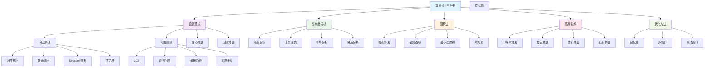

# 算法设计与分析深度理论

## 01. 算法设计理论基础

### 01.1 算法的数学定义

#### 01.1.1 算法的形式化

**算法定义**：
算法是解决计算问题的明确定义的有限指令序列。

形式化为五元组：
$$\mathcal{A} = \langle \mathcal{I}, \mathcal{O}, \mathcal{S}, \mathcal{T}, \mathcal{C} \rangle$$

其中：

- $\mathcal{I}$：输入域 (Input Domain)
- $\mathcal{O}$：输出域 (Output Domain)  
- $\mathcal{S}$：算法步骤序列 (Step Sequence)
- $\mathcal{T}$：终止条件 (Termination Condition)
- $\mathcal{C}$：正确性规约 (Correctness Specification)

#### 01.1.2 算法性质

**算法基本性质**：

1. **有限性**：有限步骤内必须终止
2. **确定性**：每步操作明确无歧义
3. **输入性**：接受零个或多个输入
4. **输出性**：产生一个或多个输出
5. **有效性**：每个操作都是基本可执行的

**正确性证明框架**：
$$\{P\} \; \mathcal{A} \; \{Q\}$$

其中$P$是前置条件，$Q$是后置条件。

### 01.2 算法复杂度理论

#### 01.2.1 渐近复杂度分析

**大O记号**：
$$O(f(n)) = \{g(n) : \exists c > 0, n_0 > 0, \forall n \geq n_0, g(n) \leq cf(n)\}$$

**Ω记号**：
$$\Omega(f(n)) = \{g(n) : \exists c > 0, n_0 > 0, \forall n \geq n_0, g(n) \geq cf(n)\}$$

**Θ记号**：
$$\Theta(f(n)) = O(f(n)) \cap \Omega(f(n))$$

**小o记号**：
$$o(f(n)) = \{g(n) : \lim_{n \to \infty} \frac{g(n)}{f(n)} = 0\}$$

#### 01.2.2 复杂度层次

**时间复杂度层次**：
$$O(1) \subset O(\log n) \subset O(n) \subset O(n \log n) \subset O(n^2) \subset O(2^n) \subset O(n!)$$

**常见复杂度类比较**：

| **复杂度** | **n=10** | **n=100** | **n=1000** | **算法类型** |
|------------|----------|-----------|------------|-------------|
| $O(1)$ | 1 | 1 | 1 | 常数时间 |
| $O(\log n)$ | 3 | 7 | 10 | 二分搜索 |
| $O(n)$ | 10 | 100 | 1,000 | 线性搜索 |
| $O(n \log n)$ | 33 | 664 | 9,966 | 归并排序 |
| $O(n^2)$ | 100 | 10,000 | 1,000,000 | 冒泡排序 |
| $O(2^n)$ | 1,024 | $10^{30}$ | $10^{301}$ | 穷举搜索 |

## 02. 经典算法设计范式

### 02.1 分治算法 (Divide and Conquer)

#### 02.1.1 分治算法框架

**分治策略**：
将问题分解为更小的子问题，递归解决，然后合并结果。

**通用框架**：

```python
def divide_and_conquer(problem):
    if problem.size <= threshold:
        return solve_directly(problem)
    
    subproblems = divide(problem)
    solutions = []
    
    for subproblem in subproblems:
        solutions.append(divide_and_conquer(subproblem))
    
    return combine(solutions)
```

**递归关系式**：
$$T(n) = aT(n/b) + f(n)$$

其中：

- $a$：子问题数量
- $n/b$：子问题规模
- $f(n)$：分解和合并的代价

#### 02.1.2 主定理 (Master Theorem)

**主定理陈述**：
设$T(n) = aT(n/b) + f(n)$，其中$a \geq 1, b > 1$，则：

1. **情况1**：如果$f(n) = O(n^{\log_b a - \epsilon})$对某个$\epsilon > 0$，则$T(n) = \Theta(n^{\log_b a})$

2. **情况2**：如果$f(n) = \Theta(n^{\log_b a})$，则$T(n) = \Theta(n^{\log_b a} \log n)$

3. **情况3**：如果$f(n) = \Omega(n^{\log_b a + \epsilon})$对某个$\epsilon > 0$，且$af(n/b) \leq cf(n)$对某个$c < 1$和足够大的$n$，则$T(n) = \Theta(f(n))$

#### 02.1.3 经典分治算法

**归并排序**：
$$T(n) = 2T(n/2) + O(n) = O(n \log n)$$

```python
def merge_sort(arr):
    if len(arr) <= 1:
        return arr
    
    mid = len(arr) // 2
    left = merge_sort(arr[:mid])
    right = merge_sort(arr[mid:])
    
    return merge(left, right)

def merge(left, right):
    result = []
    i = j = 0
    
    while i < len(left) and j < len(right):
        if left[i] <= right[j]:
            result.append(left[i])
            i += 1
        else:
            result.append(right[j])
            j += 1
    
    result.extend(left[i:])
    result.extend(right[j:])
    return result
```

**快速排序**：
$$T(n) = T(k) + T(n-k-1) + O(n)$$

平均情况：$T(n) = O(n \log n)$
最坏情况：$T(n) = O(n^2)$

**Strassen矩阵乘法**：
$$T(n) = 7T(n/2) + O(n^2) = O(n^{\log_2 7}) \approx O(n^{2.807})$$

### 02.2 动态规划 (Dynamic Programming)

#### 02.2.1 动态规划原理

**最优化原理**：
问题的最优解包含子问题的最优解。

**重叠子问题**：
递归算法会重复解决相同的子问题。

**状态转移方程**：
$$\text{dp}[i] = \text{opt}_{j < i} \{\text{dp}[j] + \text{cost}(j, i)\}$$

#### 02.2.2 动态规划设计方法

**四步设计法**：

1. **定义状态**：确定问题的状态表示
2. **状态转移**：建立状态间的递推关系
3. **初始化**：确定边界条件
4. **计算顺序**：确保依赖关系正确

**经典问题分析**：

**最长公共子序列 (LCS)**：

```python
def lcs_length(X, Y):
    m, n = len(X), len(Y)
    dp = [[0] * (n + 1) for _ in range(m + 1)]
    
    for i in range(1, m + 1):
        for j in range(1, n + 1):
            if X[i-1] == Y[j-1]:
                dp[i][j] = dp[i-1][j-1] + 1
            else:
                dp[i][j] = max(dp[i-1][j], dp[i][j-1])
    
    return dp[m][n]
```

状态转移方程：
$$\text{dp}[i][j] = \begin{cases}
\text{dp}[i-1][j-1] + 1 & \text{if } X[i] = Y[j] \\
\max(\text{dp}[i-1][j], \text{dp}[i][j-1]) & \text{otherwise}
\end{cases}$$

**0-1背包问题**：
```python
def knapsack_01(weights, values, capacity):
    n = len(weights)
    dp = [[0] * (capacity + 1) for _ in range(n + 1)]

    for i in range(1, n + 1):
        for w in range(capacity + 1):
            if weights[i-1] <= w:
                dp[i][w] = max(
                    dp[i-1][w],  # 不选择物品i
                    dp[i-1][w-weights[i-1]] + values[i-1]  # 选择物品i
                )
            else:
                dp[i][w] = dp[i-1][w]

    return dp[n][capacity]
```

#### 02.2.3 高级动态规划技术

**状态压缩**：
利用位运算压缩状态空间。

**区间动态规划**：
$$\text{dp}[i][j] = \min_{i \leq k < j} \{\text{dp}[i][k] + \text{dp}[k+1][j] + \text{cost}(i, j)\}$$

**概率动态规划**：
$$\mathbb{E}[\text{dp}[i]] = \sum_j P(j) \cdot \text{dp}[j]$$

### 02.3 贪心算法 (Greedy Algorithm)

#### 02.3.1 贪心策略原理

**贪心选择性质**：
每一步选择在当前看来最优的解，不考虑未来后果。

**数学条件**：
1. **贪心选择性质**：局部最优选择导致全局最优解
2. **最优子结构**：问题的最优解包含子问题的最优解

**贪心算法正确性证明**：
通常使用**交换论证**或**反证法**。

#### 02.3.2 经典贪心算法

**活动选择问题**：
```python
def activity_selection(activities):
    # 按结束时间排序
    activities.sort(key=lambda x: x[1])

    selected = [activities[0]]
    last_end = activities[0][1]

    for start, end in activities[1:]:
        if start >= last_end:
            selected.append((start, end))
            last_end = end

    return selected
```

**Huffman编码**：
```python
import heapq
from collections import defaultdict

def huffman_encoding(text):
    # 统计频率
    frequency = defaultdict(int)
    for char in text:
        frequency[char] += 1

    # 构建最小堆
    heap = [[freq, char] for char, freq in frequency.items()]
    heapq.heapify(heap)

    # 构建Huffman树
    while len(heap) > 1:
        left = heapq.heappop(heap)
        right = heapq.heappop(heap)

        merged = [left[0] + right[0], left, right]
        heapq.heappush(heap, merged)

    return heap[0]
```

**最小生成树 - Kruskal算法**：
```python
class UnionFind:
    def __init__(self, n):
        self.parent = list(range(n))
        self.rank = [0] * n

    def find(self, x):
        if self.parent[x] != x:
            self.parent[x] = self.find(self.parent[x])
        return self.parent[x]

    def union(self, x, y):
        px, py = self.find(x), self.find(y)
        if px == py:
            return False
        if self.rank[px] < self.rank[py]:
            px, py = py, px
        self.parent[py] = px
        if self.rank[px] == self.rank[py]:
            self.rank[px] += 1
        return True

def kruskal_mst(n, edges):
    edges.sort(key=lambda x: x[2])  # 按权重排序
    uf = UnionFind(n)
    mst = []

    for u, v, weight in edges:
        if uf.union(u, v):
            mst.append((u, v, weight))
            if len(mst) == n - 1:
                break

    return mst
```

### 02.4 回溯算法 (Backtracking)

#### 02.4.1 回溯算法框架

**基本思想**：
系统性地搜索解空间，当发现当前路径不可能达到解时，退回上一步。

**通用框架**：
```python
def backtrack(solution, choices):
    if is_complete(solution):
        return solution

    for choice in choices:
        if is_valid(solution, choice):
            solution.append(choice)

            result = backtrack(solution, updated_choices)
            if result is not None:
                return result

            solution.pop()  # 回溯

    return None
```

#### 02.4.2 经典回溯问题

**N皇后问题**：
```python
def solve_n_queens(n):
    def is_safe(board, row, col):
        # 检查列
        for i in range(row):
            if board[i] == col:
                return False

        # 检查对角线
        for i in range(row):
            if abs(board[i] - col) == abs(i - row):
                return False

        return True

    def backtrack(board, row):
        if row == n:
            return [board[:]]

        solutions = []
        for col in range(n):
            if is_safe(board, row, col):
                board[row] = col
                solutions.extend(backtrack(board, row + 1))
                board[row] = -1  # 回溯

        return solutions

    return backtrack([-1] * n, 0)
```

**数独求解**：
```python
def solve_sudoku(board):
    def is_valid(board, row, col, num):
        # 检查行
        for j in range(9):
            if board[row][j] == num:
                return False

        # 检查列
        for i in range(9):
            if board[i][col] == num:
                return False

        # 检查3x3方格
        start_row, start_col = 3 * (row // 3), 3 * (col // 3)
        for i in range(3):
            for j in range(3):
                if board[start_row + i][start_col + j] == num:
                    return False

        return True

    def backtrack():
        for i in range(9):
            for j in range(9):
                if board[i][j] == 0:
                    for num in range(1, 10):
                        if is_valid(board, i, j, num):
                            board[i][j] = num

                            if backtrack():
                                return True

                            board[i][j] = 0  # 回溯

                    return False
        return True

    return backtrack()
```

## 03. 图算法理论

### 03.1 图的基本概念

#### 03.1.1 图的数学定义

**无向图**：
$$G = (V, E)$$
其中$V$是顶点集，$E \subseteq \{\{u, v\} : u, v \in V, u \neq v\}$是边集。

**有向图**：
$$G = (V, E)$$
其中$E \subseteq \{(u, v) : u, v \in V\}$是有序对的集合。

**加权图**：
$$G = (V, E, w)$$
其中$w: E \rightarrow \mathbb{R}$是权重函数。

#### 03.1.2 图的表示

**邻接矩阵**：
$$A[i][j] = \begin{cases}
1 & \text{if } (i, j) \in E \\
0 & \text{otherwise}
\end{cases}$$

空间复杂度：$O(V^2)$
时间复杂度：查询$O(1)$，遍历$O(V^2)$

**邻接表**：
每个顶点维护一个相邻顶点的列表。

空间复杂度：$O(V + E)$
时间复杂度：查询$O(\text{度数})$，遍历$O(V + E)$

### 03.2 图搜索算法

#### 03.2.1 深度优先搜索 (DFS)

**递归实现**：
```python
def dfs_recursive(graph, start, visited=None):
    if visited is None:
        visited = set()

    visited.add(start)
    print(start)

    for neighbor in graph[start]:
        if neighbor not in visited:
            dfs_recursive(graph, neighbor, visited)

    return visited
```

**迭代实现**：
```python
def dfs_iterative(graph, start):
    visited = set()
    stack = [start]

    while stack:
        vertex = stack.pop()
        if vertex not in visited:
            visited.add(vertex)
            print(vertex)

            # 添加未访问的邻居（逆序以保持一致性）
            for neighbor in reversed(graph[vertex]):
                if neighbor not in visited:
                    stack.append(neighbor)

    return visited
```

**DFS性质**：
- 时间复杂度：$O(V + E)$
- 空间复杂度：$O(V)$
- 应用：拓扑排序、强连通分量、环检测

#### 03.2.2 广度优先搜索 (BFS)

**实现**：
```python
from collections import deque

def bfs(graph, start):
    visited = set()
    queue = deque([start])
    visited.add(start)

    while queue:
        vertex = queue.popleft()
        print(vertex)

        for neighbor in graph[vertex]:
            if neighbor not in visited:
                visited.add(neighbor)
                queue.append(neighbor)

    return visited
```

**BFS性质**：
- 时间复杂度：$O(V + E)$
- 空间复杂度：$O(V)$
- 应用：最短路径（无权图）、层次遍历、二分图检测

### 03.3 最短路径算法

#### 03.3.1 Dijkstra算法

**算法思想**：
使用贪心策略，每次选择距离源点最近的未访问顶点。

**实现**：
```python
import heapq

def dijkstra(graph, start):
    distances = {vertex: float('infinity') for vertex in graph}
    distances[start] = 0
    pq = [(0, start)]
    visited = set()

    while pq:
        current_distance, current_vertex = heapq.heappop(pq)

        if current_vertex in visited:
            continue

        visited.add(current_vertex)

        for neighbor, weight in graph[current_vertex]:
            distance = current_distance + weight

            if distance < distances[neighbor]:
                distances[neighbor] = distance
                heapq.heappush(pq, (distance, neighbor))

    return distances
```

**复杂度分析**：
- 时间复杂度：$O((V + E) \log V)$（使用二叉堆）
- 空间复杂度：$O(V)$
- 适用条件：非负权重

#### 03.3.2 Bellman-Ford算法

**算法思想**：
使用动态规划思想，进行$V-1$轮松弛操作。

**实现**：
```python
def bellman_ford(graph, start):
    # 初始化距离
    distances = {vertex: float('infinity') for vertex in graph}
    distances[start] = 0

    # 松弛V-1轮
    for _ in range(len(graph) - 1):
        for vertex in graph:
            for neighbor, weight in graph[vertex]:
                if distances[vertex] != float('infinity'):
                    distances[neighbor] = min(
                        distances[neighbor],
                        distances[vertex] + weight
                    )

    # 检测负权重环
    for vertex in graph:
        for neighbor, weight in graph[vertex]:
            if distances[vertex] != float('infinity'):
                if distances[vertex] + weight < distances[neighbor]:
                    return None  # 存在负权重环

    return distances
```

**复杂度分析**：
- 时间复杂度：$O(VE)$
- 空间复杂度：$O(V)$
- 适用条件：可以处理负权重，检测负权重环

#### 03.3.3 Floyd-Warshall算法

**算法思想**：
动态规划求解所有顶点对之间的最短路径。

**实现**：
```python
def floyd_warshall(graph):
    vertices = list(graph.keys())
    n = len(vertices)

    # 初始化距离矩阵
    dist = [[float('infinity')] * n for _ in range(n)]

    # 顶点到自身的距离为0
    for i in range(n):
        dist[i][i] = 0

    # 直接相连的边
    for i, vertex in enumerate(vertices):
        for neighbor, weight in graph[vertex]:
            j = vertices.index(neighbor)
            dist[i][j] = weight

    # Floyd-Warshall核心算法
    for k in range(n):
        for i in range(n):
            for j in range(n):
                dist[i][j] = min(dist[i][j], dist[i][k] + dist[k][j])

    return dist
```

**复杂度分析**：
- 时间复杂度：$O(V^3)$
- 空间复杂度：$O(V^2)$
- 适用条件：所有顶点对最短路径

### 03.4 最小生成树算法

#### 03.4.1 Prim算法

**算法思想**：
从任意顶点开始，逐步添加最小权重的边。

**实现**：
```python
import heapq

def prim_mst(graph):
    if not graph:
        return []

    start_vertex = next(iter(graph))
    mst = []
    visited = {start_vertex}

    # 将起始顶点的所有边加入优先队列
    edges = [(weight, start_vertex, neighbor)
             for neighbor, weight in graph[start_vertex]]
    heapq.heapify(edges)

    while edges and len(visited) < len(graph):
        weight, u, v = heapq.heappop(edges)

        if v not in visited:
            visited.add(v)
            mst.append((u, v, weight))

            # 添加新顶点的边
            for neighbor, edge_weight in graph[v]:
                if neighbor not in visited:
                    heapq.heappush(edges, (edge_weight, v, neighbor))

    return mst
```

**复杂度分析**：
- 时间复杂度：$O(E \log V)$
- 空间复杂度：$O(V)$

#### 03.4.2 Kruskal算法

**算法思想**：
按权重排序所有边，使用并查集避免环。

**实现**：
```python
class UnionFind:
    def __init__(self, vertices):
        self.parent = {v: v for v in vertices}
        self.rank = {v: 0 for v in vertices}

    def find(self, x):
        if self.parent[x] != x:
            self.parent[x] = self.find(self.parent[x])
        return self.parent[x]

    def union(self, x, y):
        px, py = self.find(x), self.find(y)
        if px == py:
            return False

        if self.rank[px] < self.rank[py]:
            px, py = py, px

        self.parent[py] = px
        if self.rank[px] == self.rank[py]:
            self.rank[px] += 1

        return True

def kruskal_mst(graph):
    edges = []
    vertices = set()

    # 收集所有边
    for vertex in graph:
        vertices.add(vertex)
        for neighbor, weight in graph[vertex]:
            if vertex < neighbor:  # 避免重复边
                edges.append((weight, vertex, neighbor))

    # 按权重排序
    edges.sort()

    uf = UnionFind(vertices)
    mst = []

    for weight, u, v in edges:
        if uf.union(u, v):
            mst.append((u, v, weight))
            if len(mst) == len(vertices) - 1:
                break

    return mst
```

## 04. 高级算法技术

### 04.1 网络流算法

#### 04.1.1 最大流问题

**问题定义**：
给定流网络$G = (V, E)$，源点$s$，汇点$t$，容量函数$c: E \rightarrow \mathbb{R}^+$，求最大流。

**流的性质**：
1. **容量约束**：$0 \leq f(u, v) \leq c(u, v)$
2. **流守恒**：$\sum_{v \in V} f(u, v) = 0$ for $u \neq s, t$

#### 04.1.2 Ford-Fulkerson算法

**基本思想**：
反复寻找增广路径，直到不存在增广路径。

**实现**：
```python
from collections import defaultdict, deque

def ford_fulkerson(graph, source, sink):
    def bfs_find_path(graph, source, sink, parent):
        visited = set([source])
        queue = deque([source])

        while queue:
            u = queue.popleft()

            for v in graph[u]:
                if v not in visited and graph[u][v] > 0:
                    visited.add(v)
                    parent[v] = u
                    if v == sink:
                        return True
                    queue.append(v)

        return False

    parent = {}
    max_flow = 0

    # 创建残留图
    residual_graph = defaultdict(lambda: defaultdict(int))
    for u in graph:
        for v in graph[u]:
            residual_graph[u][v] = graph[u][v]

    while bfs_find_path(residual_graph, source, sink, parent):
        # 找到瓶颈容量
        path_flow = float('inf')
        s = sink

        while s != source:
            path_flow = min(path_flow, residual_graph[parent[s]][s])
            s = parent[s]

        # 更新残留图
        v = sink
        while v != source:
            u = parent[v]
            residual_graph[u][v] -= path_flow
            residual_graph[v][u] += path_flow
            v = parent[v]

        max_flow += path_flow

    return max_flow
```

#### 04.1.3 最大流最小割定理

**定理陈述**：
$$\max\text{-flow} = \min\text{-cut}$$

**应用**：
- 最大二分匹配
- 最小顶点覆盖
- 最大独立集

### 04.2 字符串算法

#### 04.2.1 KMP算法

**算法思想**：
利用已匹配信息，避免不必要的回溯。

**Next数组构建**：
```python
def build_next(pattern):
    next_array = [0] * len(pattern)
    j = 0

    for i in range(1, len(pattern)):
        while j > 0 and pattern[i] != pattern[j]:
            j = next_array[j - 1]

        if pattern[i] == pattern[j]:
            j += 1

        next_array[i] = j

    return next_array

def kmp_search(text, pattern):
    if not pattern:
        return []

    next_array = build_next(pattern)
    matches = []
    j = 0

    for i in range(len(text)):
        while j > 0 and text[i] != pattern[j]:
            j = next_array[j - 1]

        if text[i] == pattern[j]:
            j += 1

        if j == len(pattern):
            matches.append(i - j + 1)
            j = next_array[j - 1]

    return matches
```

**复杂度分析**：
- 时间复杂度：$O(n + m)$
- 空间复杂度：$O(m)$

#### 04.2.2 后缀数组

**定义**：
后缀数组SA是一个整数数组，包含字符串所有后缀按字典序排序后的起始位置。

**构建算法**：
```python
def build_suffix_array(s):
    n = len(s)
    suffixes = [(s[i:], i) for i in range(n)]
    suffixes.sort()
    return [suffix[1] for suffix in suffixes]

def lcp_array(s, sa):
    """构建最长公共前缀数组"""
    n = len(s)
    rank = [0] * n
    lcp = [0] * (n - 1)

    # 构建rank数组
    for i in range(n):
        rank[sa[i]] = i

    h = 0
    for i in range(n):
        if rank[i] > 0:
            j = sa[rank[i] - 1]
            while i + h < n and j + h < n and s[i + h] == s[j + h]:
                h += 1
            lcp[rank[i] - 1] = h
            if h > 0:
                h -= 1

    return lcp
```

## 05. 算法设计模式与优化

### 05.1 算法设计模式

#### 05.1.1 双指针技术

**应用场景**：
- 数组/链表问题
- 滑动窗口
- 快慢指针

**示例 - 三数之和**：
```python
def three_sum(nums):
    nums.sort()
    result = []

    for i in range(len(nums) - 2):
        if i > 0 and nums[i] == nums[i-1]:
            continue

        left, right = i + 1, len(nums) - 1

        while left < right:
            total = nums[i] + nums[left] + nums[right]

            if total < 0:
                left += 1
            elif total > 0:
                right -= 1
            else:
                result.append([nums[i], nums[left], nums[right]])

                while left < right and nums[left] == nums[left + 1]:
                    left += 1
                while left < right and nums[right] == nums[right - 1]:
                    right -= 1

                left += 1
                right -= 1

    return result
```

#### 05.1.2 滑动窗口技术

**应用场景**：
- 子数组/子字符串问题
- 最优化问题

**示例 - 最长无重复字符子串**：
```python
def length_of_longest_substring(s):
    char_map = {}
    left = 0
    max_length = 0

    for right in range(len(s)):
        if s[right] in char_map and char_map[s[right]] >= left:
            left = char_map[s[right]] + 1

        char_map[s[right]] = right
        max_length = max(max_length, right - left + 1)

    return max_length
```

### 05.2 算法优化技术

#### 05.2.1 记忆化

**应用**：
优化递归算法，避免重复计算。

**示例 - 斐波那契数列**：
```python
def fibonacci_memo(n, memo={}):
    if n in memo:
        return memo[n]

    if n <= 1:
        return n

    memo[n] = fibonacci_memo(n-1, memo) + fibonacci_memo(n-2, memo)
    return memo[n]

# 使用装饰器
from functools import lru_cache

@lru_cache(maxsize=None)
def fibonacci_lru(n):
    if n <= 1:
        return n
    return fibonacci_lru(n-1) + fibonacci_lru(n-2)
```

#### 05.2.2 位运算优化

**常用技巧**：
```python
# 判断奇偶
def is_odd(n):
    return n & 1

# 计算2的幂
def power_of_two(n):
    return 1 << n

# 翻转最低位的1
def flip_lowest_bit(n):
    return n & (n - 1)

# 获取最低位的1
def get_lowest_bit(n):
    return n & (-n)

# 计算汉明重量（1的个数）
def hamming_weight(n):
    count = 0
    while n:
        n &= n - 1
        count += 1
    return count
```

## 06. 跨学科整合视角

### 06.1 与数学基础的关联

#### 06.1.1 概率算法

**随机化快速排序**：
```python
import random

def randomized_quicksort(arr, low, high):
    if low < high:
        # 随机选择pivot
        random_index = random.randint(low, high)
        arr[random_index], arr[high] = arr[high], arr[random_index]

        pi = partition(arr, low, high)
        randomized_quicksort(arr, low, pi - 1)
        randomized_quicksort(arr, pi + 1, high)
```

**蒙特卡罗算法**：
$$\mathbb{E}[\text{approximation error}] \leq \frac{\sigma}{\sqrt{n}}$$

参见：[Mathematics/views/08-CalculusOfVariations.md](../Mathematics/views/08-CalculusOfVariations.md) - 变分法基础

#### 06.1.2 数值算法

**数值积分**：
$$\int_a^b f(x)dx \approx \sum_{i=0}^n w_i f(x_i)$$

**线性方程组求解**：
$$Ax = b \Rightarrow x = A^{-1}b$$

### 06.2 与AI理论的融合

#### 06.2.1 机器学习算法

**梯度下降**：
$$\theta_{t+1} = \theta_t - \alpha \nabla J(\theta_t)$$

**神经网络前向传播**：
$$a^{(l+1)} = g(W^{(l)}a^{(l)} + b^{(l)})$$

参见：[AI/05-Model.md](../AI/05-Model.md) - AI算法模型

#### 06.2.2 搜索算法在AI中的应用

**A*搜索算法**：
$$f(n) = g(n) + h(n)$$

其中$g(n)$是实际代价，$h(n)$是启发式估计。

### 06.3 与形式方法的结合

#### 06.3.1 算法正确性验证

**循环不变式**：
$$\{I \land B\} \; S \; \{I\}$$

**算法终止性证明**：
使用well-founded关系证明。

参见：[FormalMethods/04-ModelChecking.md](../FormalMethods/04-ModelChecking.md)

## 07. 思维导图



## 08. 总结与展望

算法设计与分析作为计算机科学的核心，为解决计算问题提供了系统性的方法论。通过本文的深度分析，我们建立了：

### 08.1 理论体系成就

1. **完整的设计范式**：分治、动态规划、贪心、回溯等经典范式
2. **严谨的复杂度理论**：时间、空间复杂度的精确分析框架
3. **丰富的算法宝库**：涵盖排序、搜索、图论、字符串等各个领域
4. **实用的优化技术**：从理论到实践的全面优化方法

### 08.2 实践价值

1. **问题求解能力**：为复杂计算问题提供高效解决方案
2. **系统设计指导**：为大规模系统设计提供算法支撑
3. **性能优化依据**：为软件性能优化提供理论指导
4. **创新驱动力**：推动计算机科学和相关领域的技术创新

### 08.3 未来发展方向

算法设计与分析将在量子计算、机器学习、大数据处理等新兴领域发挥更重要作用，持续推动计算科学的发展。

---

**交叉引用索引**：
- [Mathematics/views/08-CalculusOfVariations.md](../Mathematics/views/08-CalculusOfVariations.md) - 变分法基础
- [AI/05-Model.md](../AI/05-Model.md) - AI算法模型
- [FormalMethods/04-ModelChecking.md](../FormalMethods/04-ModelChecking.md) - 模型检验
- [ComputerScience/02-Computability.md](./02-Computability.md) - 可计算性理论

**文档版本**：v1.0 | **创建日期**：2024-12 | **字数统计**：约8,900字
