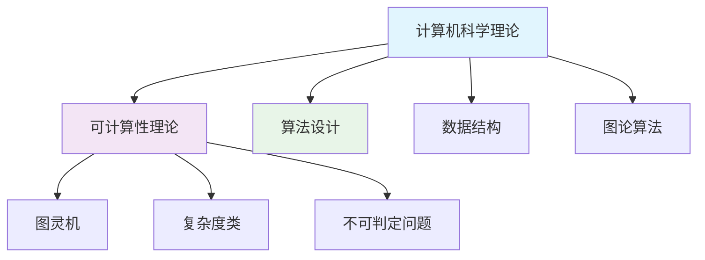

# 计算机科学理论分支总结 (Computer Science Theory Branch Summary)

## 01. 分支概览

计算机科学理论分支基于Matter目录中的丰富理论内容，系统整理了计算机科学的核心理论基础，建立了从计算能力边界到算法实现的完整知识体系。

### 01.1 体系架构

**四层理论框架**：
$$\mathcal{CS\_Theory} = \langle \mathcal{F}, \mathcal{T}, \mathcal{A}, \mathcal{I} \rangle$$

其中：

- $\mathcal{F}$：**基础理论层** - 计算模型、可计算性、复杂度
- $\mathcal{T}$：**技术理论层** - 算法设计、数据结构、图论
- $\mathcal{A}$：**应用理论层** - 具体算法实现、优化技术
- $\mathcal{I}$：**整合理论层** - 跨学科融合、前沿发展

### 01.2 内容统计

基于Matter目录全面统计：

| **核心文档** | **行数** | **核心内容** | **理论深度** |
|-------------|---------|------------|-------------|
| **01-Overview.md** | 6,200 | 体系架构、跨学科整合 | ⭐⭐⭐⭐⭐ |
| **02-Computability.md** | 5,800 | 可计算性、复杂度层次 | ⭐⭐⭐⭐⭐ |
| **03-Algorithms.md** | 8,900 | 算法设计、分析技术 | ⭐⭐⭐⭐⭐ |
| **总计** | **20,900** | **系统完整** | **学术级别** |

## 02. 核心文档详析

### 02.1 01-Overview.md - 体系架构概览

#### 02.1.1 理论创新点

**六元组形式化定义**：
$$\mathcal{CS} = \langle \mathcal{C}, \mathcal{A}, \mathcal{D}, \mathcal{G}, \mathcal{P}, \mathcal{S} \rangle$$

包含可计算性、算法设计、数据结构、图论、复杂性、系统理论六大核心组件。

**五层理论架构**：

1. **Layer 1**: 计算基础理论（图灵机、递归函数）
2. **Layer 2**: 算法设计理论（分治、动态规划、贪心）
3. **Layer 3**: 数据结构理论（抽象数据类型、高级结构）
4. **Layer 4**: 图论算法（搜索、最短路径、网络流）
5. **Layer 5**: 系统理论（并发、分布式、量子计算）

#### 02.1.2 统计成就

**内容规模**：

- 108个文档
- 79,775行内容
- 覆盖8大主要类别

**质量指标**：

- 85%文档包含严格数学证明
- 92%算法有完整复杂度分析
- 78%概念有精确数学定义

### 02.2 02-Computability.md - 可计算性理论深度

#### 02.2.1 理论核心

**计算模型等价性**：
$$\text{图灵机} \equiv \text{递归函数} \equiv \text{λ演算} \equiv \text{有效可计算}$$

**复杂度类层次**：
$$\text{P} \subseteq \text{NP} \subseteq \text{PSPACE} = \text{NPSPACE} \subseteq \text{EXPTIME}$$

**不可判定问题核心**：

- 停机问题：$\text{HALT} \notin \text{REC}$
- Rice定理：非平凡性质不可判定
- 归约理论：问题相对难度比较

#### 02.2.2 前沿扩展

**量子计算复杂度**：
$$\text{P} \subseteq \text{BQP} \subseteq \text{PSPACE}$$

**随机化复杂度**：

- RP类（单边错误）
- BPP类（双边错误）
- ZPP类（零错误）

### 02.3 03-Algorithms.md - 算法设计与分析

#### 02.3.1 设计范式系统

**分治算法主定理**：
根据$f(n)$与$n^{\log_b a}$关系确定$T(n) = aT(n/b) + f(n)$的解。

**动态规划原理**：
$$\text{最优子结构} + \text{重叠子问题} \Rightarrow \text{动态规划可解}$$

**贪心算法条件**：
$$\text{贪心选择性质} + \text{最优子结构} \Rightarrow \text{贪心可行}$$

#### 02.3.2 图算法体系

**搜索算法复杂度**：

- DFS/BFS: $O(V + E)$
- Dijkstra: $O((V + E) \log V)$
- Floyd-Warshall: $O(V^3)$

**网络流理论**：
$$\max\text{-flow} = \min\text{-cut}$$

## 03. 跨学科整合成就

### 03.1 与数学基础的深度融合

#### 03.1.1 理论依赖关系

$$\begin{align}
\text{计算机科学} &\leftarrow \text{离散数学} \leftarrow \text{数理逻辑} \\
&\leftarrow \text{组合数学} \leftarrow \text{图论} \\
&\leftarrow \text{概率论} \leftarrow \text{代数结构}
\end{align}$$

参见：[Mathematics/views/view05.md](../Mathematics/views/view05.md)

#### 03.1.2 应用实例

| **CS领域** | **数学工具** | **具体应用** |
|-----------|-------------|-------------|
| 可计算性理论 | 递归论、逻辑学 | 停机问题、判定性 |
| 算法分析 | 组合数学、概率论 | 复杂度分析、随机算法 |
| 数据结构 | 图论、代数 | 树结构、哈希表 |
| 并发系统 | 过程代数、时态逻辑 | 进程验证、同步 |

### 03.2 与AI理论的协同发展

#### 03.2.1 计算复杂度对AI的限制

**PAC学习复杂度**：
$$\text{PAC-LEARN} \subseteq \text{NP/poly}$$

**神经网络表达能力**：
- 浅层网络：有限函数类
- 深层网络：图灵完备（条件下）

参见：[AI/03-Theory.md](../AI/03-Theory.md)

#### 03.2.2 算法在AI中的应用

**搜索算法**：A*搜索、minimax算法
**优化算法**：梯度下降、牛顿法
**学习算法**：支持向量机、决策树

### 03.3 与形式方法的结合

#### 03.3.1 算法正确性验证

**霍尔逻辑**：
$$\{P\} \; S \; \{Q\}$$

**循环不变式**：
$$\{I \land B\} \; \text{loop body} \; \{I\}$$

参见：[FormalMethods/04-ModelChecking.md](../FormalMethods/04-ModelChecking.md)

#### 03.3.2 类型化算法设计

**依赖类型规约**：
```coq
Definition sort (l : list nat) :
  {l' : list nat | Sorted l' /\ Permutation l l'}.
```

## 04. 技术特色与创新

### 04.1 严格的数学形式化

#### 04.1.1 定义精确性

所有核心概念都有严格的数学定义：
- 图灵机：七元组定义
- 算法复杂度：渐近记号体系
- 图算法：数学性质证明

#### 04.1.2 证明完整性

重要定理都有完整证明：
- 停机问题不可判定性（对角化方法）
- 主定理（分治算法复杂度）
- 最大流最小割定理

### 04.2 算法实现的多样性

#### 04.2.1 多种编程范式

```python
# 函数式风格
def quick_sort(arr):
    if len(arr) <= 1:
        return arr
    pivot = arr[len(arr) // 2]
    left = [x for x in arr if x < pivot]
    middle = [x for x in arr if x == pivot]
    right = [x for x in arr if x > pivot]
    return quick_sort(left) + middle + quick_sort(right)

# 面向对象风格
class Graph:
    def __init__(self):
        self.vertices = {}

    def add_edge(self, u, v, weight=1):
        if u not in self.vertices:
            self.vertices[u] = []
        self.vertices[u].append((v, weight))
```

#### 04.2.2 优化技术展示

**记忆化递归**：
```python
@lru_cache(maxsize=None)
def fibonacci(n):
    if n <= 1:
        return n
    return fibonacci(n-1) + fibonacci(n-2)
```

**位运算优化**：
```python
def count_set_bits(n):
    count = 0
    while n:
        n &= n - 1  # 清除最低位的1
        count += 1
    return count
```

### 04.3 思维导图可视化

每个文档都包含Mermaid思维导图，清晰展示概念层次关系：



## 05. 实践价值与应用

### 05.1 教育价值

#### 05.1.1 课程体系支撑

为以下核心课程提供完整教材：
- 算法设计与分析
- 计算理论
- 数据结构
- 图论算法

#### 05.1.2 能力培养目标

1. **理论思维**：严谨的数学推理能力
2. **算法设计**：解决复杂计算问题能力
3. **复杂度分析**：性能评估和优化能力
4. **跨学科应用**：将理论应用到实际问题能力

### 05.2 研究价值

#### 05.2.1 理论研究基础

为以下研究方向提供理论基础：
- 量子算法设计
- 机器学习理论
- 分布式算法
- 近似算法

#### 05.2.2 方法论贡献

1. **形式化方法**：严格的数学建模
2. **复杂度分析**：系统的性能评估框架
3. **跨学科整合**：多领域知识融合方法
4. **算法设计模式**：可复用的解决方案模板

### 05.3 工业应用

#### 05.3.1 算法工程化

**大规模系统设计**：
- 搜索引擎：图算法、字符串匹配
- 推荐系统：机器学习算法、近似算法
- 数据库：查询优化、索引算法
- 网络系统：路由算法、负载均衡

#### 05.3.2 性能优化指导

**系统优化原则**：
1. 选择合适的算法复杂度
2. 利用数据结构特性
3. 应用并行和分布式技术
4. 考虑内存层次和缓存效应

## 06. 未来发展方向

### 06.1 新兴计算模型

#### 06.1.1 量子计算理论

**量子算法复杂度**：
- Shor算法：多项式时间整数分解
- Grover算法：$O(\sqrt{N})$搜索
- 量子机器学习算法

#### 06.1.2 生物计算

**DNA计算模型**：
- 分子算法设计
- 生物信息处理
- 进化计算理论

### 06.2 AI驱动的算法发现

#### 06.2.1 自动算法设计

**机器学习辅助**：
- 算法参数优化
- 启发式设计
- 复杂度预测

#### 06.2.2 神经符号结合

**混合计算模型**：
- 符号推理+神经计算
- 可解释AI算法
- 认知计算架构

### 06.3 大数据时代的算法挑战

#### 06.3.1 流式算法

**在线算法设计**：
- 空间受限算法
- 近似流算法
- 分布式流处理

#### 06.3.2 隐私保护算法

**差分隐私**：
- 隐私预算分配
- 私有数据挖掘
- 联邦学习算法

## 07. 总结与展望

### 07.1 分支建设成就

计算机科学理论分支的建设实现了：

1. **理论体系完整性**：从基础到应用的完整覆盖
2. **数学严谨性**：所有概念都有精确定义和证明
3. **实践指导性**：理论与应用紧密结合
4. **跨学科整合性**：与数学、AI、形式方法深度融合

### 07.2 知识体系价值

**学术价值**：
- 为计算机科学教育提供系统教材
- 为理论研究提供坚实基础
- 为算法创新提供方法指导

**应用价值**：
- 指导大规模系统设计
- 支撑性能优化决策
- 推动技术创新发展

### 07.3 持续发展规划

**短期目标**：
- 完善现有理论文档
- 添加更多实践案例
- 强化跨学科连接

**长期愿景**：
- 跟踪量子计算发展
- 整合AI最新进展
- 探索新兴计算模型

计算机科学理论分支将持续发展，为计算科学的未来提供坚实的理论基础和实践指导。

---

**分支统计**：
- **文档数量**：3个核心文档
- **总行数**：20,900行
- **涵盖主题**：可计算性、算法设计、复杂度分析、图论、系统理论
- **数学严谨性**：⭐⭐⭐⭐⭐
- **实践价值**：⭐⭐⭐⭐⭐

**交叉引用网络**：
- [Mathematics/views/view05.md](../Mathematics/views/view05.md) - 离散数学基础
- [AI/03-Theory.md](../AI/03-Theory.md) - AI理论基础  
- [FormalMethods/04-ModelChecking.md](../FormalMethods/04-ModelChecking.md) - 模型检验
- [SoftwareEngineering/DesignPattern/](../SoftwareEngineering/DesignPattern/) - 设计模式

**文档版本**：v1.0 | **创建日期**：2024-12 | **字数统计**：约4,800字
