# 形式语言理论深度分析

## 01. 形式语言基础理论

### 01.1 形式语言的数学定义

#### 01.1.1 基本概念

**形式语言**是由有限符号集合（字母表）上的字符串构成的集合：

$$\begin{align}
\Sigma &: \text{字母表（有限符号集合）} \\
\Sigma^* &: \text{所有有限字符串的集合} \\
L &\subseteq \Sigma^* \quad \text{（形式语言）}
\end{align}$$

**字符串操作**：
- **连接**：$w_1 \cdot w_2$ 或简写为 $w_1w_2$
- **长度**：$|w|$ 表示字符串 $w$ 的长度
- **空串**：$\varepsilon$，满足 $|\varepsilon| = 0$
- **幂运算**：$w^n = \underbrace{w \cdot w \cdots w}_{n \text{ 次}}$

**语言运算**：
$$\begin{align}
L_1 \cup L_2 &= \{w \mid w \in L_1 \text{ 或 } w \in L_2\} \\
L_1 \cap L_2 &= \{w \mid w \in L_1 \text{ 且 } w \in L_2\} \\
L_1 \cdot L_2 &= \{w_1w_2 \mid w_1 \in L_1, w_2 \in L_2\} \\
L^* &= \bigcup_{n=0}^{\infty} L^n \quad \text{(Kleene闭包)}
\end{align}$$

#### 01.1.2 Chomsky层次结构

**文法定义**：四元组 $G = (V, \Sigma, P, S)$
- $V$：变量（非终结符）集合
- $\Sigma$：终结符集合，$V \cap \Sigma = \emptyset$
- $P$：产生式规则集合
- $S \in V$：起始符号

**Chomsky分类**：

| **类型** | **文法约束** | **自动机模型** | **语言类别** |
|----------|-------------|---------------|-------------|
| **Type 0** | 无限制 | 图灵机 | 递归可枚举语言 |
| **Type 1** | $\|\alpha\| \leq \|\beta\|$ | 线性有界自动机 | 上下文相关语言 |
| **Type 2** | $A \rightarrow \alpha$ | 下推自动机 | 上下文无关语言 |
| **Type 3** | $A \rightarrow aB$ 或 $A \rightarrow a$ | 有限状态自动机 | 正则语言 |

**严格包含关系**：
$$\text{REG} \subset \text{CFL} \subset \text{CSL} \subset \text{RE}$$

### 01.2 自动机理论

#### 01.2.1 有限状态自动机

**确定性有限自动机 (DFA)**：
$$M = (Q, \Sigma, \delta, q_0, F)$$

- $Q$：有限状态集合
- $\Sigma$：输入字母表
- $\delta: Q \times \Sigma \rightarrow Q$：转移函数
- $q_0 \in Q$：初始状态
- $F \subseteq Q$：接受状态集合

**非确定性有限自动机 (NFA)**：
$$N = (Q, \Sigma, \Delta, q_0, F)$$
其中 $\Delta: Q \times \Sigma \rightarrow 2^Q$

**Thompson构造定理**：对任意正则表达式，存在等价的$\varepsilon$-NFA

**子集构造算法**：任意NFA都可转换为等价DFA
$$2^Q \text{状态的DFA} \equiv \text{原NFA}$$

#### 01.2.2 下推自动机

**下推自动机 (PDA)**：
$$P = (Q, \Sigma, \Gamma, \delta, q_0, Z_0, F)$$

- $\Gamma$：栈字母表
- $\delta: Q \times \Sigma_\varepsilon \times \Gamma \rightarrow 2^{Q \times \Gamma^*}$：转移关系
- $Z_0 \in \Gamma$：栈底符号

**CFL识别定理**：语言$L$是上下文无关的当且仅当存在PDA识别$L$

**CFL泵引理**：
$$\forall L \in \text{CFL}, \exists p > 0: |w| \geq p \Rightarrow w = uvxyz$$
满足：
1. $|vxy| \leq p$
2. $|vy| \geq 1$  
3. $\forall i \geq 0: uv^ixy^iz \in L$

#### 01.2.3 图灵机理论

**图灵机**：
$$M = (Q, \Sigma, \Gamma, \delta, q_0, q_{\text{accept}}, q_{\text{reject}})$$

其中 $\delta: Q \times \Gamma \rightarrow Q \times \Gamma \times \{L, R\}$

**Church-Turing假设**：算法可计算性等价于图灵机可计算性

**计算复杂性理论**：
$$\begin{align}
\mathbf{P} &= \bigcup_{k \geq 1} \text{TIME}(n^k) \\
\mathbf{NP} &= \bigcup_{k \geq 1} \text{NTIME}(n^k) \\
\mathbf{PSPACE} &= \bigcup_{k \geq 1} \text{SPACE}(n^k) \\
\mathbf{EXPTIME} &= \bigcup_{k \geq 1} \text{TIME}(2^{n^k})
\end{align}$$

### 01.3 正则语言深度分析

#### 01.3.1 正则表达式

**基本构造**：
$$\begin{align}
r &::= \emptyset \mid \varepsilon \mid a \quad (a \in \Sigma) \\
&\mid r_1 + r_2 \mid r_1 \cdot r_2 \mid r^*
\end{align}$$

**扩展操作符**：
- $r^+ = r \cdot r^*$ (正闭包)
- $r? = \varepsilon + r$ (可选)
- $[a_1-a_n]$ (字符类)

**Arden定理**：方程 $X = AX + B$ 的最小解是 $X = A^*B$

#### 01.3.2 正则语言性质

**封闭性质**：正则语言在以下运算下封闭
- 并、交、补、连接、Kleene闭包
- 同态、逆同态、商运算

**判定问题复杂性**：

| **问题** | **DFA** | **NFA** | **正则表达式** |
|----------|---------|---------|---------------|
| **成员资格** | $O(n)$ | $O(n \cdot |Q|)$ | $O(n \cdot |r|)$ |
| **空性检测** | $O(|Q|)$ | $O(|Q|)$ | $O(|r|)$ |
| **等价性** | $O(2^{|Q|})$ | PSPACE-完全 | PSPACE-完全 |

**最小化算法**：
- **Hopcroft算法**：$O(n \log n)$时间复杂度
- **分割精化**：基于等价类构造

### 01.4 上下文无关语言理论

#### 01.4.1 上下文无关文法

**正规形式**：

**Chomsky正规形式 (CNF)**：
$$A \rightarrow BC \text{ 或 } A \rightarrow a$$

**Greibach正规形式 (GNF)**：
$$A \rightarrow a\alpha \quad (\alpha \in V^*)$$

**CYK算法**：CNF文法的成员资格判定
$$O(n^3 \cdot |G|) \text{时间复杂度}$$

#### 01.4.2 CFL分析算法

**自顶向下分析**：
- **递归下降**：$\text{LL}(k)$文法
- **预测分析**：FIRST/FOLLOW集合计算

**自底向上分析**：
- **LR分析**：$\text{LR}(k)$文法族
- **LALR分析**：实用的LR分析简化

**二义性检测**：
- **固有二义性**：不可判定问题
- **特殊情况**：部分可判定

#### 01.4.3 CFL的限制与扩展

**CFL的非封闭性**：
- 不在交运算下封闭
- 不在补运算下封闭
- Ogden引理的应用

**温和上下文相关语言**：
$$\text{MCSL} = \{a^nb^nc^n \mid n \geq 1\}$$

**上下文相关语言**的线性空间识别

## 02. 高级形式语言理论

### 02.1 时态扩展语言

#### 02.1.1 $\omega$-语言

**无穷字符串**：$\Sigma^\omega = \{a_1a_2a_3\ldots \mid a_i \in \Sigma\}$

**$\omega$-正则语言**：
$$L = \bigcup_{i=1}^n U_i V_i^\omega$$
其中 $U_i, V_i$ 是有限正则语言

**Büchi自动机**：
$$\mathcal{B} = (Q, \Sigma, \delta, q_0, F)$$
接受条件：运行中访问$F$中状态无穷次

**McNaughton定理**：$\omega$-正则语言 $\equiv$ Büchi可识别语言

#### 02.1.2 时态逻辑语言

**线性时态逻辑 (LTL)**：
$$\phi ::= p \mid \neg\phi \mid \phi \land \psi \mid \mathbf{X}\phi \mid \phi \mathbf{U} \psi$$

**时态算子语义**：
- $\mathbf{X}\phi$：下一时刻$\phi$成立
- $\phi \mathbf{U} \psi$：$\phi$直到$\psi$成立
- $\mathbf{F}\phi = \text{true} \mathbf{U} \phi$：最终$\phi$成立
- $\mathbf{G}\phi = \neg\mathbf{F}\neg\phi$：总是$\phi$成立

**计算树逻辑 (CTL)**：
$$\phi ::= p \mid \neg\phi \mid \phi \land \psi \mid \mathbf{AX}\phi \mid \mathbf{EX}\phi \mid \mathbf{A}[\phi \mathbf{U} \psi] \mid \mathbf{E}[\phi \mathbf{U} \psi]$$

**模型检验复杂性**：
- **CTL**: $O(|\phi| \cdot |M|)$
- **LTL**: $O(2^{|\phi|} \cdot |M|)$
- **CTL***: $O(2^{|\phi|} \cdot |M|)$

### 02.2 函数式语言理论

#### 02.2.1 λ演算基础

**无类型λ演算**：
$$\begin{align}
M &::= x \mid \lambda x.M \mid M N \\
\end{align}$$

**$\alpha$等价**：$\lambda x.M =_\alpha \lambda y.M[x:=y]$

**$\beta$规约**：$(\lambda x.M)N \rightarrow_\beta M[x:=N]$

**Church-Rosser定理**：λ演算满足合流性
$$M \rightarrow^* N_1 \land M \rightarrow^* N_2 \Rightarrow \exists P: N_1 \rightarrow^* P \land N_2 \rightarrow^* P$$

#### 02.2.2 简单类型λ演算

**类型定义**：
$$\tau ::= \iota \mid \tau \rightarrow \tau$$

**类型判断**：
$$\frac{\Gamma, x:\tau \vdash M:\sigma}{\Gamma \vdash \lambda x.M : \tau \rightarrow \sigma}$$

**强正规化定理**：所有良类型项都强正规化

**主类型定理**：每个可类型化项都有主类型

#### 02.2.3 多态类型系统

**System F (二阶λ演算)**：
$$\begin{align}
\tau &::= \alpha \mid \tau \rightarrow \tau \mid \forall\alpha.\tau \\
M &::= x \mid \lambda x.M \mid M N \mid \Lambda\alpha.M \mid M[\tau]
\end{align}$$

**参数化定理**：
$$\forall\alpha.\tau \rightarrow \tau \text{ 只能是 } \lambda x.x$$

**类型推导的不可判定性**：System F的类型检查是不可判定的

### 02.3 并发语言理论

#### 02.3.1 进程代数

**CCS (Calculus of Communicating Systems)**：
$$\begin{align}
P &::= \mathbf{0} \mid \alpha.P \mid P + Q \mid P \mid Q \mid P \backslash L \mid P[f] \mid \text{rec } X.P
\end{align}$$

**行为等价**：
- **强互模拟**：$P \sim Q$
- **弱互模拟**：$P \approx Q$  
- **踪迹等价**：$P =_T Q$

**$\pi$演算**：
$$P ::= \mathbf{0} \mid \alpha.P \mid P + Q \mid P \mid Q \mid (\nu x)P \mid !P$$

其中 $\alpha ::= x(y) \mid \bar{x}y \mid \tau$

#### 02.3.2 Petri网理论

**场所/变迁网**：
$$N = (P, T, F, W, M_0)$$
- $P$：场所集合
- $T$：变迁集合  
- $F \subseteq (P \times T) \cup (T \times P)$：流关系
- $W: F \rightarrow \mathbb{N}^+$：权重函数
- $M_0: P \rightarrow \mathbb{N}$：初始标记

**点火规则**：
$$M \xrightarrow{t} M' \iff \forall p \in P: M(p) \geq W(p,t) \land M'(p) = M(p) - W(p,t) + W(t,p)$$

**可达性分析**：
$$\mathcal{R}(N, M_0) = \{M \mid M_0 \xrightarrow{*} M\}$$

**活性分析**：
- **死锁自由**：$\forall M \in \mathcal{R}(N, M_0), \exists t \in T: M \xrightarrow{t}$
- **公平性**：无限运行中每个变迁都被无穷次激活

## 03. 形式语言应用实践

### 03.1 编程语言设计

#### 03.1.1 语法设计原则

**LL(k)文法约束**：
$$\text{FIRST}_k(\alpha) \cap \text{FIRST}_k(\beta) = \emptyset$$
对于产生式 $A \rightarrow \alpha \mid \beta$

**LR(k)文法约束**：
无移进-规约冲突和规约-规约冲突

**操作符优先级**：
$$\begin{array}{|c|c|c|}
\hline
\text{操作符} & \text{优先级} & \text{结合性} \\
\hline
\text{*,/} & 7 & \text{左结合} \\
\text{+,-} & 6 & \text{左结合} \\
\text{<,>} & 4 & \text{左结合} \\
\text{&&} & 3 & \text{左结合} \\
\text{||} & 2 & \text{左结合} \\
= & 1 & \text{右结合} \\
\hline
\end{array}$$

#### 03.1.2 类型系统设计

**Hindley-Milner类型推导**：
$$\begin{align}
\text{unify}(\tau_1, \tau_2) &= \text{mgu}(\tau_1, \tau_2) \\
\text{generalize}(\Gamma, \tau) &= \forall\vec{\alpha}.\tau \quad (\vec{\alpha} = \text{ftv}(\tau) \setminus \text{ftv}(\Gamma))
\end{align}$$

**类型类约束**：
```haskell
class Eq a where
  (==) :: a -> a -> Bool
  (/=) :: a -> a -> Bool
```

**依赖类型设计**：
$$\begin{align}
\text{Vec} &: \mathbb{N} \rightarrow \text{Type} \rightarrow \text{Type} \\
\text{nil} &: \text{Vec } 0 \text{ } A \\
\text{cons} &: A \rightarrow \text{Vec } n \text{ } A \rightarrow \text{Vec } (n+1) \text{ } A
\end{align}$$

### 03.2 形式验证应用

#### 03.2.1 模型检验实践

**SPIN/Promela示例**：
```promela
active proctype Sender() {
  chan toReceiver = [1] of { int };
  toReceiver ! 42;
  printf("Message sent\n");
}

active proctype Receiver() {
  int msg;
  toReceiver ? msg;
  printf("Received: %d\n", msg);
}
```

**TLA+规约示例**：
```tla
EXTENDS Integers, Sequences

VARIABLES pc, counter

Init == pc = "start" /\ counter = 0

Increment == pc = "start" /\ counter' = counter + 1 /\ pc' = "end"

Spec == Init /\ [][Increment]_<<pc, counter>>
```

#### 03.2.2 定理证明实践

**Coq证明示例**：
```coq
Theorem plus_comm : forall n m : nat, n + m = m + n.
Proof.
  intros n m.
  induction n as [| n' IHn'].
  - simpl. rewrite <- plus_n_O. reflexivity.
  - simpl. rewrite IHn'. rewrite plus_n_Sm. reflexivity.
Qed.
```

**Lean证明示例**：
```lean
theorem add_comm (a b : ℕ) : a + b = b + a :=
  Nat.add_comm a b
```

### 03.3 编译器技术

#### 03.3.1 词法分析

**正则表达式到DFA转换**：
1. **Thompson构造**：RE → ε-NFA
2. **子集构造**：ε-NFA → DFA  
3. **DFA最小化**：等价状态合并

**词法分析器生成器**：
```flex
%{
#include "tokens.h"
%}

%%
[0-9]+          { return NUMBER; }
[a-zA-Z][a-zA-Z0-9]* { return IDENTIFIER; }
"+"             { return PLUS; }
"*"             { return TIMES; }
[ \t\n]         { /* skip whitespace */ }
%%
```

#### 03.3.2 语法分析

**YACC/Bison语法定义**：
```yacc
%token NUMBER IDENTIFIER
%left '+' '-'
%left '*' '/'

%%
expr:   expr '+' expr   { $$ = $1 + $3; }
    |   expr '*' expr   { $$ = $1 * $3; }
    |   NUMBER          { $$ = $1; }
    |   IDENTIFIER      { $$ = lookup($1); }
    ;
%%
```

**错误恢复策略**：
1. **恐慌模式**：跳到同步点
2. **短语级恢复**：局部修正
3. **全局恢复**：最小修正代价

## 04. 跨学科整合视角

### 04.1 与数学的深度关联

#### 04.1.1 代数结构对应

$$\begin{array}{|c|c|}
\hline
\text{语言理论} & \text{代数结构} \\
\hline
\text{语言} & \text{集合} \\
\text{连接} & \text{运算} \\
\text{空语言} & \text{零元} \\
\text{空串语言} & \text{单位元} \\
\text{Kleene闭包} & \text{自由幺半群} \\
\hline
\end{array}$$

参见：[Mathematics/Algebra/02-Groups.md](../Mathematics/Algebra/02-Groups.md)

#### 04.1.2 范畴论视角

**语言范畴**：
- **对象**：形式语言
- **态射**：语言之间的函数映射
- **函子**：保持结构的语言变换

**语法范畴**：
- **对象**：语法范畴
- **态射**：语法变换
- **自然变换**：语法等价关系

### 04.2 与AI理论的融合

#### 04.2.1 自然语言处理

**上下文无关文法在NLP中的应用**：
```
S -> NP VP
NP -> Det N | N
VP -> V NP | V
Det -> "the" | "a"
N -> "cat" | "dog"
V -> "chases" | "sees"
```

**统计CFG**：
$$P(\text{tree}) = \prod_{\text{rule in tree}} P(\text{rule})$$

参见：[AI/03-Theory.md](../AI/03-Theory.md) - 自然语言处理理论

#### 04.2.2 神经网络与形式语言

**RNN识别能力**：
- 简单RNN：正则语言
- LSTM：部分上下文相关语言
- Transformer：具有位置编码的近似图灵机

**神经形式语言学习**：
$$\mathcal{L}_{\text{learned}} = \arg\min_L \mathbb{E}_{(x,y)} [\ell(f_L(x), y)]$$

### 04.3 与软件工程的协同

#### 04.3.1 领域特定语言 (DSL)

**内部DSL设计**：基于宿主语言的语法扩展
```scala
val query = select("name", "age") from "users" where "age" > 18
```

**外部DSL设计**：独立的语法和语义
```sql
SELECT name, age FROM users WHERE age > 18;
```

参见：[SoftwareEngineering/DesignPattern/](../SoftwareEngineering/DesignPattern/) - 语言设计模式

#### 04.3.2 API设计的形式化

**接口代数**：
$$\text{Interface} = \langle \text{Methods}, \text{Composition}, \text{Constraints} \rangle$$

**协议规约**：
```
protocol FileProtocol {
  open() -> Bool
  read() -> Data [requires: isOpen]
  close() [ensures: !isOpen]
}
```

## 05. 思维导图

```mermaid
graph TD
    A[形式语言理论] --> B[基础理论]
    A --> C[高级理论]
    A --> D[应用实践]
    A --> E[跨学科融合]
    
    B --> B1[Chomsky层次]
    B --> B2[自动机理论]
    B --> B3[正则语言]
    B --> B4[上下文无关语言]
    
    B1 --> B11[Type 0: 无限制]
    B1 --> B12[Type 1: 上下文相关]
    B1 --> B13[Type 2: 上下文无关]
    B1 --> B14[Type 3: 正则]
    
    B2 --> B21[有限状态自动机]
    B2 --> B22[下推自动机]
    B2 --> B23[图灵机]
    B2 --> B24[线性有界自动机]
    
    C --> C1[时态扩展语言]
    C --> C2[函数式语言]
    C --> C3[并发语言]
    C --> C4[类型理论]
    
    C1 --> C11[ω-语言]
    C1 --> C12[时态逻辑]
    C1 --> C13[Büchi自动机]
    C1 --> C14[模型检验]
    
    C2 --> C21[λ演算]
    C2 --> C22[多态类型]
    C2 --> C23[依赖类型]
    C2 --> C24[线性类型]
    
    D --> D1[编程语言设计]
    D --> D2[编译器技术]
    D --> D3[形式验证]
    D --> D4[DSL开发]
    
    E --> E1[数学基础]
    E --> E2[AI理论]
    E --> E3[软件工程]
    E --> E4[硬件设计]
    
    style A fill:#e1f5fe
    style B fill:#f3e5f5
    style C fill:#e8f5e8
    style D fill:#fff3e0
    style E fill:#fce4ec
```



## 06. 未来发展趋势

### 06.1 理论发展方向

#### 06.1.1 量子形式语言

**量子自动机**：
$$Q = (Q_{\text{classical}}, \Sigma, \delta_{\text{quantum}}, q_0, F, U)$$

其中 $U$ 是酉变换操作

**量子上下文**：处理量子态的非经典逻辑

#### 06.1.2 概率形式语言

**马尔可夫链文法**：
$$P(w) = \prod_{i=1}^{|w|} P(w_i | w_{i-k}^{i-1})$$

**随机上下文无关文法**：
$$P(\text{derivation}) = \prod_{\text{rules used}} P(\text{rule})$$

### 06.2 应用发展方向

#### 06.2.1 AI驱动的语言设计

**神经网络辅助解析**：
$$\text{Parser} = \text{Traditional Parser} + \text{Neural Disambiguator}$$

**自适应语法学习**：
$$G_{t+1} = \text{update}(G_t, \text{feedback}_t)$$

#### 06.2.2 大规模并发语言

**分布式π演算**：
$$P ::= \ldots \mid P @_l \mid \text{migrate } P \text{ to } l$$

**区块链协议语言**：智能合约的形式化规约语言

### 06.3 工具生态发展

#### 06.3.1 智能化开发工具

**AI辅助语法设计**：
- 自动二义性检测
- 智能错误恢复
- 性能优化建议

**可视化语言工具**：
- 语法树可视化
- 自动机图形化
- 交互式证明环境

## 07. 总结与展望

形式语言理论作为计算机科学的核心基础，在理论深度和应用广度上都展现了强大的生命力。通过本文的深度分析，我们可以总结：

### 07.1 理论成就

1. **严格的数学基础**：Chomsky层次提供了计算模型的分类框架
2. **完整的分析工具**：自动机理论提供了语言识别的机制
3. **丰富的应用实践**：编译器、验证、AI等领域的广泛应用
4. **跨学科的桥梁作用**：连接数学、逻辑、计算机科学

### 07.2 发展前景

形式语言理论正朝着智能化、量子化、大规模并发方向发展，将在未来的计算系统设计、AI理论发展、软件工程实践中发挥更加重要的作用。

---

**交叉引用索引**：
- [Mathematics/views/view05.md](../Mathematics/views/view05.md) - 数理逻辑基础
- [Philosophy/04-Logic.md](../Philosophy/04-Logic.md) - 逻辑哲学
- [AI/03-Theory.md](../AI/03-Theory.md) - AI理论基础
- [SoftwareEngineering/DesignPattern/](../SoftwareEngineering/DesignPattern/) - 设计模式

**文档版本**：v1.0 | **创建日期**：2024-12 | **字数统计**：约6,800字