# 类型理论深度分析

## 01. 类型理论基础框架

### 01.1 类型理论的哲学基础

#### 01.1.1 类型论的产生背景

**Russell悖论**与类型层次：
$$\{x \mid x \notin x\} \text{ 导致 } R \in R \iff R \notin R$$

Russell的简单类型理论解决方案：
$$\begin{align}
\text{Type}_0 &: \text{个体域} \\
\text{Type}_1 &: \text{个体的性质} \\
\text{Type}_2 &: \text{性质的性质} \\
&\vdots
\end{align}$$

**Curry-Howard对应**：类型与命题的深层联系
$$\begin{array}{|c|c|}
\hline
\text{逻辑} & \text{类型理论} \\
\hline
\text{命题} & \text{类型} \\
\text{证明} & \text{程序项} \\
\text{证明检查} & \text{类型检查} \\
\text{命题逻辑} & \text{简单类型} \\
\text{一阶逻辑} & \text{依赖类型} \\
\text{模态逻辑} & \text{单子类型} \\
\hline
\end{array}$$

#### 01.1.2 类型理论的核心概念

**类型判断** (Type Judgment)：
$$\Gamma \vdash t : T$$
解读：在上下文$\Gamma$中，项$t$具有类型$T$

**类型形成规则**：
$$\frac{\Gamma \vdash A : \text{Type} \quad \Gamma, x:A \vdash B : \text{Type}}{\Gamma \vdash (x:A) \to B : \text{Type}} \text{[Π-Formation]}$$

**项形成规则**：
$$\frac{\Gamma, x:A \vdash t : B}{\Gamma \vdash \lambda x.t : (x:A) \to B} \text{[Π-Introduction]}$$

**类型等价**：
$$\Gamma \vdash A \equiv B : \text{Type}$$

### 01.2 简单类型λ演算

#### 01.2.1 基本类型系统

**类型语法**：
$$\tau ::= \iota \mid \tau \rightarrow \tau$$

其中$\iota$是基础类型（如$\text{Nat}, \text{Bool}$等）

**项语法**：
$$e ::= x \mid \lambda x:\tau.e \mid e_1 \; e_2 \mid c$$

其中$c$是常量

**类型规则**：
$$\begin{align}
&\frac{x:\tau \in \Gamma}{\Gamma \vdash x : \tau} \text{[Var]} \\
&\frac{\Gamma, x:\tau \vdash e : \sigma}{\Gamma \vdash \lambda x:\tau.e : \tau \rightarrow \sigma} \text{[Abs]} \\
&\frac{\Gamma \vdash e_1 : \tau \rightarrow \sigma \quad \Gamma \vdash e_2 : \tau}{\Gamma \vdash e_1 \; e_2 : \sigma} \text{[App]}
\end{align}$$

#### 01.2.2 类型理论的基本性质

**类型唯一性** (Subject Uniqueness)：
$$\Gamma \vdash e : \tau \land \Gamma \vdash e : \sigma \Rightarrow \tau = \sigma$$

**类型保持性** (Subject Reduction)：
$$\Gamma \vdash e : \tau \land e \rightarrow e' \Rightarrow \Gamma \vdash e' : \tau$$

**进展性** (Progress)：
$$\emptyset \vdash e : \tau \Rightarrow (\text{value}(e) \lor \exists e': e \rightarrow e')$$

**强正规化** (Strong Normalization)：
简单类型λ演算中所有良类型项都强正规化

**主类型** (Principal Type)：
每个可类型化项都有最一般的类型

### 01.3 多态类型系统

#### 01.3.1 参数多态 (Parametric Polymorphism)

**System F** (二阶λ演算)：
$$\begin{align}
\tau &::= \alpha \mid \tau \rightarrow \tau \mid \forall\alpha.\tau \\
e &::= x \mid \lambda x:\tau.e \mid e_1 \; e_2 \mid \Lambda\alpha.e \mid e[\tau]
\end{align}$$

**类型规则扩展**：
$$\begin{align}
&\frac{\Gamma \vdash e : \forall\alpha.\tau \quad \alpha \notin \text{FV}(\Gamma)}{\Gamma \vdash \Lambda\alpha.e : \forall\alpha.\tau} \text{[∀-Intro]} \\
&\frac{\Gamma \vdash e : \forall\alpha.\tau}{\Gamma \vdash e[\sigma] : \tau[\alpha := \sigma]} \text{[∀-Elim]}
\end{align}$$

**参数化定理** (Parametricity)：
$$\forall\alpha.\alpha \rightarrow \alpha \text{ 的唯一项是 } \Lambda\alpha.\lambda x:\alpha.x$$

#### 01.3.2 类型推导算法

**Hindley-Milner算法**：
$$\begin{align}
\mathcal{W}(\Gamma, e) &= (\sigma, S) \\
\text{其中} \quad S\Gamma &\vdash e : \sigma \\
\text{且} \quad \sigma &= \text{principal type of } e
\end{align}$$

**合一算法** (Unification)：
$$\text{mgu}(\tau_1, \tau_2) = S \text{ s.t. } S\tau_1 = S\tau_2$$

**类型约束生成**：
$$\begin{align}
\mathcal{C}(x) &= \{x : \alpha\} \text{ (fresh } \alpha\text{)} \\
\mathcal{C}(\lambda x.e) &= \mathcal{C}(e) \cup \{\text{type}(\lambda x.e) = \text{type}(x) \rightarrow \text{type}(e)\} \\
\mathcal{C}(e_1 \; e_2) &= \mathcal{C}(e_1) \cup \mathcal{C}(e_2) \cup \{\text{type}(e_1) = \text{type}(e_2) \rightarrow \alpha\}
\end{align}$$

## 02. 依赖类型理论

### 02.1 依赖类型基础

#### 02.1.1 依赖函数类型 (Π-types)

**语法定义**：
$$\Pi x:A.B(x) \quad \text{或} \quad (x:A) \rightarrow B(x)$$

表示：依赖于$x:A$的函数，返回类型为$B(x)$

**形成规则**：
$$\frac{\Gamma \vdash A : \text{Type} \quad \Gamma, x:A \vdash B : \text{Type}}{\Gamma \vdash \Pi x:A.B : \text{Type}}$$

**引入规则**：
$$\frac{\Gamma, x:A \vdash b : B}{\Gamma \vdash \lambda x:A.b : \Pi x:A.B}$$

**消除规则**：
$$\frac{\Gamma \vdash f : \Pi x:A.B \quad \Gamma \vdash a : A}{\Gamma \vdash f(a) : B[x := a]}$$

#### 01.1.2 依赖对类型 (Σ-types)

**语法定义**：
$$\Sigma x:A.B(x) \quad \text{或} \quad (x:A) \times B(x)$$

表示：依赖于$x:A$的对，第二分量类型为$B(x)$

**形成规则**：
$$\frac{\Gamma \vdash A : \text{Type} \quad \Gamma, x:A \vdash B : \text{Type}}{\Gamma \vdash \Sigma x:A.B : \text{Type}}$$

**引入规则**：
$$\frac{\Gamma \vdash a : A \quad \Gamma \vdash b : B[x := a]}{\Gamma \vdash (a,b) : \Sigma x:A.B}$$

**消除规则**：
$$\begin{align}
&\frac{\Gamma \vdash p : \Sigma x:A.B}{\Gamma \vdash \pi_1(p) : A} \\
&\frac{\Gamma \vdash p : \Sigma x:A.B}{\Gamma \vdash \pi_2(p) : B[x := \pi_1(p)]}
\end{align}$$

### 02.2 归纳类型

#### 02.2.1 自然数类型

**形成规则**：
$$\Gamma \vdash \mathbb{N} : \text{Type}$$

**构造子**：
$$\begin{align}
\Gamma &\vdash 0 : \mathbb{N} \\
\Gamma &\vdash \text{succ} : \mathbb{N} \rightarrow \mathbb{N}
\end{align}$$

**消除规则** (归纳原理)：
$$\frac{\begin{array}{c}
\Gamma, n:\mathbb{N} \vdash P(n) : \text{Type} \\
\Gamma \vdash p_0 : P(0) \\
\Gamma \vdash p_s : \Pi n:\mathbb{N}. P(n) \rightarrow P(\text{succ}(n))
\end{array}}{\Gamma \vdash \text{rec}_\mathbb{N} : \Pi n:\mathbb{N}. P(n)}$$

**计算规则**：
$$\begin{align}
\text{rec}_\mathbb{N}(0, p_0, p_s) &\equiv p_0 \\
\text{rec}_\mathbb{N}(\text{succ}(n), p_0, p_s) &\equiv p_s(n, \text{rec}_\mathbb{N}(n, p_0, p_s))
\end{align}$$

#### 02.2.2 列表类型

**参数化归纳类型**：
$$\text{List}(A) \text{ with constructors:}$$
$$\begin{align}
\text{nil} &: \text{List}(A) \\
\text{cons} &: A \rightarrow \text{List}(A) \rightarrow \text{List}(A)
\end{align}$$

**依赖类型版本**：
$$\text{Vec}(A, n) : A \rightarrow \mathbb{N} \rightarrow \text{Type}$$
$$\begin{align}
\text{vnil} &: \text{Vec}(A, 0) \\
\text{vcons} &: \Pi n:\mathbb{N}. A \rightarrow \text{Vec}(A, n) \rightarrow \text{Vec}(A, \text{succ}(n))
\end{align}$$

### 02.3 等式类型

#### 02.3.1 Martin-Löf等式类型

**同一性类型** (Identity Type)：
$$\text{Id}_A(a, b) \quad \text{或} \quad a =_A b$$

**形成规则**：
$$\frac{\Gamma \vdash A : \text{Type} \quad \Gamma \vdash a : A \quad \Gamma \vdash b : A}{\Gamma \vdash a =_A b : \text{Type}}$$

**引入规则** (反射性)：
$$\frac{\Gamma \vdash a : A}{\Gamma \vdash \text{refl}_a : a =_A a}$$

**消除规则** (路径归纳)：
$$\frac{\begin{array}{c}
\Gamma, x:A, y:A, p:(x =_A y) \vdash P(x,y,p) : \text{Type} \\
\Gamma, x:A \vdash d : P(x,x,\text{refl}_x) \\
\Gamma \vdash a : A \quad \Gamma \vdash b : A \quad \Gamma \vdash q : a =_A b
\end{array}}{\Gamma \vdash \text{J}(d, q) : P(a,b,q)}$$

#### 02.3.2 同伦类型理论 (HoTT)

**单价性公理** (Univalence Axiom)：
$$\text{ua} : (A \simeq B) \rightarrow (A = B)$$

其中$A \simeq B$表示$A$与$B$同构

**高阶等同性**：
- **0-路径**：点
- **1-路径**：点之间的等式
- **2-路径**：路径之间的等式
- **n-路径**：$(n-1)$-路径之间的等式

**同伦层级**：
$$\begin{align}
\text{isContr}(A) &\equiv \Sigma a:A. \Pi x:A. (a = x) \\
\text{isProp}(A) &\equiv \Pi x,y:A. (x = y) \\
\text{isSet}(A) &\equiv \Pi x,y:A. \text{isProp}(x = y)
\end{align}$$

## 03. 线性类型理论

### 03.1 线性逻辑基础

#### 03.1.1 资源敏感类型

**线性类型的动机**：
- 精确的资源管理
- 副作用控制
- 并发安全保证

**线性逻辑连接词**：
$$\begin{align}
A \multimap B &: \text{线性蕴含} \\
A \otimes B &: \text{乘法合取} \\
A \oplus B &: \text{加法析取} \\
!A &: \text{指数(可复制)} \\
?A &: \text{为什么不(可丢弃)}
\end{align}$$

#### 03.1.2 线性类型规则

**线性蕴含引入**：
$$\frac{\Gamma, x:A \vdash t : B}{\Gamma \vdash \lambda x.t : A \multimap B}$$
约束：$x$在$t$中恰好被使用一次

**线性蕴含消除**：
$$\frac{\Gamma_1 \vdash f : A \multimap B \quad \Gamma_2 \vdash a : A}{\Gamma_1, \Gamma_2 \vdash f \; a : B}$$
约束：$\Gamma_1 \cap \Gamma_2 = \emptyset$

**指数规则**：
$$\begin{align}
&\frac{\Gamma \vdash t : A}{\Gamma \vdash !t : !A} \text{ (if all vars in } \Gamma \text{ are } !\text{-ed)} \\
&\frac{\Gamma, x:!A \vdash t : B}{\Gamma \vdash \text{let } !x = u \text{ in } t : B}
\end{align}$$

### 03.2 仿射类型系统

#### 03.2.1 仿射类型的特性

**使用约束**：每个变量最多使用一次
$$\Gamma \vdash t : A \Rightarrow \forall x \in \text{FV}(t): \text{count}(x, t) \leq 1$$

**弱化规则**：
$$\frac{\Gamma \vdash t : B}{\Gamma, x:A \vdash t : B} \text{ (if } x \notin \text{FV}(t)\text{)}$$

**收缩限制**：不允许变量复制

#### 03.2.2 仿射类型的应用

**内存安全**：
```rust
fn consume(x: String) -> usize {
    x.len()  // x被移动，不能再使用
}

fn main() {
    let s = String::from("hello");
    let len = consume(s);
    // println!("{}", s);  // 编译错误：s已被移动
}
```

**并发安全**：
```rust
use std::thread;

fn main() {
    let data = vec![1, 2, 3];
    let handle = thread::spawn(move || {
        println!("{:?}", data);  // data被移动到新线程
    });
    // println!("{:?}", data);  // 编译错误：data已被移动
    handle.join().unwrap();
}
```

### 03.3 量子类型理论

#### 03.3.1 量子计算的类型理论

**量子类型**：
$$\begin{align}
\text{Qubit} &: \text{Type} \\
\text{QState}(n) &: \mathbb{N} \rightarrow \text{Type} \\
\text{Unitary}(n, m) &: \mathbb{N} \rightarrow \mathbb{N} \rightarrow \text{Type}
\end{align}$$

**量子操作类型**：
$$\begin{align}
\text{H} &: \text{Qubit} \multimap \text{Qubit} \quad \text{(Hadamard门)} \\
\text{CNOT} &: \text{Qubit} \otimes \text{Qubit} \multimap \text{Qubit} \otimes \text{Qubit} \\
\text{Measure} &: \text{Qubit} \multimap \text{Bool} \quad \text{(破坏性测量)}
\end{align}$$

#### 03.3.2 无克隆定理的类型化

**量子无克隆性**：
$$\nexists f : \text{Qubit} \rightarrow \text{Qubit} \otimes \text{Qubit}$$

**线性类型强制**：量子比特必须是线性类型
$$\text{qubit} : \text{Qubit} \vdash \text{use\_once}(\text{qubit}) : \text{Result}$$

## 04. 高级类型系统

### 04.1 子类型与协变性

#### 04.1.1 子类型关系

**子类型定义**：
$$A <: B \iff \text{任何} A \text{的值都可以安全地用作} B \text{的值}$$

**函数类型的协变性/逆变性**：
$$\frac{A' <: A \quad B <: B'}{A \rightarrow B <: A' \rightarrow B'}$$

**记录类型的结构子类型**：
$$\{l_1:A_1, \ldots, l_n:A_n, l_{n+1}:A_{n+1}\} <: \{l_1:A_1, \ldots, l_n:A_n\}$$

#### 04.1.2 有界量化

**有界多态类型**：
$$\forall\alpha <: B. \tau$$

表示：类型变量$\alpha$的范围被约束为$B$的子类型

**有界量化规则**：
$$\begin{align}
&\frac{\Gamma \vdash A <: B \quad \Gamma, \alpha <: B \vdash t : \tau}{\Gamma \vdash \Lambda\alpha <: B. t : \forall\alpha <: B. \tau} \\
&\frac{\Gamma \vdash t : \forall\alpha <: B. \tau \quad \Gamma \vdash A <: B}{\Gamma \vdash t[A] : \tau[\alpha := A]}
\end{align}$$

### 04.2 效应类型系统

#### 04.2.1 单子类型

**单子结构**：
$$\begin{align}
\text{return} &: A \rightarrow M \; A \\
\text{bind} &: M \; A \rightarrow (A \rightarrow M \; B) \rightarrow M \; B
\end{align}$$

**单子法则**：
$$\begin{align}
\text{bind}(\text{return}(a), f) &= f(a) \\
\text{bind}(m, \text{return}) &= m \\
\text{bind}(\text{bind}(m, f), g) &= \text{bind}(m, \lambda x. \text{bind}(f(x), g))
\end{align}$$

**常见单子实例**：
$$\begin{align}
\text{Maybe} \; A &= \text{Some}(A) + \text{None} \\
\text{List} \; A &= \text{Nil} + \text{Cons}(A, \text{List} \; A) \\
\text{IO} \; A &= \text{World} \rightarrow (A, \text{World}) \\
\text{State} \; S \; A &= S \rightarrow (A, S)
\end{align}$$

#### 04.2.2 代数效应

**效应类型标注**：
$$f : A \xrightarrow{\{E_1, E_2\}} B$$

表示：函数$f$可能产生效应$E_1, E_2$

**效应操作**：
$$\begin{align}
\text{perform} &: \text{Op} \rightarrow \text{Args} \xrightarrow{\{\text{Op}\}} \text{Result} \\
\text{handle} &: (A \xrightarrow{\{E\}} B) \rightarrow \text{Handler}(E) \rightarrow (A \rightarrow B)
\end{align}$$

### 04.3 会话类型

#### 04.3.1 通信协议的类型化

**会话类型语法**：
$$\begin{align}
S &::= ?T.S \mid !T.S \mid \oplus\{l_i:S_i\} \mid \&\{l_i:S_i\} \mid \text{end}
\end{align}$$

其中：
- $?T.S$：接收类型$T$的值，然后按$S$继续
- $!T.S$：发送类型$T$的值，然后按$S$继续
- $\oplus\{l_i:S_i\}$：选择发送标签$l_i$
- $\&\{l_i:S_i\}$：等待接收标签选择

**对偶类型**：
$$\begin{align}
\overline{?T.S} &= !T.\overline{S} \\
\overline{!T.S} &= ?T.\overline{S} \\
\overline{\oplus\{l_i:S_i\}} &= \&\{l_i:\overline{S_i}\} \\
\overline{\text{end}} &= \text{end}
\end{align}$$

#### 04.3.2 线性通道类型

**通道使用规则**：
$$\frac{\Gamma \vdash c : S \quad \Gamma \vdash v : T \quad \Gamma \vdash P : \text{Proc}}{\Gamma \setminus c \vdash c!v.P : \text{Proc}}$$

其中$S = !T.S'$且$\Gamma \setminus c$表示从$\Gamma$中移除$c$

**类型保持性**：
$$P \rightarrow P' \land \Gamma \vdash P : \text{Proc} \Rightarrow \Gamma' \vdash P' : \text{Proc}$$

## 05. 类型理论应用实践

### 05.1 程序验证中的类型

#### 05.1.1 精化类型

**精化类型定义**：
$$\{x : B \mid P(x)\}$$

表示：满足谓词$P$的类型$B$的子集

**示例**：
$$\begin{align}
\text{Pos} &= \{n : \text{Int} \mid n > 0\} \\
\text{NonNull}(A) &= \{x : A \mid x \neq \text{null}\} \\
\text{Sorted}(\text{List}) &= \{l : \text{List} \; \text{Int} \mid \text{isSorted}(l)\}
\end{align}$$

**精化类型检查**：
$$\frac{\Gamma \vdash e : B \quad \Gamma \vdash P(e) : \text{Bool}}{\Gamma \vdash e : \{x : B \mid P(x)\}}$$

#### 05.1.2 Liquid Types

**液体类型推导**：
$$\begin{align}
\text{assume} \quad &f : \text{Int} \rightarrow \{v : \text{Int} \mid v \geq 0\} \\
\text{check} \quad &\lambda x. \text{if } x \geq 0 \text{ then } f(x) \text{ else } 0
\end{align}$$

**约束生成与求解**：
$$\begin{align}
\text{constraint} &: x \geq 0 \Rightarrow f(x) \geq 0 \\
\text{SMT solver} &: \text{SAT/UNSAT}
\end{align}$$

### 05.2 并发编程中的类型

#### 05.2.1 所有权类型系统

**Rust所有权模型**：
```rust
struct Resource {
    data: String,
}

impl Resource {
    fn new(s: String) -> Self {
        Resource { data: s }
    }

    fn consume(self) -> String {  // 获取所有权
        self.data
    }

    fn borrow(&self) -> &str {    // 不可变借用
        &self.data
    }

    fn borrow_mut(&mut self) -> &mut String {  // 可变借用
        &mut self.data
    }
}
```

**生命周期标注**：
```rust
fn longest<'a>(x: &'a str, y: &'a str) -> &'a str {
    if x.len() > y.len() { x } else { y }
}
```

#### 05.2.2 协议类型

**CSP风格协议**：
```haskell
type Protocol =
    Send Int (Recv String End)
  | Recv Bool (Send Float End)
  | End

send :: a -> Protocol -> IO Protocol
recv :: Protocol -> IO (a, Protocol)
```

**π演算类型化**：
$$\begin{align}
P &::= 0 \mid a(x).P \mid \bar{a}b.P \mid P \mid Q \mid (\nu a)P \\
\text{typing} &\quad \Gamma \vdash P \text{ ok}
\end{align}$$

### 05.3 领域特定类型系统

#### 05.3.1 单位类型系统

**量纲分析**：
```fsharp
[<Measure>] type m      // 米
[<Measure>] type s      // 秒
[<Measure>] type kg     // 千克

let distance = 100.0<m>
let time = 10.0<s>
let speed = distance / time  // 类型：float<m/s>
```

**类型安全的单位运算**：
$$\begin{align}
\text{Length} \times \text{Length} &= \text{Area} \\
\text{Length} / \text{Time} &= \text{Velocity} \\
\text{Mass} \times \text{Acceleration} &= \text{Force}
\end{align}$$

#### 05.3.2 数据库类型

**SQL类型映射**：
```scala
case class User(id: Int, name: String, email: String)

val query: Query[User] = sql"""
  SELECT id, name, email
  FROM users
  WHERE age > ${minAge}
""".as[User]
```

**类型安全的查询构建**：
```haskell
users :: Table (UserId, UserName, UserEmail)
select (userId, userName) $
  from users $
  where_ (\(uid, name, email) -> userId >. val 18)
```

## 06. 跨学科整合视角

### 06.1 与数学基础的关系

#### 06.1.1 构造数学

**构造性类型理论**作为数学基础：
- **存在证明**：构造性地给出对象
- **可计算性**：所有证明都是算法
- **预期性**：拒绝排中律的无限制使用

**Bishop构造数学**：
$$\exists x \in X. P(x) \equiv \text{存在算法找到满足} P \text{的} x$$

参见：[Mathematics/views/view05.md](../Mathematics/views/view05.md) - 构造数学基础

#### 06.1.2 范畴论对应

**类型范畴**：
- **对象**：类型
- **态射**：类型化函数
- **恒等态射**：$\text{id}_A : A \rightarrow A$
- **复合**：函数复合

**内部逻辑**：
$$\begin{array}{|c|c|}
\hline
\text{逻辑} & \text{范畴论} \\
\hline
\text{合取} & \text{积} \\
\text{析取} & \text{余积} \\
\text{蕴含} & \text{指数对象} \\
\text{量词} & \text{极限/余极限} \\
\hline
\end{array}$$

### 06.2 与AI理论的融合

#### 06.2.1 可解释AI的类型基础

**推理链的类型化**：
```haskell
data Reasoning a b where
  Axiom :: a -> Reasoning a a
  ModusPonens :: Reasoning a (a -> b) -> Reasoning a a -> Reasoning a b
  Composition :: Reasoning a b -> Reasoning b c -> Reasoning a c
```

**神经网络的类型抽象**：
$$\begin{align}
\text{Layer}(n, m) &: \mathbb{R}^n \rightarrow \mathbb{R}^m \\
\text{Network} &: \text{Layer}(n_1, n_2) \rightarrow \ldots \rightarrow \text{Layer}(n_{k-1}, n_k)
\end{align}$$

参见：[AI/04-MetaModel.md](../AI/04-MetaModel.md) - AI架构类型化

#### 06.2.2 概率类型系统

**概率单子**：
```haskell
newtype Prob a = Prob [(a, Rational)]

instance Monad Prob where
  return x = Prob [(x, 1)]
  Prob xs >>= f = Prob [(y, p * q) | (x, p) <- xs, (y, q) <- runProb (f x)]
```

**贝叶斯推理的类型化**：
$$\begin{align}
\text{Prior} &: \text{Prob} \; \Theta \\
\text{Likelihood} &: \Theta \rightarrow \text{Data} \rightarrow \mathbb{R}^+ \\
\text{Posterior} &: \text{Data} \rightarrow \text{Prob} \; \Theta
\end{align}$$

### 06.3 与软件工程的协同

#### 06.3.1 设计模式的类型化

**访问者模式**：
```haskell
class Visitor v where
  visitInt :: v -> Int -> Int
  visitString :: v -> String -> String

data Expr = IntExpr Int | StringExpr String

accept :: Visitor v => v -> Expr -> String
accept v (IntExpr i) = show $ visitInt v i
accept v (StringExpr s) = visitString v s
```

**工厂模式的类型安全**：
```rust
trait Factory<T> {
    fn create(&self) -> T;
}

struct ConcreteFactory;

impl Factory<Product> for ConcreteFactory {
    fn create(&self) -> Product {
        Product::new()
    }
}
```

参见：[SoftwareEngineering/DesignPattern/](../SoftwareEngineering/DesignPattern/) - 模式类型化

#### 06.3.2 API设计的类型安全

**构建器模式的类型状态**：
```rust
struct Builder<State> {
    _phantom: PhantomData<State>,
}

struct HasName;
struct HasEmail;
struct Complete;

impl Builder<()> {
    fn new() -> Self { /* ... */ }
    fn name(self, name: String) -> Builder<HasName> { /* ... */ }
}

impl Builder<HasName> {
    fn email(self, email: String) -> Builder<Complete> { /* ... */ }
}

impl Builder<Complete> {
    fn build(self) -> User { /* ... */ }
}
```

## 07. 思维导图

```mermaid
graph TD
    A[类型理论] --> B[基础理论]
    A --> C[高级系统]
    A --> D[应用实践]
    A --> E[跨学科融合]

    B --> B1[简单类型λ演算]
    B --> B2[多态类型系统]
    B --> B3[依赖类型]
    B --> B4[归纳类型]

    B1 --> B11[类型判断]
    B1 --> B12[类型保持性]
    B1 --> B13[强正规化]
    B1 --> B14[主类型定理]

    B2 --> B21[System F]
    B2 --> B22[Hindley-Milner]
    B2 --> B23[参数化定理]
    B2 --> B24[类型推导]

    C --> C1[线性类型]
    C --> C2[子类型系统]
    C --> C3[效应类型]
    C --> C4[会话类型]

    C1 --> C11[资源管理]
    C1 --> C12[仿射类型]
    C1 --> C13[量子类型]
    C1 --> C14[所有权系统]

    C2 --> C21[协变性]
    C2 --> C22[有界量化]
    C2 --> C23[结构子类型]
    C2 --> C24[F-bounded多态]

    D --> D1[程序验证]
    D --> D2[并发编程]
    D --> D3[领域建模]
    D --> D4[API设计]

    E --> E1[数学基础]
    E --> E2[AI理论]
    E --> E3[软件工程]
    E --> E4[编程语言]

    style A fill:#e1f5fe
    style B fill:#f3e5f5
    style C fill:#e8f5e8
    style D fill:#fff3e0
    style E fill:#fce4ec
```



## 08. 未来发展趋势

### 08.1 理论前沿发展

#### 08.1.1 高阶归纳类型 (HITs)

**圆周类型**：
$$\begin{align}
S^1 &: \text{Type} \\
\text{base} &: S^1 \\
\text{loop} &: \text{base} =_{S^1} \text{base}
\end{align}$$

**截断**：
$$\|\|-1|| : \text{Type} \rightarrow \text{Type}$$

#### 08.1.2 立方类型理论

**路径类型**的计算性解释：
$$\text{Path}(A, a, b) = I \rightarrow A \text{ with endpoints } a, b$$

其中$I$是区间类型

#### 08.1.3 观察类型理论

**观察等价**：
$$a \sim_A b \iff \forall C[\cdot]. C[a] \sim C[b]$$

### 08.2 实践发展方向

#### 08.2.1 渐进类型系统

**可选类型注解**：
```python
def greet(name: str) -> str:
    return f"Hello, {name}"

def process(data):  # 无类型注解
    return data.upper()
```

**类型擦除与保留**：
$$\text{Gradual} : \text{Static} \leftrightarrow \text{Dynamic}$$

#### 08.2.2 概率类型推导

**类型不确定性建模**：
$$P(\Gamma \vdash e : \tau) = \sigma$$

**机器学习辅助类型推导**：
$$\text{TypeNet} : \text{AST} \rightarrow \text{Prob}(\text{Type})$$

### 08.3 工具生态发展

#### 08.3.1 交互式类型开发

**类型驱动开发**：
1. 写类型签名
2. 让编译器生成模板
3. 填充实现细节

**类型洞察**：基于类型的代码搜索和建议

#### 08.3.2 类型可视化

**类型关系图**：可视化复杂类型层次
**依赖图**：显示类型依赖关系
**推导树**：可视化类型推导过程

## 09. 总结与展望

类型理论作为计算机科学的重要理论基础，在程序语言设计、软件验证、形式方法等领域发挥着核心作用。通过本文的深度分析，我们可以总结：

### 09.1 理论成就

1. **严格的逻辑基础**：通过Curry-Howard对应建立了逻辑与计算的深层联系
2. **丰富的类型系统**：从简单类型到依赖类型，提供了不同层次的表达能力
3. **实用的应用框架**：在程序验证、并发控制、资源管理中的成功应用
4. **跨学科的影响力**：对数学基础、AI理论、软件工程的深远影响

### 09.2 发展前景

类型理论正朝着更加智能化、自动化、实用化的方向发展，将在未来的编程语言设计、软件验证、AI安全等领域发挥更加重要的作用，成为构建可信软件系统的重要理论基础。

---

**交叉引用索引**：
- [Mathematics/views/view05.md](../Mathematics/views/view05.md) - 数学逻辑基础
- [Philosophy/04-Logic.md](../Philosophy/04-Logic.md) - 逻辑哲学基础  
- [AI/04-MetaModel.md](../AI/04-MetaModel.md) - AI架构设计
- [SoftwareEngineering/DesignPattern/](../SoftwareEngineering/DesignPattern/) - 设计模式

**文档版本**：v1.0 | **创建日期**：2024-12 | **字数统计**：约8,500字
