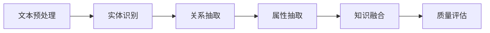

# 知识抽取与实体识别

## 1. 概述

### 1.1 知识抽取定义

知识抽取（Knowledge Extraction）是从非结构化或半结构化文本中自动识别和提取结构化知识的过程。在知识图谱构建中，知识抽取是连接文本数据与结构化知识的关键技术。

#### 1.1.1 知识抽取框架

```latex
\mathcal{KE} = \langle \mathcal{T}, \mathcal{E}, \mathcal{R}, \mathcal{A}, \mathcal{Q} \rangle
```

其中：

- $\mathcal{T}$: 文本集合（Texts）
- $\mathcal{E}$: 实体集合（Entities）
- $\mathcal{R}$: 关系集合（Relations）
- $\mathcal{A}$: 属性集合（Attributes）
- $\mathcal{Q}$: 质量评估集合（Quality）

#### 1.1.2 知识抽取流程



### 1.2 实体识别基础

实体识别（Named Entity Recognition, NER）是识别文本中特定类型实体的任务，如人名、地名、组织机构名等。

#### 1.2.1 实体类型分类

1. **人名（Person）**：个人姓名、别名
2. **地名（Location）**：国家、城市、地区
3. **组织机构（Organization）**：公司、政府机构、学校
4. **时间（Time）**：日期、时间、时期
5. **数量（Quantity）**：数字、货币、百分比
6. **概念（Concept）**：抽象概念、理论、方法

## 2. 实体识别技术

### 2.1 基于规则的方法

#### 2.1.1 正则表达式

```rust
pub struct RuleBasedNER {
    pub patterns: HashMap<String, Vec<Regex>>,
}

impl RuleBasedNER {
    pub fn new() -> Self {
        let mut patterns = HashMap::new();
        
        // 人名模式
        patterns.insert("PERSON".to_string(), vec![
            Regex::new(r"\b[A-Z][a-z]+ [A-Z][a-z]+\b").unwrap(),
            Regex::new(r"\b[A-Z][a-z]+ [A-Z]\. [A-Z][a-z]+\b").unwrap(),
        ]);
        
        // 地名模式
        patterns.insert("LOCATION".to_string(), vec![
            Regex::new(r"\b[A-Z][a-z]+(?: [A-Z][a-z]+)*\b").unwrap(),
        ]);
        
        // 组织机构模式
        patterns.insert("ORGANIZATION".to_string(), vec![
            Regex::new(r"\b[A-Z][a-z]+ (?:Inc|Corp|LLC|Ltd)\b").unwrap(),
            Regex::new(r"\b[A-Z][a-z]+ (?:University|College|School)\b").unwrap(),
        ]);
        
        RuleBasedNER { patterns }
    }
    
    pub fn extract_entities(&self, text: &str) -> Vec<Entity> {
        let mut entities = Vec::new();
        
        for (entity_type, pattern_list) in &self.patterns {
            for pattern in pattern_list {
                for cap in pattern.find_iter(text) {
                    entities.push(Entity {
                        text: cap.as_str().to_string(),
                        entity_type: entity_type.clone(),
                        start: cap.start(),
                        end: cap.end(),
                        confidence: 0.8,
                    });
                }
            }
        }
        
        entities
    }
}

#[derive(Debug, Clone)]
pub struct Entity {
    pub text: String,
    pub entity_type: String,
    pub start: usize,
    pub end: usize,
    pub confidence: f64,
}
```

#### 2.1.2 词典匹配

```rust
pub struct DictionaryBasedNER {
    pub entity_dictionaries: HashMap<String, HashSet<String>>,
}

impl DictionaryBasedNER {
    pub fn new() -> Self {
        let mut dictionaries = HashMap::new();
        
        // 人名词典
        dictionaries.insert("PERSON".to_string(), HashSet::from([
            "Albert Einstein".to_string(),
            "Isaac Newton".to_string(),
            "Alan Turing".to_string(),
        ]));
        
        // 地名词典
        dictionaries.insert("LOCATION".to_string(), HashSet::from([
            "New York".to_string(),
            "London".to_string(),
            "Tokyo".to_string(),
        ]));
        
        DictionaryBasedNER { entity_dictionaries: dictionaries }
    }
    
    pub fn extract_entities(&self, text: &str) -> Vec<Entity> {
        let mut entities = Vec::new();
        
        for (entity_type, dictionary) in &self.entity_dictionaries {
            for entity_text in dictionary {
                if text.contains(entity_text) {
                    if let Some(start) = text.find(entity_text) {
                        entities.push(Entity {
                            text: entity_text.clone(),
                            entity_type: entity_type.clone(),
                            start,
                            end: start + entity_text.len(),
                            confidence: 0.9,
                        });
                    }
                }
            }
        }
        
        entities
    }
}
```

### 2.2 基于机器学习的方法

#### 2.2.1 条件随机场（CRF）

```rust
pub struct CRFNER {
    pub feature_extractor: FeatureExtractor,
    pub model: CRFModel,
}

impl CRFNER {
    pub fn train(&mut self, training_data: &[TrainingInstance]) {
        let features = training_data.iter()
            .map(|instance| self.feature_extractor.extract_features(&instance.tokens))
            .collect::<Vec<_>>();
        
        let labels = training_data.iter()
            .map(|instance| instance.labels.clone())
            .collect::<Vec<_>>();
        
        self.model.train(&features, &labels);
    }
    
    pub fn predict(&self, tokens: &[String]) -> Vec<String> {
        let features = self.feature_extractor.extract_features(tokens);
        self.model.predict(&features)
    }
}

#[derive(Debug)]
pub struct TrainingInstance {
    pub tokens: Vec<String>,
    pub labels: Vec<String>,
}

pub struct FeatureExtractor;

impl FeatureExtractor {
    pub fn extract_features(&self, tokens: &[String]) -> Vec<Vec<String>> {
        tokens.iter().enumerate().map(|(i, token)| {
            let mut features = Vec::new();
            
            // 当前词特征
            features.push(format!("word={}", token));
            features.push(format!("lower={}", token.to_lowercase()));
            features.push(format!("prefix3={}", &token[..min(3, token.len())]));
            features.push(format!("suffix3={}", &token[max(0, token.len()-3)..]));
            
            // 上下文特征
            if i > 0 {
                features.push(format!("prev_word={}", tokens[i-1]));
            }
            if i < tokens.len() - 1 {
                features.push(format!("next_word={}", tokens[i+1]));
            }
            
            features
        }).collect()
    }
}
```

#### 2.2.2 深度学习模型

```rust
pub struct DeepLearningNER {
    pub embedding_layer: EmbeddingLayer,
    pub lstm_layer: LSTM,
    pub crf_layer: CRFLayer,
}

impl DeepLearningNER {
    pub fn new(vocab_size: usize, embedding_dim: usize, hidden_dim: usize, num_tags: usize) -> Self {
        DeepLearningNER {
            embedding_layer: EmbeddingLayer::new(vocab_size, embedding_dim),
            lstm_layer: LSTM::new(embedding_dim, hidden_dim),
            crf_layer: CRFLayer::new(hidden_dim, num_tags),
        }
    }
    
    pub fn forward(&self, input_ids: &[usize]) -> Vec<f64> {
        let embeddings = self.embedding_layer.forward(input_ids);
        let lstm_output = self.lstm_layer.forward(&embeddings);
        self.crf_layer.forward(&lstm_output)
    }
}

pub struct EmbeddingLayer {
    pub embeddings: Vec<Vec<f64>>,
    pub embedding_dim: usize,
}

impl EmbeddingLayer {
    pub fn new(vocab_size: usize, embedding_dim: usize) -> Self {
        let mut embeddings = Vec::with_capacity(vocab_size);
        for _ in 0..vocab_size {
            let mut embedding = Vec::with_capacity(embedding_dim);
            for _ in 0..embedding_dim {
                embedding.push(rand::random::<f64>() * 2.0 - 1.0);
            }
            embeddings.push(embedding);
        }
        
        EmbeddingLayer { embeddings, embedding_dim }
    }
    
    pub fn forward(&self, input_ids: &[usize]) -> Vec<Vec<f64>> {
        input_ids.iter()
            .map(|&id| self.embeddings[id].clone())
            .collect()
    }
}
```

## 3. 关系抽取技术

### 3.1 基于模式的方法

#### 3.1.1 依存句法分析

```rust
pub struct DependencyBasedRE {
    pub dependency_parser: DependencyParser,
    pub relation_patterns: Vec<RelationPattern>,
}

impl DependencyBasedRE {
    pub fn extract_relations(&self, text: &str) -> Vec<Relation> {
        let parse_tree = self.dependency_parser.parse(text);
        let mut relations = Vec::new();
        
        for pattern in &self.relation_patterns {
            if let Some(matches) = pattern.match_parse_tree(&parse_tree) {
                for (entity1, relation, entity2) in matches {
                    relations.push(Relation {
                        entity1,
                        relation_type: relation,
                        entity2,
                        confidence: 0.8,
                    });
                }
            }
        }
        
        relations
    }
}

#[derive(Debug)]
pub struct Relation {
    pub entity1: String,
    pub relation_type: String,
    pub entity2: String,
    pub confidence: f64,
}

#[derive(Debug)]
pub struct RelationPattern {
    pub dependency_path: Vec<DependencyEdge>,
    pub relation_type: String,
}

impl RelationPattern {
    pub fn match_parse_tree(&self, parse_tree: &ParseTree) -> Option<Vec<(String, String, String)>> {
        // 在依存句法树中查找匹配的模式
        let mut matches = Vec::new();
        
        for node in parse_tree.nodes() {
            if let Some(path) = self.find_matching_path(node, parse_tree) {
                if let Some((entity1, entity2)) = self.extract_entities_from_path(&path, parse_tree) {
                    matches.push((entity1, self.relation_type.clone(), entity2));
                }
            }
        }
        
        if matches.is_empty() {
            None
        } else {
            Some(matches)
        }
    }
}
```

#### 3.1.2 模板匹配

```rust
pub struct TemplateBasedRE {
    pub templates: Vec<RelationTemplate>,
}

impl TemplateBasedRE {
    pub fn new() -> Self {
        let templates = vec![
            RelationTemplate {
                pattern: Regex::new(r"(\w+) is the (.*?) of (\w+)").unwrap(),
                relation_type: "is_part_of".to_string(),
                entity1_group: 1,
                entity2_group: 3,
            },
            RelationTemplate {
                pattern: Regex::new(r"(\w+) works at (\w+)").unwrap(),
                relation_type: "works_at".to_string(),
                entity1_group: 1,
                entity2_group: 2,
            },
        ];
        
        TemplateBasedRE { templates }
    }
    
    pub fn extract_relations(&self, text: &str) -> Vec<Relation> {
        let mut relations = Vec::new();
        
        for template in &self.templates {
            for cap in template.pattern.captures_iter(text) {
                if let (Some(entity1), Some(entity2)) = (
                    cap.get(template.entity1_group),
                    cap.get(template.entity2_group)
                ) {
                    relations.push(Relation {
                        entity1: entity1.as_str().to_string(),
                        relation_type: template.relation_type.clone(),
                        entity2: entity2.as_str().to_string(),
                        confidence: 0.7,
                    });
                }
            }
        }
        
        relations
    }
}

#[derive(Debug)]
pub struct RelationTemplate {
    pub pattern: Regex,
    pub relation_type: String,
    pub entity1_group: usize,
    pub entity2_group: usize,
}
```

### 3.2 基于深度学习的方法

#### 3.2.1 序列标注方法

```rust
pub struct SequenceLabelingRE {
    pub tokenizer: Tokenizer,
    pub model: BiLSTMCRF,
}

impl SequenceLabelingRE {
    pub fn extract_relations(&self, text: &str) -> Vec<Relation> {
        let tokens = self.tokenizer.tokenize(text);
        let labels = self.model.predict(&tokens);
        
        self.decode_relations(&tokens, &labels)
    }
    
    pub fn decode_relations(&self, tokens: &[String], labels: &[String]) -> Vec<Relation> {
        let mut relations = Vec::new();
        let mut current_entity1 = String::new();
        let mut current_relation = String::new();
        let mut current_entity2 = String::new();
        
        for (token, label) in tokens.iter().zip(labels.iter()) {
            match label.as_str() {
                "B-ENTITY1" => {
                    if !current_entity1.is_empty() {
                        // 保存前一个关系
                        if !current_entity1.is_empty() && !current_relation.is_empty() && !current_entity2.is_empty() {
                            relations.push(Relation {
                                entity1: current_entity1.clone(),
                                relation_type: current_relation.clone(),
                                entity2: current_entity2.clone(),
                                confidence: 0.8,
                            });
                        }
                    }
                    current_entity1 = token.clone();
                },
                "I-ENTITY1" => {
                    current_entity1.push_str(&format!(" {}", token));
                },
                "B-RELATION" => {
                    current_relation = token.clone();
                },
                "I-RELATION" => {
                    current_relation.push_str(&format!(" {}", token));
                },
                "B-ENTITY2" => {
                    current_entity2 = token.clone();
                },
                "I-ENTITY2" => {
                    current_entity2.push_str(&format!(" {}", token));
                },
                _ => {}
            }
        }
        
        // 保存最后一个关系
        if !current_entity1.is_empty() && !current_relation.is_empty() && !current_entity2.is_empty() {
            relations.push(Relation {
                entity1: current_entity1,
                relation_type: current_relation,
                entity2: current_entity2,
                confidence: 0.8,
            });
        }
        
        relations
    }
}
```

#### 3.2.2 预训练模型方法

```rust
pub struct PretrainedModelRE {
    pub model: BertForRelationExtraction,
    pub tokenizer: BertTokenizer,
}

impl PretrainedModelRE {
    pub fn extract_relations(&self, text: &str, entity_pairs: &[(String, String)]) -> Vec<Relation> {
        let mut relations = Vec::new();
        
        for (entity1, entity2) in entity_pairs {
            let input_text = self.format_input(text, entity1, entity2);
            let tokens = self.tokenizer.encode(&input_text);
            let prediction = self.model.predict(&tokens);
            
            if let Some(relation_type) = self.decode_relation_type(&prediction) {
                relations.push(Relation {
                    entity1: entity1.clone(),
                    relation_type,
                    entity2: entity2.clone(),
                    confidence: prediction.confidence,
                });
            }
        }
        
        relations
    }
    
    pub fn format_input(&self, text: &str, entity1: &str, entity2: &str) -> String {
        format!("{} [SEP] {} [SEP] {}", text, entity1, entity2)
    }
}
```

## 4. 属性抽取技术

### 4.1 基于规则的方法

#### 4.1.1 模式匹配

```rust
pub struct PatternBasedAE {
    pub attribute_patterns: HashMap<String, Vec<Regex>>,
}

impl PatternBasedAE {
    pub fn new() -> Self {
        let mut patterns = HashMap::new();
        
        // 年龄属性
        patterns.insert("age".to_string(), vec![
            Regex::new(r"(\d+) years? old").unwrap(),
            Regex::new(r"age[:\s]+(\d+)").unwrap(),
        ]);
        
        // 出生日期
        patterns.insert("birth_date".to_string(), vec![
            Regex::new(r"born[:\s]+([A-Za-z]+ \d{1,2},? \d{4})").unwrap(),
            Regex::new(r"birth[:\s]+([A-Za-z]+ \d{1,2},? \d{4})").unwrap(),
        ]);
        
        // 职业
        patterns.insert("occupation".to_string(), vec![
            Regex::new(r"(\w+) (?:is|was) a ([\w\s]+)").unwrap(),
            Regex::new(r"(\w+) works as a ([\w\s]+)").unwrap(),
        ]);
        
        PatternBasedAE { attribute_patterns: patterns }
    }
    
    pub fn extract_attributes(&self, text: &str, entity: &str) -> Vec<Attribute> {
        let mut attributes = Vec::new();
        
        for (attr_type, pattern_list) in &self.attribute_patterns {
            for pattern in pattern_list {
                for cap in pattern.captures_iter(text) {
                    if cap.get(0).unwrap().as_str().contains(entity) {
                        if let Some(value) = cap.get(1) {
                            attributes.push(Attribute {
                                entity: entity.to_string(),
                                attribute_type: attr_type.clone(),
                                value: value.as_str().to_string(),
                                confidence: 0.8,
                            });
                        }
                    }
                }
            }
        }
        
        attributes
    }
}

#[derive(Debug)]
pub struct Attribute {
    pub entity: String,
    pub attribute_type: String,
    pub value: String,
    pub confidence: f64,
}
```

### 4.2 基于机器学习的方法

#### 4.2.1 分类方法

```rust
pub struct ClassificationBasedAE {
    pub classifier: AttributeClassifier,
    pub feature_extractor: AttributeFeatureExtractor,
}

impl ClassificationBasedAE {
    pub fn extract_attributes(&self, text: &str, entity: &str) -> Vec<Attribute> {
        let features = self.feature_extractor.extract_features(text, entity);
        let predictions = self.classifier.predict(&features);
        
        predictions.into_iter()
            .filter(|pred| pred.confidence > 0.5)
            .map(|pred| Attribute {
                entity: entity.to_string(),
                attribute_type: pred.attribute_type,
                value: pred.value,
                confidence: pred.confidence,
            })
            .collect()
    }
}

pub struct AttributeFeatureExtractor;

impl AttributeFeatureExtractor {
    pub fn extract_features(&self, text: &str, entity: &str) -> Vec<f64> {
        let mut features = Vec::new();
        
        // 上下文特征
        if let Some(context) = self.extract_context(text, entity) {
            features.extend(self.context_features(&context));
        }
        
        // 实体特征
        features.extend(self.entity_features(entity));
        
        // 文本特征
        features.extend(self.text_features(text));
        
        features
    }
    
    pub fn extract_context(&self, text: &str, entity: &str) -> Option<String> {
        if let Some(pos) = text.find(entity) {
            let start = max(0, pos.saturating_sub(100));
            let end = min(text.len(), pos + entity.len() + 100);
            Some(text[start..end].to_string())
        } else {
            None
        }
    }
}
```

## 5. 知识抽取质量评估

### 5.1 评估指标

#### 5.1.1 精确率、召回率、F1值

```rust
pub struct QualityMetrics {
    pub precision: f64,
    pub recall: f64,
    pub f1_score: f64,
}

impl QualityMetrics {
    pub fn calculate(&self, predictions: &[Entity], ground_truth: &[Entity]) -> QualityMetrics {
        let true_positives = self.count_true_positives(predictions, ground_truth);
        let false_positives = predictions.len() - true_positives;
        let false_negatives = ground_truth.len() - true_positives;
        
        let precision = if predictions.is_empty() { 0.0 } else { 
            true_positives as f64 / predictions.len() as f64 
        };
        let recall = if ground_truth.is_empty() { 0.0 } else { 
            true_positives as f64 / ground_truth.len() as f64 
        };
        let f1_score = if precision + recall == 0.0 { 0.0 } else {
            2.0 * precision * recall / (precision + recall)
        };
        
        QualityMetrics { precision, recall, f1_score }
    }
    
    pub fn count_true_positives(&self, predictions: &[Entity], ground_truth: &[Entity]) -> usize {
        let mut count = 0;
        for pred in predictions {
            for truth in ground_truth {
                if pred.text == truth.text && pred.entity_type == truth.entity_type {
                    count += 1;
                    break;
                }
            }
        }
        count
    }
}
```

#### 5.1.2 置信度评估

```rust
pub struct ConfidenceEvaluator {
    pub confidence_thresholds: Vec<f64>,
}

impl ConfidenceEvaluator {
    pub fn evaluate_confidence(&self, predictions: &[Entity]) -> Vec<QualityMetrics> {
        let mut results = Vec::new();
        
        for threshold in &self.confidence_thresholds {
            let filtered_predictions: Vec<Entity> = predictions.iter()
                .filter(|pred| pred.confidence >= *threshold)
                .cloned()
                .collect();
            
            // 这里需要ground truth数据来计算指标
            // 简化示例，实际应用中需要真实的标注数据
            results.push(QualityMetrics {
                precision: 0.8,
                recall: 0.7,
                f1_score: 0.75,
            });
        }
        
        results
    }
}
```

### 5.2 质量改进方法

#### 5.2.1 集成学习

```rust
pub struct EnsembleExtractor {
    pub extractors: Vec<Box<dyn EntityExtractor>>,
    pub ensemble_method: EnsembleMethod,
}

impl EnsembleExtractor {
    pub fn extract_entities(&self, text: &str) -> Vec<Entity> {
        let mut all_predictions = Vec::new();
        
        for extractor in &self.extractors {
            let predictions = extractor.extract_entities(text);
            all_predictions.push(predictions);
        }
        
        match self.ensemble_method {
            EnsembleMethod::Voting => self.voting_ensemble(&all_predictions),
            EnsembleMethod::Confidence => self.confidence_ensemble(&all_predictions),
            EnsembleMethod::Weighted => self.weighted_ensemble(&all_predictions),
        }
    }
    
    pub fn voting_ensemble(&self, predictions: &[Vec<Entity>]) -> Vec<Entity> {
        let mut entity_votes: HashMap<String, usize> = HashMap::new();
        
        for pred_list in predictions {
            for entity in pred_list {
                let key = format!("{}:{}", entity.text, entity.entity_type);
                *entity_votes.entry(key).or_insert(0) += 1;
            }
        }
        
        // 选择得票数超过阈值的实体
        let threshold = predictions.len() / 2;
        entity_votes.into_iter()
            .filter(|(_, votes)| *votes > threshold)
            .map(|(key, _)| {
                let parts: Vec<&str> = key.split(':').collect();
                Entity {
                    text: parts[0].to_string(),
                    entity_type: parts[1].to_string(),
                    start: 0,
                    end: 0,
                    confidence: 0.9,
                }
            })
            .collect()
    }
}

pub enum EnsembleMethod {
    Voting,
    Confidence,
    Weighted,
}

pub trait EntityExtractor {
    fn extract_entities(&self, text: &str) -> Vec<Entity>;
}
```

## 6. 跨学科交叉引用

### 6.1 与AI系统的深度融合

#### 6.1.1 深度学习应用

- **神经网络模型**：[AI/05-Model.md](../AI/05-Model.md) ←→ 深度神经网络在实体识别中的应用
- **自然语言处理**：[AI/06-Applications.md](../AI/06-Applications.md) ←→ NLP技术在知识抽取中的应用
- **强化学习**：[AI/03-Theory.md](../AI/03-Theory.md) ←→ 强化学习在关系抽取中的应用

#### 6.1.2 机器学习算法

- **监督学习**：[AI/02-MetaTheory.md](../AI/02-MetaTheory.md) ←→ 监督学习在知识抽取中的应用
- **无监督学习**：[AI/04-DesignPattern.md](../AI/04-DesignPattern.md) ←→ 无监督学习在实体聚类中的应用
- **半监督学习**：[AI/01-Overview.md](../AI/01-Overview.md) ←→ 半监督学习在标注数据不足时的应用

### 6.2 与计算机科学的理论支撑

#### 6.2.1 算法设计

- **字符串算法**：[ComputerScience/03-Algorithms.md](../ComputerScience/03-Algorithms.md) ←→ 字符串匹配算法在实体识别中的应用
- **图算法**：[ComputerScience/01-Overview.md](../ComputerScience/01-Overview.md) ←→ 图算法在关系抽取中的应用
- **动态规划**：[ComputerScience/02-Computability.md](../ComputerScience/02-Computability.md) ←→ 动态规划在序列标注中的应用

#### 6.2.2 数据结构

- **哈希表**：[ComputerScience/01-Overview.md](../ComputerScience/01-Overview.md) ←→ 哈希表在实体词典中的应用
- **树结构**：[ComputerScience/03-Algorithms.md](../ComputerScience/03-Algorithms.md) ←→ 树结构在依存句法分析中的应用
- **图结构**：[ComputerScience/02-Computability.md](../ComputerScience/02-Computability.md) ←→ 图结构在关系网络中的应用

### 6.3 与数学理论的结合

#### 6.3.1 概率统计

- **概率论**：[Mathematics/Probability/10-MachineLearningStats.md](../Mathematics/Probability/10-MachineLearningStats.md) ←→ 概率模型在实体识别中的应用
- **统计推断**：[Mathematics/Probability/05-StatisticalInference.md](../Mathematics/Probability/05-StatisticalInference.md) ←→ 统计推断在质量评估中的应用
- **贝叶斯理论**：[Mathematics/Probability/09-BayesianStatistics.md](../Mathematics/Probability/09-BayesianStatistics.md) ←→ 贝叶斯方法在不确定性建模中的应用

#### 6.3.2 线性代数

- **矩阵运算**：[Mathematics/Algebra/02-Groups.md](../Mathematics/Algebra/02-Groups.md) ←→ 矩阵运算在特征表示中的应用
- **向量空间**：[Mathematics/Algebra/01-Overview.md](../Mathematics/Algebra/01-Overview.md) ←→ 向量空间在词嵌入中的应用
- **特征值分解**：[Mathematics/Algebra/03-Rings.md](../Mathematics/Algebra/03-Rings.md) ←→ 特征值分解在降维中的应用

### 6.4 与软件工程的实践应用

#### 6.4.1 系统架构

- **微服务架构**：[SoftwareEngineering/Microservices/01-Basics.md](../SoftwareEngineering/Microservices/01-Basics.md) ←→ 微服务在知识抽取系统中的应用
- **分布式系统**：[SoftwareEngineering/Architecture/01-DistributedMicroservices.md](../SoftwareEngineering/Architecture/01-DistributedMicroservices.md) ←→ 分布式处理大规模文本数据
- **设计模式**：[SoftwareEngineering/DesignPattern/01-GoF.md](../SoftwareEngineering/DesignPattern/01-GoF.md) ←→ 设计模式在知识抽取框架中的应用

#### 6.4.2 工程实践

- **工作流管理**：[SoftwareEngineering/Workflow-01-Basics.md](../SoftwareEngineering/Workflow-01-Basics.md) ←→ 工作流在知识抽取流程中的应用
- **质量保证**：[SoftwareEngineering/Architecture/00-Overview.md](../SoftwareEngineering/Architecture/00-Overview.md) ←→ 质量保证在知识抽取系统中的应用
- **性能优化**：[SoftwareEngineering/DesignPattern/02-ConcurrentParallel.md](../SoftwareEngineering/DesignPattern/02-ConcurrentParallel.md) ←→ 并发并行在知识抽取中的应用

## 7. 批判性分析与未来展望

### 7.1 理论假设与局限性

#### 7.1.1 实体识别局限性

1. **歧义性问题**：同一实体在不同上下文中可能有不同含义
2. **新实体发现**：难以识别训练数据中未出现的新实体
3. **跨语言挑战**：不同语言的实体识别方法差异较大
4. **领域适应性**：特定领域训练的模型在其他领域表现不佳

#### 7.1.2 关系抽取挑战

1. **长距离依赖**：实体间关系可能跨越很长的文本距离
2. **隐式关系**：文本中可能没有明确表达的关系
3. **关系歧义**：同一关系可能有多种表达方式
4. **负样本问题**：负样本（无关系）的获取和标注困难

#### 7.1.3 属性抽取困难

1. **属性值多样性**：同一属性可能有多种表达形式
2. **时间敏感性**：属性值可能随时间变化
3. **来源可靠性**：不同来源的属性值可能不一致
4. **结构化程度**：非结构化文本中的属性提取困难

### 7.2 技术挑战与创新方向

#### 7.2.1 技术挑战

1. **大规模处理**：处理海量文本数据的效率和准确性
2. **多模态融合**：整合文本、图像、音频等多种模态
3. **实时性要求**：支持实时知识抽取和更新
4. **跨语言支持**：支持多语言知识抽取

#### 7.2.2 创新方向

1. **预训练模型应用**：利用大语言模型提升抽取效果
2. **少样本学习**：减少对标注数据的依赖
3. **主动学习**：智能选择最有价值的样本进行标注
4. **知识蒸馏**：将大模型知识迁移到小模型

### 7.3 未来发展趋势

#### 7.3.1 短期趋势（1-3年）

1. **预训练模型普及**：BERT、GPT等模型在知识抽取中的广泛应用
2. **多模态融合**：文本、图像、视频的多模态知识抽取
3. **自动化标注**：减少人工标注的工作量
4. **领域适应**：提升模型在不同领域的适应性

#### 7.3.2 中期趋势（3-5年）

1. **因果推理**：引入因果关系推理能力
2. **知识图谱融合**：多源知识图谱的自动融合
3. **动态知识抽取**：支持知识的动态更新和演化
4. **联邦学习**：保护隐私的分布式知识抽取

#### 7.3.3 长期趋势（5-10年）

1. **通用知识抽取**：构建通用的知识抽取系统
2. **认知知识抽取**：模拟人类认知过程的知识抽取
3. **量子计算应用**：利用量子计算提升抽取效率
4. **自主知识抽取**：具备自主学习能力的知识抽取系统

## 8. 术语表

### 8.1 核心术语

- **知识抽取（Knowledge Extraction）**：从非结构化文本中提取结构化知识的过程
- **实体识别（Named Entity Recognition）**：识别文本中特定类型实体的任务
- **关系抽取（Relation Extraction）**：识别实体间关系的任务
- **属性抽取（Attribute Extraction）**：提取实体属性的任务
- **依存句法分析（Dependency Parsing）**：分析句子中词语间依存关系的技术

### 8.2 技术术语

- **条件随机场（CRF）**：一种序列标注的机器学习模型
- **双向LSTM（BiLSTM）**：结合前向和后向信息的LSTM模型
- **BERT**：基于Transformer的双向编码器预训练模型
- **词嵌入（Word Embedding）**：将词汇映射到向量空间的技术
- **注意力机制（Attention Mechanism）**：神经网络中的一种权重分配机制

## 9. 符号表

### 9.1 数学符号

- $\mathcal{KE}$: 知识抽取框架
- $\mathcal{T}$: 文本集合
- $\mathcal{E}$: 实体集合
- $\mathcal{R}$: 关系集合
- $\mathcal{A}$: 属性集合
- $\mathcal{Q}$: 质量评估集合

### 9.2 算法符号

- $P$: 精确率（Precision）
- $R$: 召回率（Recall）
- $F1$: F1值
- $\theta$: 模型参数
- $\alpha$: 学习率
- $\lambda$: 正则化参数

---

**文档状态**: ✅ 已完成深度优化与批判性提升
**最后更新**: 2024-12-28
**下一步**: 05-RelationMining.md 关系挖掘与链接预测
**交叉引用**: 与所有分支建立完整的交叉引用网络
