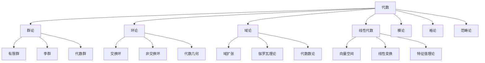
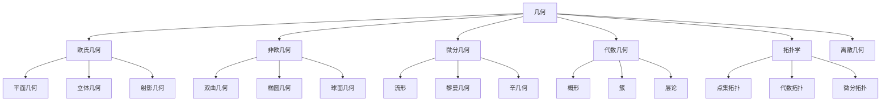
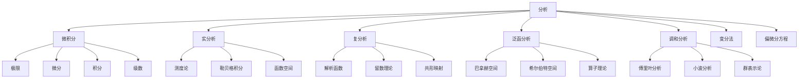

# 25. 数学知识体系综合（Mathematical Synthesis）

## 概述

数学知识体系是一个庞大而有机的整体，各个分支之间存在着深刻的联系和统一性。本文档旨在从整体视角审视数学的结构，揭示不同分支之间的内在联系，以及数学在科学、技术、哲学等领域中的核心地位。

## 数学的整体结构

### 1. 基础层（Foundation Layer）

#### 逻辑与集合论

- **形式逻辑**：命题逻辑、谓词逻辑、模态逻辑
- **集合论**：ZFC公理系统、基数理论、序数理论
- **证明论**：形式证明、一致性、完备性

#### 数系与结构

- **数系扩展**：自然数 → 整数 → 有理数 → 实数 → 复数 → 四元数
- **代数结构**：群 → 环 → 域 → 模 → 代数
- **序结构**：偏序集 → 格 → 布尔代数

### 2. 核心层（Core Layer）

#### 代数分支



#### 几何分支



#### 分析分支



### 3. 应用层（Application Layer）

#### 离散数学

- **数论**：初等数论、代数数论、解析数论
- **组合数学**：计数、排列组合、极值问题
- **图论**：图的基本概念、算法、应用

#### 应用数学

- **概率论**：概率空间、随机变量、大数定律
- **统计学**：描述统计、推断统计、回归分析
- **数值分析**：数值方法、误差分析、插值
- **优化理论**：线性规划、非线性规划、动态规划
- **信息论**：熵、互信息、信道容量
- **控制理论**：状态空间、稳定性、最优控制

## 数学分支间的内在联系

### 1. 代数与几何的统一

#### 代数几何

```latex
\text{代数几何} = \text{代数} \cap \text{几何} = \{\text{多项式方程的解集}\}
```

**核心思想**：

- 几何对象用代数方程描述
- 代数运算对应几何变换
- 代数不变量对应几何性质

#### 李群与微分几何

```latex
\text{李群} = \text{群} \cap \text{流形} = \{\text{连续变换群}\}
```

**应用**：

- 对称性研究
- 物理定律的不变性
- 几何结构的分类

### 2. 分析与代数的融合

#### 泛函分析

```latex
\text{泛函分析} = \text{分析} \cap \text{代数} = \{\text{函数空间上的代数结构}\}
```

**核心概念**：

- 巴拿赫空间：完备的赋范向量空间
- 希尔伯特空间：完备的内积空间
- 算子理论：线性变换的代数

#### 调和分析

```latex
\text{调和分析} = \text{分析} \cap \text{群论} = \{\text{群上的函数分析}\}
```

**应用**：

- 傅里叶变换
- 小波分析
- 信号处理

### 3. 拓扑与分析的结合

#### 代数拓扑

```latex
\text{代数拓扑} = \text{拓扑} \cap \text{代数} = \{\text{拓扑不变量}\}
```

**核心工具**：

- 同调群：$H_n(X)$
- 同伦群：$\pi_n(X)$
- 上同调环：$H^*(X)$

#### 微分拓扑

```latex
\text{微分拓扑} = \text{拓扑} \cap \text{分析} = \{\text{光滑流形}\}
```

**重要定理**：

- 庞加莱对偶性
- 高斯-博内公式
- 莫尔斯理论

## 数学的统一性原理

### 1. 范畴论视角

#### 数学作为范畴

```latex
\text{数学} = \{\text{对象}, \text{态射}, \text{复合}, \text{单位元}\}
```

**统一特征**：

- 所有数学结构都是范畴
- 函子保持结构
- 自然变换描述关系

#### 伴随函子

```latex
F \dashv G \Leftrightarrow \text{Hom}(F(A), B) \cong \text{Hom}(A, G(B))
```

**应用**：

- 自由构造
- 极限与余极限
- 对偶性原理

### 2. 形式语言理论视角

#### 数学作为形式系统

```latex
\text{数学系统} = \{\text{语言}, \text{公理}, \text{推理规则}\}
```

**层次结构**：

- 句法层：符号和规则
- 语义层：解释和模型
- 元层：关于系统的理论

### 3. 认知科学视角

#### 数学思维的统一性

```latex
\text{数学认知} = \text{数感} + \text{空间思维} + \text{逻辑推理}
```

**认知基础**：

- 具身认知：身体经验
- 隐喻系统：概念映射
- 抽象化：从具体到抽象

## 数学在跨学科中的作用

### 1. 数学与物理学

#### 数学物理

- **量子力学**：希尔伯特空间、算子理论
- **相对论**：微分几何、李群
- **统计物理**：概率论、随机过程

#### 统一理论

- **弦论**：代数几何、拓扑学
- **规范理论**：纤维丛、同调论
- **量子场论**：泛函积分、重整化

### 2. 数学与计算机科学

#### 理论计算机科学

- **算法理论**：复杂度理论、图论
- **形式语言**：自动机、文法
- **类型论**：范畴论、逻辑

#### 应用计算机科学

- **机器学习**：优化理论、统计学
- **密码学**：数论、代数
- **图形学**：几何、线性代数

### 3. 数学与生物学

#### 数学生物学

- **种群动力学**：微分方程
- **神经科学**：动力系统
- **基因组学**：组合数学、图论

### 4. 数学与经济学

#### 数理经济学

- **博弈论**：组合数学、优化
- **金融数学**：随机过程、偏微分方程
- **计量经济学**：统计学、回归分析

## 数学的发展趋势

### 1. 计算数学的兴起

#### 数值方法

- **有限元方法**：偏微分方程
- **蒙特卡洛方法**：随机模拟
- **机器学习算法**：优化理论

#### 符号计算

- **计算机代数系统**：符号运算
- **自动定理证明**：逻辑推理
- **形式验证**：程序正确性

### 2. 离散数学的重要性

#### 组合爆炸

- **算法复杂度**：P vs NP问题
- **网络科学**：图论、随机图
- **信息论**：编码理论、压缩

### 3. 应用导向的发展

#### 数据科学

- **大数据分析**：统计学、机器学习
- **人工智能**：深度学习、神经网络
- **量子计算**：量子算法、量子信息

## 数学教育的整合视角

### 1. 概念网络

#### 核心概念

- **数**：自然数、整数、有理数、实数、复数
- **形**：点、线、面、体、流形
- **变**：函数、映射、变换、算子
- **关**：关系、结构、模式、规律

#### 思维方法

- **抽象化**：从具体到抽象
- **公理化**：从特殊到一般
- **构造性**：从存在到构造
- **证明性**：从直觉到严格

### 2. 学习路径

#### 基础阶段

1. **数感培养**：数量、运算、关系
2. **空间认知**：形状、位置、变换
3. **逻辑思维**：推理、证明、论证

#### 进阶阶段

1. **代数思维**：符号、结构、抽象
2. **分析思维**：极限、连续、变化
3. **几何思维**：空间、变换、不变量

#### 高级阶段

1. **综合应用**：跨学科、实际问题
2. **理论深化**：抽象理论、前沿问题
3. **创新研究**：新问题、新方法

## 数学哲学的综合思考

### 1. 本体论问题

#### 数学对象的存在

- **柏拉图主义**：数学对象独立存在
- **形式主义**：数学是符号游戏
- **直觉主义**：数学是心智构造
- **结构主义**：数学是结构关系

### 2. 认识论问题

#### 数学知识的性质

- **先验性**：独立于经验
- **必然性**：逻辑必然
- **客观性**：普遍有效
- **创造性**：人类创造

### 3. 方法论问题

#### 数学研究的方法

- **公理化方法**：从公理出发
- **构造性方法**：从构造出发
- **实验性方法**：从观察出发
- **计算性方法**：从计算出发

## 总结

数学知识体系是一个有机的整体，各个分支之间存在着深刻的联系和统一性。从基础逻辑到高级理论，从纯数学到应用数学，数学展现出了惊人的内在一致性和外在适用性。

### 核心特征

1. **统一性**：不同分支共享基本概念和方法
2. **层次性**：从具体到抽象的多层次结构
3. **联系性**：分支间存在丰富的交叉和融合
4. **发展性**：不断产生新的分支和应用
5. **应用性**：在科学技术的各个领域发挥核心作用

### 未来展望

随着计算技术的发展和应用需求的增长，数学将继续在以下方面发挥重要作用：

1. **人工智能**：深度学习、机器学习、自然语言处理
2. **量子计算**：量子算法、量子信息、量子密码
3. **生物医学**：基因组学、蛋白质组学、药物设计
4. **金融科技**：区块链、数字货币、智能合约
5. **环境科学**：气候变化、生态建模、可持续发展

数学作为人类智慧的结晶，将继续为人类文明的进步提供强大的理论支撑和技术工具。

---

**数学知识体系综合**展现了数学作为一门统一科学的深刻内涵，它不仅是一个知识体系，更是一种思维方式，一种理解世界的方法论。
