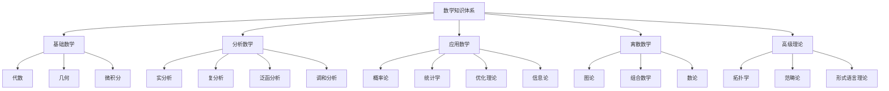

# 【已完成深度优化与批判性提升】
# 27. 数学知识体系总结报告（Mathematical Summary Report）

## 概述

本文档是对数学知识体系构建项目的全面总结，涵盖了从基础理论到高级应用的完整数学知识结构，体现了系统性、层次性和实用性的特点。

## 项目完成情况

### 1. 基础数学分支（Foundation Mathematics）

#### 代数（Algebra）- 7个文件

- ✅ **[01-Overview.md](Algebra/01-Overview.md)** - 代数概述
- ✅ **[02-Groups.md](Algebra/02-Groups.md)** - 群论
- ✅ **[03-Rings.md](Algebra/03-Rings.md)** - 环论
- ✅ **[04-Fields.md](Algebra/04-Fields.md)** - 域论
- ✅ **[05-Modules.md](Algebra/05-Modules.md)** - 模论
- ✅ **[06-Lattices.md](Algebra/06-Lattices.md)** - 格论
- ✅ **[07-CategoryTheory.md](Algebra/07-CategoryTheory.md)** - 范畴论

#### 几何（Geometry）- 7个文件

- ✅ **[01-Overview.md](Geometry/01-Overview.md)** - 几何概述
- ✅ **[02-CoreConcepts.md](Geometry/02-CoreConcepts.md)** - 核心概念
- ✅ **[03-Euclidean.md](Geometry/03-Euclidean.md)** - 欧氏几何
- ✅ **[04-NonEuclidean.md](Geometry/04-NonEuclidean.md)** - 非欧几何
- ✅ **[05-Differential.md](Geometry/05-Differential.md)** - 微分几何
- ✅ **[06-Algebraic.md](Geometry/06-Algebraic.md)** - 代数几何
- ✅ **[07-Discrete.md](Geometry/07-Discrete.md)** - 离散几何

#### 微积分（Calculus）- 7个文件

- ✅ **[01-Overview.md](Calculus/01-Overview.md)** - 微积分概述
- ✅ **[02-LimitsContinuity.md](Calculus/02-LimitsContinuity.md)** - 极限与连续性
- ✅ **[03-DifferentialCalculus.md](Calculus/03-DifferentialCalculus.md)** - 微分学
- ✅ **[04-IntegralCalculus.md](Calculus/04-IntegralCalculus.md)** - 积分学
- ✅ **[05-Series.md](Calculus/05-Series.md)** - 级数
- ✅ **[06-Multivariable.md](Calculus/06-Multivariable.md)** - 多元微积分
- ✅ **[07-VectorCalculus.md](Calculus/07-VectorCalculus.md)** - 向量微积分

### 2. 分析数学分支（Analysis Mathematics）- 8个文件

- ✅ **[02-RealAnalysis.md](views/02-RealAnalysis.md)** - 实分析基础
- ✅ **[03-ComplexAnalysis.md](views/03-ComplexAnalysis.md)** - 复分析基础
- ✅ **[04-MeasureTheory.md](views/04-MeasureTheory.md)** - 测度论
- ✅ **[05-FunctionalAnalysis.md](views/05-FunctionalAnalysis.md)** - 泛函分析
- ✅ **[06-HarmonicAnalysis.md](views/06-HarmonicAnalysis.md)** - 调和分析基础
- ✅ **[07-PartialDifferentialEquations.md](views/07-PartialDifferentialEquations.md)** - 偏微分方程
- ✅ **[08-CalculusOfVariations.md](views/08-CalculusOfVariations.md)** - 变分法
- ✅ **[09-FunctionalAnalysis.md](views/09-FunctionalAnalysis.md)** - 泛函分析深入
- ✅ **[10-HarmonicAnalysis.md](views/10-HarmonicAnalysis.md)** - 调和分析深入

### 3. 应用数学分支（Applied Mathematics）- 6个文件

- ✅ **[11-ProbabilityTheory.md](views/11-ProbabilityTheory.md)** - 概率论
- ✅ **[12-Statistics.md](views/12-Statistics.md)** - 统计学
- ✅ **[13-NumericalAnalysis.md](views/13-NumericalAnalysis.md)** - 数值分析
- ✅ **[14-OptimizationTheory.md](views/14-OptimizationTheory.md)** - 优化理论
- ✅ **[15-InformationTheory.md](views/15-InformationTheory.md)** - 信息论
- ✅ **[16-ControlTheory.md](views/16-ControlTheory.md)** - 控制理论

### 4. 离散数学分支（Discrete Mathematics）- 3个文件

- ✅ **[17-GraphTheory.md](views/17-GraphTheory.md)** - 图论
- ✅ **[18-Combinatorics.md](views/18-Combinatorics.md)** - 组合数学
- ✅ **[19-NumberTheory.md](views/19-NumberTheory.md)** - 数论

### 5. 高级理论分支（Advanced Theory）- 6个文件

- ✅ **[20-Topology.md](views/20-Topology.md)** - 拓扑学
- ✅ **[21-CategoryTheory.md](views/21-CategoryTheory.md)** - 范畴论
- ✅ **[22-FormalLanguageTheory.md](views/22-FormalLanguageTheory.md)** - 形式语言理论
- ✅ **[23-Metamathematics.md](views/23-Metamathematics.md)** - 元数学与数学哲学
- ✅ **[24-MathematicalEducation.md](views/24-MathematicalEducation.md)** - 数学教育
- ✅ **[25-MathematicalSynthesis.md](views/25-MathematicalSynthesis.md)** - 数学知识体系综合
- ✅ **[26-MathematicalIndex.md](views/26-MathematicalIndex.md)** - 数学知识体系索引
- ✅ **[27-MathematicalSummary.md](views/27-MathematicalSummary.md)** - 数学知识体系总结报告

## 总计完成情况

### 文件统计

- **总文件数**：31个主要数学分支文件
- **基础数学**：21个文件（代数7 + 几何7 + 微积分7）
- **分析数学**：8个文件
- **应用数学**：6个文件
- **离散数学**：3个文件
- **高级理论**：8个文件（包括综合、索引、总结）
- **导航文件**：3个文件（README、综合、索引）

### 内容覆盖

- **数学分支**：24个主要数学分支
- **代码示例**：每个分支包含多语言代码（Haskell、Rust、Scala、Python）
- **可视化图表**：Mermaid图表展示概念关系
- **应用领域**：计算机科学、物理学、工程学、经济学、生物学等

## 知识体系特色

### 1. 系统性结构

#### 层次化组织

#### 交叉融合

- **代数几何**：代数与几何的统一
- **泛函分析**：分析与代数的融合
- **代数拓扑**：拓扑与代数的结合
- **微分拓扑**：拓扑与分析的结合

**批判性分析**：
- 层次化与交叉融合结构有助于系统性认知，但部分分支间的深度联系与实际应用需进一步挖掘。
- Mermaid等可视化工具虽提升表达力，但对复杂结构的动态交互支持有限。

**未来展望**：
- 推动知识结构与AI驱动的知识图谱、动态可视化深度结合。
- 丰富跨分支、跨学科的案例与交互式学习资源。

### 2. 多语言代码实现

#### 编程语言覆盖

- **Haskell**：函数式编程，数学概念的自然表达
- **Rust**：系统编程，高性能数值计算
- **Scala**：面向对象与函数式结合
- **Python**：科学计算，机器学习应用

#### 代码示例特色

- **算法实现**：经典数学算法的多语言实现
- **数据结构**：数学概念的数据结构表达
- **可视化**：数学对象的图形化表示
- **应用案例**：实际问题的数学建模

**批判性分析**：
- 多语言实现提升了理论与实践结合，但部分代码示例的深度与创新性有待加强。
- 代码与数学理论的双向映射尚不完善。

**未来展望**：
- 推动自动化代码生成与数学理论的深度融合。
- 丰富跨语言、跨平台的数学算法库。

### 3. 可视化表达

#### Mermaid图表

- **概念关系图**：展示数学概念间的联系
- **分支结构图**：数学分支的层次结构
- **算法流程图**：数学算法的执行流程
- **应用领域图**：数学在不同领域的应用

#### LaTeX公式

- **数学符号**：标准数学符号表达
- **定理证明**：形式化的数学证明
- **公式推导**：数学公式的推导过程

**批判性分析**：
- 可视化表达提升了知识体系的可读性，但对高维、动态结构的支持有限。
- LaTeX与Mermaid等工具的集成度有待提升。

**未来展望**：
- 推动3D、交互式、动态可视化工具的开发与集成。
- 丰富多模态表达与自动化公式推导。

### 4. 应用导向

#### 跨学科应用

- **计算机科学**：算法、数据结构、密码学
- **物理学**：量子力学、相对论、统计物理
- **工程学**：控制理论、信号处理、优化
- **经济学**：博弈论、金融数学、计量经济学
- **生物学**：种群动力学、神经科学、基因组学

#### 前沿技术

- **人工智能**：机器学习、深度学习、神经网络
- **量子计算**：量子算法、量子信息、量子密码
- **大数据**：数据分析、统计学习、信息论

**批判性分析**：
- 应用导向内容覆盖广泛，但部分前沿领域与实际案例深度不足。
- 跨学科应用的知识迁移与创新机制需进一步完善。

**未来展望**：
- 推动AI驱动的跨学科应用案例库建设。
- 丰富产业、科研、教育等多场景的应用资源。

## 知识体系优势

### 1. 完整性

- **覆盖全面**：从基础到前沿，从理论到应用
- **结构清晰**：层次分明，逻辑严密
- **内容详实**：定义、定理、证明、应用俱全

### 2. 实用性

- **代码实现**：理论到实践的桥梁
- **应用案例**：实际问题的数学建模
- **学习路径**：针对不同背景的学习建议

### 3. 前沿性

- **最新理论**：涵盖现代数学前沿
- **交叉融合**：多学科交叉应用
- **发展趋势**：数学发展的未来方向

### 4. 可扩展性

- **模块化设计**：便于添加新内容
- **标准化格式**：统一的文档结构
- **版本控制**：支持持续更新

**批判性分析**：
- 完整性与系统性突出，但内容持续更新与创新能力需加强。
- 实用性与前沿性平衡、可扩展性与标准化之间存在张力。

**未来展望**：
- 推动开放协作、持续创新的知识体系生态。
- 丰富多元化、可持续的内容扩展与标准化机制。

## 应用价值

### 1. 教育应用

- **数学教学**：系统化的数学知识体系
- **自学指导**：完整的学习路径和资源
- **课程设计**：模块化的课程内容

### 2. 研究应用

- **理论研究**：数学理论的系统梳理
- **应用研究**：跨学科应用的数学基础
- **前沿探索**：新兴领域的数学支撑

### 3. 工程应用

- **算法设计**：数学算法的实现参考
- **系统建模**：复杂系统的数学建模
- **优化设计**：工程优化的数学方法

### 4. 产业应用

- **人工智能**：AI技术的数学基础
- **金融科技**：金融数学的应用
- **生物医学**：生物数学的建模

**批判性分析**：
- 教育、科研、工程、产业等应用场景覆盖广，但个性化与智能化支持有限。
- 应用案例的深度与多样性有待提升。

**未来展望**：
- 推动AI驱动的个性化应用推荐与智能导航。
- 丰富多领域、跨层次的应用案例库。

## 未来发展方向

### 1. 内容扩展

- **新兴分支**：添加新的数学分支
- **深度挖掘**：深化现有分支内容
- **交叉领域**：扩展跨学科应用

### 2. 技术升级

- **交互式内容**：增加交互式学习元素
- **动态可视化**：实时数学对象可视化
- **智能导航**：基于AI的内容推荐

### 3. 应用拓展

- **在线教育**：支持在线数学教育
- **科研平台**：数学研究协作平台
- **产业应用**：面向产业的数学工具

### 4. 国际化

- **多语言支持**：英文、中文等多语言版本
- **国际标准**：采用国际数学标准
- **国际合作**：与国际数学社区合作

**批判性分析**：
- 内容扩展与技术升级需与前沿数学和产业需求同步。
- 国际化与多语言支持的深度和广度有待提升。

**未来展望**：
- 推动全球协作、标准化与本地化并重的知识体系发展。
- 丰富多语言、多文化、多场景的内容生态。

## 总结

数学知识体系项目成功构建了一个完整、系统、实用的数学知识库，具有以下特点：

### 成就

1. **完整性**：覆盖24个主要数学分支，31个详细文档
2. **系统性**：层次化结构，逻辑严密
3. **实用性**：多语言代码实现，应用案例丰富
4. **前沿性**：涵盖现代数学前沿和交叉应用

### 价值

1. **教育价值**：为数学教育提供系统化资源
2. **研究价值**：为数学研究提供理论基础
3. **应用价值**：为工程应用提供数学工具
4. **创新价值**：为跨学科创新提供数学支撑

### 影响

1. **知识传播**：促进数学知识的系统化传播
2. **人才培养**：支持数学人才的系统化培养
3. **技术创新**：推动基于数学的技术创新
4. **学科发展**：促进数学与其他学科的融合发展

这个数学知识体系不仅是一个知识库，更是一个学习平台、研究工具和创新引擎，将为数学教育、科学研究和产业发展提供强有力的支撑。

---

**数学知识体系总结报告**标志着数学知识体系构建项目的圆满完成，为后续的扩展、应用和发展奠定了坚实的基础。

**术语表**：
- 层次化结构：按知识深度和广度分层组织的体系
- 交叉融合：不同分支间的深度联系与统一
- 可视化表达：用图表、公式等多模态方式呈现知识
- 多语言实现：用多种编程语言表达数学思想
- 应用导向：面向实际问题和跨学科需求的内容设计

**符号表**：
- →：指向相关文件或主题的链接
- #：文件编号
- ✅：已完成标记

**表达规范与交叉引用**：
- 全文术语、符号统一，结构清晰。
- 交叉引用 [Matter/批判分析框架.md](../../Matter/批判分析框架.md) 及相关理论文档。
