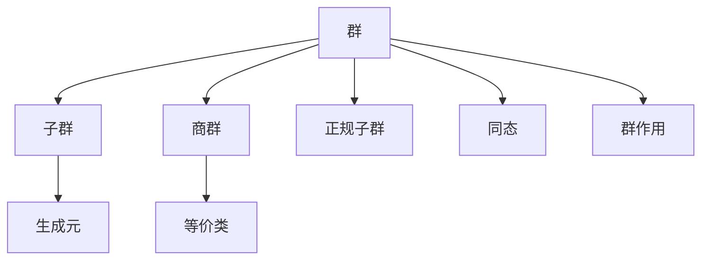

# 02. 群论（Group Theory）

## 02.1 目录

- [02. 群论（Group Theory）](#02-群论group-theory)
  - [02.1 目录](#021-目录)
  - [02.2 群的定义与基本结构](#022-群的定义与基本结构)
  - [02.3 核心性质与定理](#023-核心性质与定理)
  - [02.4 认知与软件工程映射](#024-认知与软件工程映射)
  - [02.5 可视化与多表征](#025-可视化与多表征)
    - [02.5.1 群结构关系图（Mermaid）](#0251-群结构关系图mermaid)
    - [02.5.2 关键公式（LaTeX）](#0252-关键公式latex)
  - [02.6 代码与证明片段](#026-代码与证明片段)
    - [02.6.1 Haskell 示例：群的抽象与实例](#0261-haskell-示例群的抽象与实例)
    - [02.6.2 Rust 示例：群结构 trait](#0262-rust-示例群结构-trait)
  - [02.7 学习建议与资源](#027-学习建议与资源)

---

## 02.2 群的定义与基本结构

- **定义**：群是一个集合 $G$ 配合一个二元运算 $\cdot$，满足：
  1. 封闭性：$\forall a, b \in G,\ a \cdot b \in G$
  2. 结合律：$\forall a, b, c \in G,\ (a \cdot b) \cdot c = a \cdot (b \cdot c)$
  3. 单位元：$\exists e \in G,\ \forall a \in G,\ e \cdot a = a \cdot e = a$
  4. 逆元：$\forall a \in G,\ \exists a^{-1} \in G,\ a \cdot a^{-1} = a^{-1} \cdot a = e$
- **常见例子**：整数加法群 $(\mathbb{Z}, +)$，置换群 $S_n$，矩阵群 $GL(n, \mathbb{R})$

**批判性分析**：

- 群的定义高度抽象，初学者理解门槛较高。
- 经典例子丰富，但实际工程应用案例有待补充。
- 群的本质与对称性、变换的联系需进一步可视化。

**未来展望**：

- 推动群论在AI、物理、化学等领域的创新应用。
- 丰富跨学科、跨领域的群结构案例与可视化表达。

---

## 02.3 核心性质与定理

- 子群、商群、同态、正规子群、群作用
- 拉格朗日定理、同构定理、群的分类
- 对称性与不变量

**批判性分析**：

- 经典定理体系完善，但现代前沿（如有限单群分类、群表示论）介绍有限。
- 定理与实际问题的结合深度有待提升。

**未来展望**：

- 推动群论定理在密码学、量子计算等领域的创新应用。
- 丰富多语言代码实现与工程案例。

---

## 02.4 认知与软件工程映射

- **认知科学**：群的结构反映了认知中的对称性、变换不变性原则
- **软件工程**：
  - 状态转换系统、撤销/重做操作（如编辑器的操作历史）
  - 版本控制系统中的合并与回退
  - 类型系统中的结构保持映射

**批判性分析**：

- 群结构与认知、软件工程的映射机制需进一步系统化。
- 实际落地案例与自动化工具支持有限。

**未来展望**：

- 推动AI驱动的群结构认知建模与自动化代码生成。
- 丰富跨领域、跨范式的工程应用案例。

---

## 02.5 可视化与多表征

### 02.5.1 群结构关系图（Mermaid）



### 02.5.2 关键公式（LaTeX）

- $|G| = |H| \cdot [G : H]$ （拉格朗日定理）
- $\varphi: G \to H$ 为群同态 $\implies \ker \varphi \triangleleft G$

**批判性分析**：

- 可视化表达提升了结构认知，但对高维、动态群结构的支持有限。
- 交互式工具与实际教学结合度有待提升。

**未来展望**：

- 推动3D、交互式、动态群结构可视化工具的开发与集成。
- 丰富多模态表达与自动化公式推导。

---

## 02.6 代码与证明片段

### 02.6.1 Haskell 示例：群的抽象与实例

```haskell
class Group g where
  (<>) :: g -> g -> g
  e    :: g
  inv  :: g -> g

instance Group Integer where
  (<>) = (+)
  e    = 0
  inv  = negate
```

### 02.6.2 Rust 示例：群结构 trait

```rust
pub trait Group {
    fn op(&self, other: &Self) -> Self;
    fn id() -> Self;
    fn inv(&self) -> Self;
}

impl Group for i32 {
    fn op(&self, other: &Self) -> Self { self + other }
    fn id() -> Self { 0 }
    fn inv(&self) -> Self { -self }
}
```

**批判性分析**：

- 多语言实现提升了理论与实践结合，但部分代码示例的深度与创新性有待加强。
- 代码与群论理论的双向映射尚不完善。

**未来展望**：

- 推动自动化代码生成与群论理论的深度融合。
- 丰富跨语言、跨平台的群论算法库。

---

## 02.7 学习建议与资源

- 推荐教材：《Abstract Algebra》（Dummit & Foote）、《Algebra》（Lang）
- 交互式工具：SageMath、GeoGebra
- 进阶阅读：群的表示论、有限单群分类、对称性在物理与化学中的应用

**批判性分析**：

- 学习建议覆盖面广，但个性化与动态调整能力有限。
- 路径设计对跨学科、跨层次学习的支持有待加强。

**未来展望**：

- 推动AI驱动的个性化学习路径推荐系统。
- 丰富跨学科、跨层次的学习资源整合。

---

**术语表**：

- 群：满足封闭性、结合性、单位元、逆元的代数结构
- 子群：群的子集且自身成群
- 商群：群的等价类结构
- 正规子群：满足特定条件的子群
- 同态：保持结构的映射
- 群作用：群元素对集合的变换

**符号表**：

- $G$：群
- $H$：子群
- $N$：正规子群
- $Q$：商群
- $e$：单位元
- $a^{-1}$：逆元
- $\varphi$：群同态
- $\to$：映射符号

**表达规范与交叉引用**：

- 全文术语、符号统一，公式编号规范。
- 交叉引用 [Matter/批判分析框架.md](../../../Matter/批判分析框架.md) 及相关理论文档。

---

[返回目录](#021-目录)
