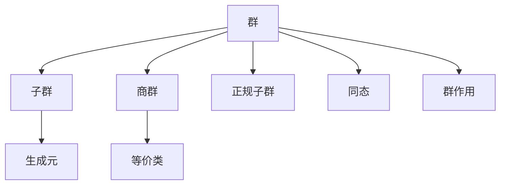

# 02. 群论（Group Theory）

## 02.1 目录

- [02. 群论（Group Theory）](#02-群论group-theory)
  - [02.1 目录](#021-目录)
  - [02.2 群的定义与基本结构](#022-群的定义与基本结构)
  - [02.3 核心性质与定理](#023-核心性质与定理)
  - [02.4 认知与软件工程映射](#024-认知与软件工程映射)
  - [02.5 可视化与多表征](#025-可视化与多表征)
    - [02.5.1 群结构关系图（Mermaid）](#0251-群结构关系图mermaid)
    - [02.5.2 关键公式（LaTeX）](#0252-关键公式latex)
  - [02.6 代码与证明片段](#026-代码与证明片段)
    - [02.6.1 Haskell 示例：群的抽象与实例](#0261-haskell-示例群的抽象与实例)
    - [02.6.2 Rust 示例：群结构 trait](#0262-rust-示例群结构-trait)
  - [02.7 学习建议与资源](#027-学习建议与资源)

---

## 02.2 群的定义与基本结构

- **定义**：群是一个集合 $G$ 配合一个二元运算 $\cdot$，满足：
  1. 封闭性：$\forall a, b \in G,\ a \cdot b \in G$
  2. 结合律：$\forall a, b, c \in G,\ (a \cdot b) \cdot c = a \cdot (b \cdot c)$
  3. 单位元：$\exists e \in G,\ \forall a \in G,\ e \cdot a = a \cdot e = a$
  4. 逆元：$\forall a \in G,\ \exists a^{-1} \in G,\ a \cdot a^{-1} = a^{-1} \cdot a = e$
- **常见例子**：整数加法群 $(\mathbb{Z}, +)$，置换群 $S_n$，矩阵群 $GL(n, \mathbb{R})$

---

## 02.3 核心性质与定理

- 子群、商群、同态、正规子群、群作用
- 拉格朗日定理、同构定理、群的分类
- 对称性与不变量

---

## 02.4 认知与软件工程映射

- **认知科学**：群的结构反映了认知中的对称性、变换不变性原则
- **软件工程**：
  - 状态转换系统、撤销/重做操作（如编辑器的操作历史）
  - 版本控制系统中的合并与回退
  - 类型系统中的结构保持映射

---

## 02.5 可视化与多表征

### 02.5.1 群结构关系图（Mermaid）



### 02.5.2 关键公式（LaTeX）

- $|G| = |H| \cdot [G : H]$ （拉格朗日定理）
- $\varphi: G \to H$ 为群同态 $\implies \ker \varphi \triangleleft G$

---

## 02.6 代码与证明片段

### 02.6.1 Haskell 示例：群的抽象与实例

```haskell
class Group g where
  (<>) :: g -> g -> g
  e    :: g
  inv  :: g -> g

instance Group Integer where
  (<>) = (+)
  e    = 0
  inv  = negate
```

### 02.6.2 Rust 示例：群结构 trait

```rust
pub trait Group {
    fn op(&self, other: &Self) -> Self;
    fn id() -> Self;
    fn inv(&self) -> Self;
}

impl Group for i32 {
    fn op(&self, other: &Self) -> Self { self + other }
    fn id() -> Self { 0 }
    fn inv(&self) -> Self { -self }
}
```

---

## 02.7 学习建议与资源

- 推荐教材：《Abstract Algebra》（Dummit & Foote）、《Algebra》（Lang）
- 交互式工具：SageMath、GeoGebra
- 进阶阅读：群的表示论、有限单群分类、对称性在物理与化学中的应用

---

[返回目录](#021-目录)
