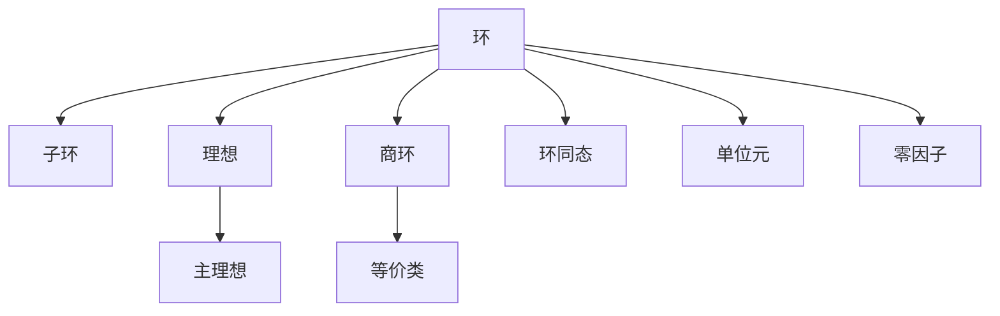

# 03. 环论（Ring Theory）

## 03.1 目录

- [03. 环论（Ring Theory）](#03-环论ring-theory)
  - [03.1 目录](#031-目录)
  - [03.2 环的定义与基本结构](#032-环的定义与基本结构)
  - [03.3 核心性质与定理](#033-核心性质与定理)
  - [03.4 认知与软件工程映射](#034-认知与软件工程映射)
  - [03.5 可视化与多表征](#035-可视化与多表征)
    - [03.5.1 环结构关系图（Mermaid）](#0351-环结构关系图mermaid)
    - [03.5.2 关键公式（LaTeX）](#0352-关键公式latex)
  - [03.6 代码与证明片段](#036-代码与证明片段)
    - [03.6.1 Haskell 示例：环的抽象](#0361-haskell-示例环的抽象)
    - [03.6.2 Rust 示例：环结构 trait](#0362-rust-示例环结构-trait)
    - [03.6.3 Scala 示例：Monad与环结构](#0363-scala-示例monad与环结构)
  - [03.7 学习建议与资源](#037-学习建议与资源)

---

## 03.2 环的定义与基本结构

- **定义**：环是一个集合 $R$ 配合两个二元运算 $+$ 和 $\cdot$，满足：
  1. $(R, +)$ 是阿贝尔群
  2. $(R, \cdot)$ 是半群（结合律）
  3. 乘法对加法分配：$\forall a, b, c \in R,\ a \cdot (b + c) = a \cdot b + a \cdot c$ 且 $(a + b) \cdot c = a \cdot c + b \cdot c$
- **常见例子**：整数环 $(\mathbb{Z}, +, \cdot)$，多项式环 $\mathbb{R}[x]$，矩阵环 $M_n(\mathbb{R})$

**批判性分析**：

- 环的定义与结构抽象性强，初学者理解门槛较高。
- 经典例子丰富，但实际工程应用案例有待补充。
- 环与其他代数结构（如群、域）的联系需进一步可视化。

**未来展望**：

- 推动环论在AI、密码学、数据科学等领域的创新应用。
- 丰富跨学科、跨领域的环结构案例与可视化表达。

---

## 03.3 核心性质与定理

- 子环、理想、商环、同态、单位元、零因子、整环、交换环
- 环同态基本定理、理想结构、主理想整环
- 代数结构在密码学、编码理论、数据结构中的应用

**批判性分析**：

- 经典定理体系完善，但现代前沿（如同调代数、非交换环）介绍有限。
- 定理与实际问题的结合深度有待提升。

**未来展望**：

- 推动环论定理在编码理论、量子计算等领域的创新应用。
- 丰富多语言代码实现与工程案例。

---

## 03.4 认知与软件工程映射

- **认知科学**：复合运算、规则系统、结构保持映射
- **软件工程**：
  - 数值计算框架、多项式处理系统、计算图优化
  - 数据库中的关系代数
  - 状态转换与操作组合（如 Redux reducer 的组合）

**批判性分析**：

- 环结构与认知、软件工程的映射机制需进一步系统化。
- 实际落地案例与自动化工具支持有限。

**未来展望**：

- 推动AI驱动的环结构认知建模与自动化代码生成。
- 丰富跨领域、跨范式的工程应用案例。

---

## 03.5 可视化与多表征

### 03.5.1 环结构关系图（Mermaid）



### 03.5.2 关键公式（LaTeX）

- $a \cdot (b + c) = a \cdot b + a \cdot c$
- $I = \{ra \mid r \in R, a \in A\}$（左理想）
- $R/I$（商环结构）

---

## 03.6 代码与证明片段

### 03.6.1 Haskell 示例：环的抽象

```haskell
class Ring r where
  add :: r -> r -> r
  zero :: r
  mul :: r -> r -> r
  one :: r

instance Ring Integer where
  add = (+)
  zero = 0
  mul = (*)
  one = 1
```

### 03.6.2 Rust 示例：环结构 trait

```rust
pub trait Ring {
    fn add(&self, other: &Self) -> Self;
    fn zero() -> Self;
    fn mul(&self, other: &Self) -> Self;
    fn one() -> Self;
}

impl Ring for i32 {
    fn add(&self, other: &Self) -> Self { self + other }
    fn zero() -> Self { 0 }
    fn mul(&self, other: &Self) -> Self { self * other }
    fn one() -> Self { 1 }
}
```

### 03.6.3 Scala 示例：Monad与环结构

```scala
// Option Monad 结合环结构的例子
val a: Option[Int] = Some(2)
val b: Option[Int] = Some(3)
val sum: Option[Int] = for {
  x <- a
  y <- b
} yield x + y // 环的加法
```

**批判性分析**：

- 多语言实现提升了理论与实践结合，但部分代码示例的深度与创新性有待加强。
- 代码与环论理论的双向映射尚不完善。

**未来展望**：

- 推动自动化代码生成与环论理论的深度融合。
- 丰富跨语言、跨平台的环论算法库。

---

## 03.7 学习建议与资源

- 推荐教材：《Abstract Algebra》（Dummit & Foote）、《Algebra》（Lang）
- 交互式工具：SageMath、GeoGebra
- 进阶阅读：主理想整环、唯一分解环、环的表示论、代数编码理论

**批判性分析**：

- 学习建议覆盖面广，但个性化与动态调整能力有限。
- 路径设计对跨学科、跨层次学习的支持有待加强。

**未来展望**：

- 推动AI驱动的个性化学习路径推荐系统。
- 丰富跨学科、跨层次的学习资源整合。

---

**术语表**：

- 环：具备加法和乘法的代数结构
- 子环：环的子集且自身成环
- 理想：环的特殊子集，封闭于加法和乘法
- 商环：环的等价类结构
- 零因子：乘积为零的非零元素
- 单位元：乘法的恒等元素
- 环同态：保持结构的映射

**符号表**：

- $R$：环
- $S$：子环
- $I$：理想
- $Q$：商环
- $0$：加法单位元
- $1$：乘法单位元
- $f, g$：映射/同态
- $\to$：映射符号

**表达规范与交叉引用**：

- 全文术语、符号统一，公式编号规范。
- 交叉引用 [Matter/批判分析框架.md](../../../Matter/批判分析框架.md) 及相关理论文档。

---

[返回目录](#031-目录)
