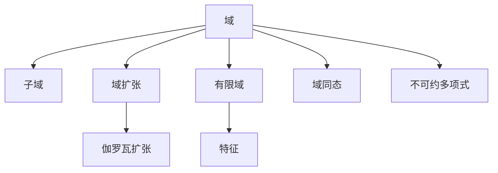

# 04. 域论（Field Theory）

## 04.1 目录

- [04. 域论（Field Theory）](#04-域论field-theory)
  - [04.1 目录](#041-目录)
  - [04.2 域的定义与基本结构](#042-域的定义与基本结构)
  - [04.3 核心性质与定理](#043-核心性质与定理)
  - [04.4 认知与软件工程映射](#044-认知与软件工程映射)
  - [04.5 可视化与多表征](#045-可视化与多表征)
    - [04.5.1 域结构关系图（Mermaid）](#0451-域结构关系图mermaid)
    - [04.5.2 关键公式（LaTeX）](#0452-关键公式latex)
  - [04.6 代码与证明片段](#046-代码与证明片段)
    - [04.6.1 Haskell 示例：有限域上的多项式运算](#0461-haskell-示例有限域上的多项式运算)
    - [04.6.2 Rust 示例：有限域元素结构](#0462-rust-示例有限域元素结构)
  - [04.7 学习建议与资源](#047-学习建议与资源)

---

## 04.2 域的定义与基本结构

- **定义**：域是一个集合 $F$ 配合两个二元运算 $+$ 和 $\cdot$，满足：
  1. $(F, +)$ 是阿贝尔群
  2. $(F \setminus \{0\}, \cdot)$ 是阿贝尔群
  3. 乘法对加法分配：$\forall a, b, c \in F,\ a \cdot (b + c) = a \cdot b + a \cdot c$
- **常见例子**：有理数域 $(\mathbb{Q}, +, \cdot)$，实数域 $(\mathbb{R}, +, \cdot)$，复数域 $(\mathbb{C}, +, \cdot)$，有限域 $\mathbb{F}_p$

**批判性分析**：

- 域的定义与结构抽象性强，初学者理解门槛较高。
- 经典例子丰富，但实际工程应用案例有待补充。
- 域与其他代数结构（如环、群）的联系需进一步可视化。

**未来展望**：

- 推动域论在AI、密码学、数据科学等领域的创新应用。
- 丰富跨学科、跨领域的域结构案例与可视化表达。

---

## 04.3 核心性质与定理

- 子域、域扩张、有限域、特征、代数扩张、分裂域、正规扩张、伽罗瓦理论
- 域同态、同构、不可约多项式、根的存在性
- 应用：编码理论、密码学、有限域上的算法

**批判性分析**：

- 经典定理体系完善，但现代前沿（如伽罗瓦理论、有限域算法）介绍有限。
- 定理与实际问题的结合深度有待提升。

**未来展望**：

- 推动域论定理在编码理论、量子计算等领域的创新应用。
- 丰富多语言代码实现与工程案例。

---

## 04.4 认知与软件工程映射

- **认知科学**：逆元、结构对称性、抽象化与一般化
- **软件工程**：
  - 有限域在加密算法（如 AES、RSA）中的应用
  - 纠错码（如 Reed-Solomon 码）
  - 多项式运算与代数数据结构

**批判性分析**：

- 域结构与认知、软件工程的映射机制需进一步系统化。
- 实际落地案例与自动化工具支持有限。

**未来展望**：

- 推动AI驱动的域结构认知建模与自动化代码生成。
- 丰富跨领域、跨范式的工程应用案例。

---

## 04.5 可视化与多表征

### 04.5.1 域结构关系图（Mermaid）



### 04.5.2 关键公式（LaTeX）

- $|\mathbb{F}_p| = p$，$|\mathbb{F}_{p^n}| = p^n$
- $f(x)$ 在 $F$ 上不可约 $\implies$ $F[x]/(f(x))$ 是域
- $[E:F]$ 域扩张次数

**批判性分析**：

- 可视化表达提升了结构认知，但对高维、动态域结构的支持有限。
- 交互式工具与实际教学结合度有待提升。

**未来展望**：

- 推动3D、交互式、动态域结构可视化工具的开发与集成。
- 丰富多模态表达与自动化公式推导。

---

## 04.6 代码与证明片段

### 04.6.1 Haskell 示例：有限域上的多项式运算

```haskell
-- 有限域 F_p 上的多项式加法
addPoly :: [Int] -> [Int] -> [Int]
addPoly xs ys = zipWith (+) (pad xs) (pad ys)
  where pad zs = zs ++ replicate (max (length xs) (length ys) - length zs) 0

-- 模 p 取余
modP :: Int -> [Int] -> [Int]
modP p = map (`mod` p)
```

### 04.6.2 Rust 示例：有限域元素结构

```rust
pub struct Fp {
    value: u32,
    p: u32,
}

impl Fp {
    pub fn new(value: u32, p: u32) -> Self {
        Self { value: value % p, p }
    }
    pub fn add(&self, other: &Self) -> Self {
        Fp::new((self.value + other.value) % self.p, self.p)
    }
    pub fn mul(&self, other: &Self) -> Self {
        Fp::new((self.value * other.value) % self.p, self.p)
    }
    pub fn inv(&self) -> Self {
        // 费马小定理求逆元（仅适用于素数域）
        Fp::new(self.value.pow(self.p - 2) % self.p, self.p)
    }
}
```

**批判性分析**：

- 多语言实现提升了理论与实践结合，但部分代码示例的深度与创新性有待加强。
- 代码与域论理论的双向映射尚不完善。

**未来展望**：

- 推动自动化代码生成与域论理论的深度融合。
- 丰富跨语言、跨平台的域论算法库。

---

## 04.7 学习建议与资源

- 推荐教材：《Abstract Algebra》（Dummit & Foote）、《Field and Galois Theory》（Stewart）
- 交互式工具：SageMath、GeoGebra
- 进阶阅读：伽罗瓦理论、有限域算法、编码与密码学应用

**批判性分析**：

- 学习建议覆盖面广，但个性化与动态调整能力有限。
- 路径设计对跨学科、跨层次学习的支持有待加强。

**未来展望**：

- 推动AI驱动的个性化学习路径推荐系统。
- 丰富跨学科、跨层次的学习资源整合。

---

**术语表**：

- 域：加法和乘法均可逆的代数结构
- 子域：域的子集且自身成域
- 域扩张：更大域包含原域的结构
- 有限域：元素个数有限的域
- 伽罗瓦扩张：满足特定对称性的域扩张
- 不可约多项式：在域上不可因式分解的多项式
- 域同态：保持结构的映射

**符号表**：

- $F$：域
- $E$：扩张域
- $GF$：有限域
- $H$：域同态
- $P$：特征
- $f(x)$：多项式
- $\to$：映射符号

**表达规范与交叉引用**：

- 全文术语、符号统一，公式编号规范。
- 交叉引用 [Matter/批判分析框架.md](../../../Matter/批判分析框架.md) 及相关理论文档。

---

[返回目录](#041-目录)
