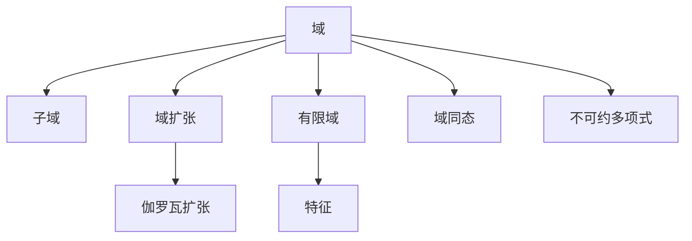

# 04. 域论（Field Theory）

## 04.1 目录

- [04. 域论（Field Theory）](#04-域论field-theory)
  - [04.1 目录](#041-目录)
  - [04.2 域的定义与基本结构](#042-域的定义与基本结构)
  - [04.3 核心性质与定理](#043-核心性质与定理)
  - [04.4 认知与软件工程映射](#044-认知与软件工程映射)
  - [04.5 可视化与多表征](#045-可视化与多表征)
    - [04.5.1 域结构关系图（Mermaid）](#0451-域结构关系图mermaid)
    - [04.5.2 关键公式（LaTeX）](#0452-关键公式latex)
  - [04.6 代码与证明片段](#046-代码与证明片段)
    - [04.6.1 Haskell 示例：有限域上的多项式运算](#0461-haskell-示例有限域上的多项式运算)
    - [04.6.2 Rust 示例：有限域元素结构](#0462-rust-示例有限域元素结构)
  - [04.7 学习建议与资源](#047-学习建议与资源)

---

## 04.2 域的定义与基本结构

- **定义**：域是一个集合 $F$ 配合两个二元运算 $+$ 和 $\cdot$，满足：
  1. $(F, +)$ 是阿贝尔群
  2. $(F \setminus \{0\}, \cdot)$ 是阿贝尔群
  3. 乘法对加法分配：$\forall a, b, c \in F,\ a \cdot (b + c) = a \cdot b + a \cdot c$
- **常见例子**：有理数域 $(\mathbb{Q}, +, \cdot)$，实数域 $(\mathbb{R}, +, \cdot)$，复数域 $(\mathbb{C}, +, \cdot)$，有限域 $\mathbb{F}_p$

---

## 04.3 核心性质与定理

- 子域、域扩张、有限域、特征、代数扩张、分裂域、正规扩张、伽罗瓦理论
- 域同态、同构、不可约多项式、根的存在性
- 应用：编码理论、密码学、有限域上的算法

---

## 04.4 认知与软件工程映射

- **认知科学**：逆元、结构对称性、抽象化与一般化
- **软件工程**：
  - 有限域在加密算法（如 AES、RSA）中的应用
  - 纠错码（如 Reed-Solomon 码）
  - 多项式运算与代数数据结构

---

## 04.5 可视化与多表征

### 04.5.1 域结构关系图（Mermaid）



### 04.5.2 关键公式（LaTeX）

- $|\mathbb{F}_p| = p$，$|\mathbb{F}_{p^n}| = p^n$
- $f(x)$ 在 $F$ 上不可约 $\implies$ $F[x]/(f(x))$ 是域
- $[E:F]$ 域扩张次数

---

## 04.6 代码与证明片段

### 04.6.1 Haskell 示例：有限域上的多项式运算

```haskell
-- 有限域 F_p 上的多项式加法
addPoly :: [Int] -> [Int] -> [Int]
addPoly xs ys = zipWith (+) (pad xs) (pad ys)
  where pad zs = zs ++ replicate (max (length xs) (length ys) - length zs) 0

-- 模 p 取余
modP :: Int -> [Int] -> [Int]
modP p = map (`mod` p)
```

### 04.6.2 Rust 示例：有限域元素结构

```rust
pub struct Fp {
    value: u32,
    p: u32,
}

impl Fp {
    pub fn new(value: u32, p: u32) -> Self {
        Self { value: value % p, p }
    }
    pub fn add(&self, other: &Self) -> Self {
        Fp::new((self.value + other.value) % self.p, self.p)
    }
    pub fn mul(&self, other: &Self) -> Self {
        Fp::new((self.value * other.value) % self.p, self.p)
    }
    pub fn inv(&self) -> Self {
        // 费马小定理求逆元（仅适用于素数域）
        Fp::new(self.value.pow(self.p - 2) % self.p, self.p)
    }
}
```

---

## 04.7 学习建议与资源

- 推荐教材：《Abstract Algebra》（Dummit & Foote）、《Field and Galois Theory》（Stewart）
- 交互式工具：SageMath、GeoGebra
- 进阶阅读：伽罗瓦理论、有限域算法、编码与密码学应用

---

[返回目录](#041-目录)
