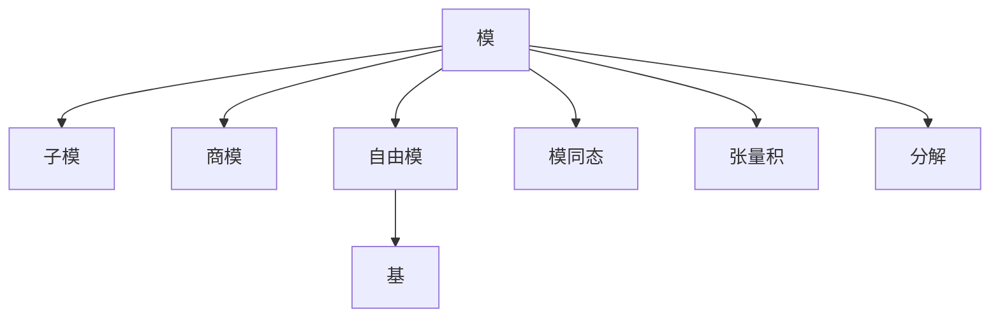

# 05. 模论（Module Theory）

## 05.1 目录

- [05. 模论（Module Theory）](#05-模论module-theory)
  - [05.1 目录](#051-目录)
  - [05.2 模的定义与基本结构](#052-模的定义与基本结构)
  - [05.3 核心性质与定理](#053-核心性质与定理)
  - [05.4 认知与软件工程映射](#054-认知与软件工程映射)
  - [05.5 可视化与多表征](#055-可视化与多表征)
    - [05.5.1 模结构关系图（Mermaid）](#0551-模结构关系图mermaid)
    - [05.5.2 关键公式（LaTeX）](#0552-关键公式latex)
  - [05.6 代码与证明片段](#056-代码与证明片段)
    - [05.6.1 Haskell 示例：模的抽象](#0561-haskell-示例模的抽象)
    - [05.6.2 Rust 示例：模结构 trait](#0562-rust-示例模结构-trait)
  - [05.7 学习建议与资源](#057-学习建议与资源)

---

## 05.2 模的定义与基本结构

- **定义**：设 $R$ 是一个环，$M$ 是一个集合，若 $M$ 配合加法 $+$ 构成阿贝尔群，且存在 $R$ 上的标量乘法 $\cdot$，满足：
  1. $r \cdot (m + n) = r \cdot m + r \cdot n$
  2. $(r + s) \cdot m = r \cdot m + s \cdot m$
  3. $(rs) \cdot m = r \cdot (s \cdot m)$
  4. $1_R \cdot m = m$（若 $R$ 有单位元）
  则称 $M$ 为 $R$-模。
- **常见例子**：向量空间（域上的模）、$\mathbb{Z}$-模（即阿贝尔群）、多项式模、矩阵模

---

## 05.3 核心性质与定理

- 子模、商模、模同态、自由模、有限生成模、张量积、模的分解
- 结构定理（有限生成阿贝尔群）、Noether 模、Artin 模
- 应用：线性代数、表示论、同调代数、编码理论

---

## 05.4 认知与软件工程映射

- **认知科学**：抽象结构、分解与组合、层次化建模
- **软件工程**：
  - 向量空间模型（如信息检索中的TF-IDF）
  - 数据结构的泛型抽象（如泛型容器、矩阵库）
  - 张量运算与深度学习框架

---

## 05.5 可视化与多表征

### 05.5.1 模结构关系图（Mermaid）



### 05.5.2 关键公式（LaTeX）

- $r \cdot (m + n) = r \cdot m + r \cdot n$
- $(r + s) \cdot m = r \cdot m + s \cdot m$
- $M/N$（商模结构）
- $M \otimes_R N$（张量积）

---

## 05.6 代码与证明片段

### 05.6.1 Haskell 示例：模的抽象

```haskell
class Module r m where
  add :: m -> m -> m
  zero :: m
  smul :: r -> m -> m

instance Module Integer [Integer] where
  add = zipWith (+)
  zero = repeat 0
  smul r = map (r *)
```

### 05.6.2 Rust 示例：模结构 trait

```rust
pub trait Module<R> {
    fn add(&self, other: &Self) -> Self;
    fn zero() -> Self;
    fn smul(r: R, m: &Self) -> Self;
}

impl Module<i32> for Vec<i32> {
    fn add(&self, other: &Self) -> Self {
        self.iter().zip(other.iter()).map(|(a, b)| a + b).collect()
    }
    fn zero() -> Self {
        vec![0; 0]
    }
    fn smul(r: i32, m: &Self) -> Self {
        m.iter().map(|x| r * x).collect()
    }
}
```

---

## 05.7 学习建议与资源

- 推荐教材：《Algebra》（Lang）、《Abstract Algebra》（Dummit & Foote）
- 交互式工具：SageMath、线性代数可视化工具
- 进阶阅读：同调代数、张量积、模的表示论、深度学习中的张量结构

---

[返回目录](#051-目录)
