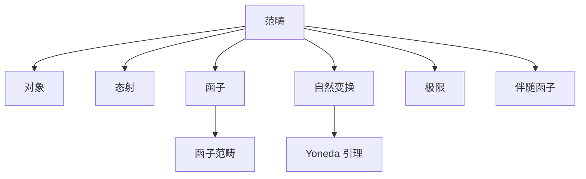

# 07. 范畴论（Category Theory）

## 07.1 目录

- [07. 范畴论（Category Theory）](#07-范畴论category-theory)
  - [07.1 目录](#071-目录)
  - [07.2 范畴的定义与基本结构](#072-范畴的定义与基本结构)
  - [07.3 核心性质与定理](#073-核心性质与定理)
  - [07.4 认知与软件工程映射](#074-认知与软件工程映射)
  - [07.5 可视化与多表征](#075-可视化与多表征)
    - [07.5.1 范畴结构关系图（Mermaid）](#0751-范畴结构关系图mermaid)
    - [07.5.2 关键公式（LaTeX）](#0752-关键公式latex)
  - [07.6 代码与证明片段](#076-代码与证明片段)
    - [07.6.1 Haskell 示例：Functor 与 Monad](#0761-haskell-示例functor-与-monad)
    - [07.6.2 Rust 示例：Functor trait](#0762-rust-示例functor-trait)
  - [07.7 学习建议与资源](#077-学习建议与资源)

---

## 07.2 范畴的定义与基本结构

- **定义**：范畴 $\mathcal{C}$ 包含：
  1. 一类对象 $\mathrm{Ob}(\mathcal{C})$
  2. 每对对象 $A, B$ 有态射集合 $\mathrm{Hom}(A, B)$
  3. 态射可复合：$f \in \mathrm{Hom}(A, B), g \in \mathrm{Hom}(B, C) \implies g \circ f \in \mathrm{Hom}(A, C)$
  4. 每个对象有恒等态射 $\mathrm{id}_A$
  5. 复合满足结合律，恒等元性质
- **常见例子**：集合范畴 $\mathbf{Set}$，群范畴 $\mathbf{Grp}$，向量空间范畴 $\mathbf{Vect}$，预序集范畴

---

## 07.3 核心性质与定理

- 态射、函子、自然变换、等价范畴、极限与余极限、积与余积、伴随函子、幺半范畴
- Yoneda 引理、范畴等价、表示定理、普遍性质
- 应用：统一数学结构、函数式编程、类型理论、知识表示

---

## 07.4 认知与软件工程映射

- **认知科学**：关系网络、结构映射、抽象范式
- **软件工程**：
  - 函数式编程中的 Monad、Functor、自然变换
  - 组件组合、微服务架构的抽象建模
  - 类型系统与范畴结构的对应

---

## 07.5 可视化与多表征

### 07.5.1 范畴结构关系图（Mermaid）



### 07.5.2 关键公式（LaTeX）

- $g \circ f : A \to C$
- $F : \mathcal{C} \to \mathcal{D}$（函子）
- $\eta : F \Rightarrow G$（自然变换）
- $\mathrm{Hom}_\mathcal{C}(A, -) \cong \mathrm{Nat}(\mathrm{Hom}_\mathcal{C}(A, -), F)$（Yoneda 引理）

---

## 07.6 代码与证明片段

### 07.6.1 Haskell 示例：Functor 与 Monad

```haskell
class Functor f where
  fmap :: (a -> b) -> f a -> f b

class Functor m => Monad m where
  return :: a -> m a
  (>>=) :: m a -> (a -> m b) -> m b
```

### 07.6.2 Rust 示例：Functor trait

```rust
pub trait Functor<A, B, F> {
    fn fmap(self, f: F) -> Self;
}

impl Functor<i32, i32, fn(i32) -> i32> for Option<i32> {
    fn fmap(self, f: fn(i32) -> i32) -> Self {
        self.map(f)
    }
}
```

---

## 07.7 学习建议与资源

- 推荐教材：《Category Theory for Programmers》（Bartosz Milewski）、《Categories for the Working Mathematician》（Mac Lane）
- 交互式工具：CatLab、Haskell Playground
- 进阶阅读：Yoneda 引理、伴随函子、范畴论在计算机科学中的应用

---

[返回目录](#071-目录)
