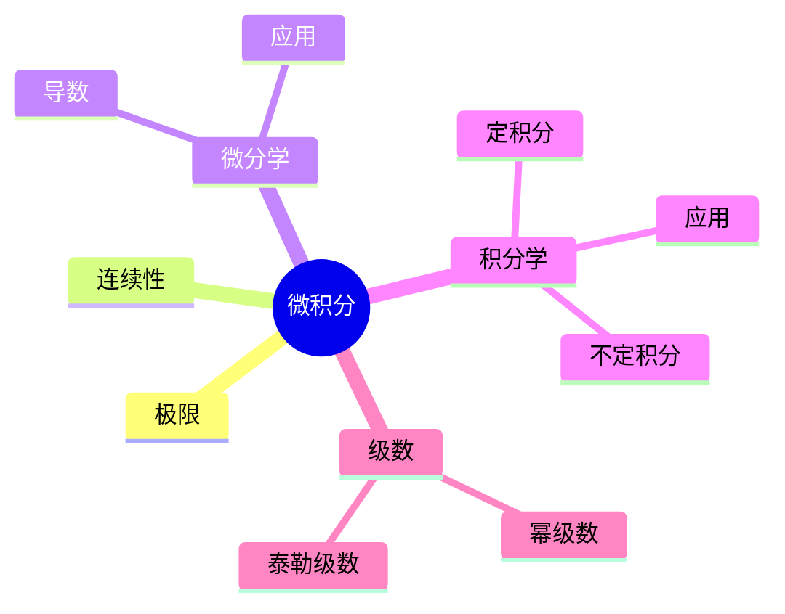

# 01. 微积分内容概览（Calculus Overview）

## 01.1 目录

- [01. 微积分内容概览（Calculus Overview）](#01-微积分内容概览calculus-overview)
  - [01.1 目录](#011-目录)
  - [01.2 引言与核心概念](#012-引言与核心概念)
  - [01.3 极限与连续性](#013-极限与连续性)
  - [01.4 微分学](#014-微分学)
  - [01.5 积分学](#015-积分学)
  - [01.6 无穷级数](#016-无穷级数)
  - [01.7 典型定理与公式](#017-典型定理与公式)
  - [01.8 多表征与可视化](#018-多表征与可视化)
    - [01.8.1 结构关系图（Mermaid）](#0181-结构关系图mermaid)
    - [01.8.2 典型公式与图示](#0182-典型公式与图示)

---

## 01.2 引言与核心概念

- 微积分研究变化率与积累，分为微分学和积分学两大核心部分。
- 主要处理瞬时变化率（导数）与总量积累（积分）问题。
- 极限是微积分的基础，微分和积分通过微积分基本定理紧密联系。

---

## 01.3 极限与连续性

- 极限描述函数在趋近某点或无穷远时的行为。
- 连续性要求函数在某点极限存在且等于函数值。
- 典型定理：夹逼定理、介值定理、最值定理。
- $\epsilon$-$\delta$ 定义为理论基础。

---

## 01.4 微分学

- 导数定义：$f'(x) = \lim_{h \to 0} \frac{f(x+h) - f(x)}{h}$
- 几何意义：切线斜率
- 导数法则：和差、乘积、商、链式法则
- 应用：变化率、极值、单调性、优化、曲率

---

## 01.5 积分学

- 不定积分与原函数、定积分与黎曼和
- 微积分基本定理：导数与积分互逆
- 面积、体积、弧长、物理应用
- 积分技巧：换元、分部积分、三角换元

---

## 01.6 无穷级数

- 序列与级数的收敛性
- 幂级数、泰勒级数
- 收敛判别法：比较、比值、根、交错级数等

---

## 01.7 典型定理与公式

- 微积分基本定理
- 洛必达法则
- 泰勒公式
- $\int_a^b f'(x)dx = f(b) - f(a)$
- $\sum_{n=1}^\infty \frac{1}{n^2} = \frac{\pi^2}{6}$

---

## 01.8 多表征与可视化

### 01.8.1 结构关系图（Mermaid）

### 01.8.2 典型公式与图示

- $f'(x) = \lim_{h \to 0} \frac{f(x+h) - f(x)}{h}$
- $\int_a^b f(x)dx$
- 
- 

---

[返回目录](#011-目录)
