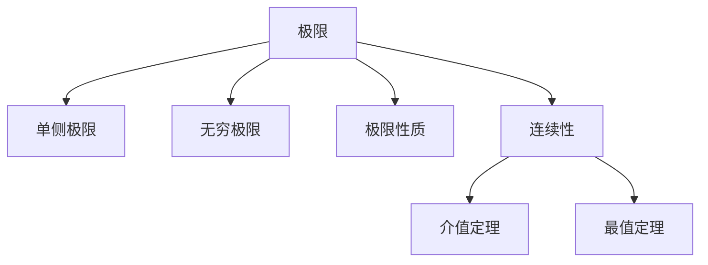

# 02. 极限与连续性（Limits and Continuity）

## 02.1 目录

- [02. 极限与连续性（Limits and Continuity）](#02-极限与连续性limits-and-continuity)
  - [02.1 目录](#021-目录)
  - [02.2 极限的定义与性质](#022-极限的定义与性质)
  - [02.3 连续性的定义与判别](#023-连续性的定义与判别)
  - [02.4 典型定理与公式](#024-典型定理与公式)
  - [02.5 可视化与多表征](#025-可视化与多表征)
    - [02.5.1 结构关系图（Mermaid）](#0251-结构关系图mermaid)
    - [02.5.2 典型图示](#0252-典型图示)
  - [02.6 学习建议与资源](#026-学习建议与资源)

---

## 02.2 极限的定义与性质

- 直观定义与 $\epsilon$-$\delta$ 严格定义
- 单侧极限、无穷极限、无穷远处的极限
- 极限的四则运算、夹逼定理
- 极限存在的充要条件

---

## 02.3 连续性的定义与判别

- 点的连续性、区间上的连续性
- 间断点类型：可去、跳跃、无穷间断
- 连续函数的性质：介值定理、最值定理、复合与四则运算的连续性

---

## 02.4 典型定理与公式

- $\lim_{x \to c} f(x) = L$
- $\lim_{x \to 0} \frac{\sin x}{x} = 1$
- 夹逼定理、介值定理、最值定理
- $\epsilon$-$\delta$ 语言的极限与连续性判别

---

## 02.5 可视化与多表征

### 02.5.1 结构关系图（Mermaid）

### 02.5.2 典型图示

- 
- 

---

## 02.6 学习建议与资源

- 推荐教材：《Calculus》（Stewart）、《Principles of Mathematical Analysis》（Rudin）
- 交互式工具：Desmos、GeoGebra
- 进阶阅读：实分析中的极限与连续性、函数空间的连续性

---

[返回目录](#021-目录)
