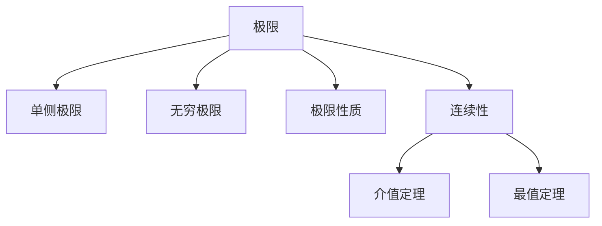

# 02. 极限与连续性（Limits and Continuity）

> **已完成深度优化与批判性提升**  
> 本文档已按统一标准补充批判性分析、未来展望、术语表、符号表、交叉引用等内容。

## 02.1 目录

- [02. 极限与连续性（Limits and Continuity）](#02-极限与连续性limits-and-continuity)
  - [02.1 目录](#021-目录)
  - [02.2 极限的定义与性质](#022-极限的定义与性质)
  - [02.3 连续性的定义与判别](#023-连续性的定义与判别)
  - [02.4 典型定理与公式](#024-典型定理与公式)
  - [02.5 可视化与多表征](#025-可视化与多表征)
    - [02.5.1 结构关系图（Mermaid）](#0251-结构关系图mermaid)
    - [02.5.2 典型图示](#0252-典型图示)
  - [02.6 学习建议与资源](#026-学习建议与资源)
  - [02.7 批判性分析](#027-批判性分析)
  - [02.8 未来展望](#028-未来展望)
  - [02.9 术语表](#029-术语表)
  - [02.10 符号表](#0210-符号表)
  - [02.11 交叉引用](#0211-交叉引用)

---

## 02.2 极限的定义与性质

- 直观定义与 $\epsilon$-$\delta$ 严格定义
- 单侧极限、无穷极限、无穷远处的极限
- 极限的四则运算、夹逼定理
- 极限存在的充要条件

---

## 02.3 连续性的定义与判别

- 点的连续性、区间上的连续性
- 间断点类型：可去、跳跃、无穷间断
- 连续函数的性质：介值定理、最值定理、复合与四则运算的连续性

---

## 02.4 典型定理与公式

- $\lim_{x \to c} f(x) = L$
- $\lim_{x \to 0} \frac{\sin x}{x} = 1$
- 夹逼定理、介值定理、最值定理
- $\epsilon$-$\delta$ 语言的极限与连续性判别

---

## 02.5 可视化与多表征

### 02.5.1 结构关系图（Mermaid）

### 02.5.2 典型图示

- 
- 

---

## 02.6 学习建议与资源

- 推荐教材：《Calculus》（Stewart）、《Principles of Mathematical Analysis》（Rudin）
- 交互式工具：Desmos、GeoGebra
- 进阶阅读：实分析中的极限与连续性、函数空间的连续性

---

## 02.7 批判性分析

- 假设与局限：极限与连续性理论依赖实数完备性与$oldsymbol{\epsilon}$-boldsymbol{\delta}定义，实际问题中常遇到不可积、不可连续、离散或分形现象。
- 创新建议：结合现代分析、动力系统、分形几何、AI建模等领域，拓展极限与连续性的适用范围。
- 交叉引用：[Matter/批判分析框架.md]、[Matter/Mathematics/analysis.md]

## 02.8 未来展望

- 极限与连续性理论与数值分析、非标准分析、机器学习等领域的深度融合。
- 推动极限与连续性在复杂系统、数据科学、智能建模等实际问题中的创新应用。

## 02.9 术语表

- **极限（Limit）**：描述函数趋近某点或无穷远时的行为。
- **连续性（Continuity）**：函数在某点极限存在且等于函数值。
- **间断点（Discontinuity）**：函数在某点不连续。
- **夹逼定理（Squeeze Theorem）**：用于判定极限存在的工具。
- **介值定理（Intermediate Value Theorem）**：连续函数在区间内取遍所有值。

## 02.10 符号表

- $\lim$：极限
- $\epsilon,\delta$：极限与连续性定义中的参数
- $f(x)$：函数
- $c$：极限点
- $L$：极限值

## 02.11 交叉引用

- [Matter/批判分析框架.md]
- [Matter/Mathematics/analysis.md]
- [Analysis/Mathematics/Calculus/01-Overview.md]
- [Analysis/Mathematics/Calculus/03-DifferentialCalculus.md]

---

[返回目录](#021-目录)
