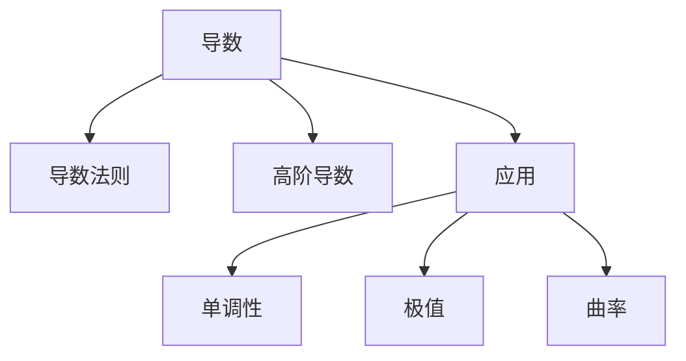

# 03. 微分学（Differential Calculus）

## 03.1 目录

- [03. 微分学（Differential Calculus）](#03-微分学differential-calculus)
  - [03.1 目录](#031-目录)
  - [03.2 导数的定义与几何意义](#032-导数的定义与几何意义)
  - [03.3 导数法则与高阶导数](#033-导数法则与高阶导数)
  - [03.4 导数的应用](#034-导数的应用)
  - [03.5 典型定理与公式](#035-典型定理与公式)
  - [03.6 可视化与多表征](#036-可视化与多表征)
    - [03.6.1 结构关系图（Mermaid）](#0361-结构关系图mermaid)
    - [03.6.2 典型图示](#0362-典型图示)
  - [03.7 学习建议与资源](#037-学习建议与资源)

---

## 03.2 导数的定义与几何意义

- 导数定义：$f'(x) = \lim_{h \to 0} \frac{f(x+h) - f(x)}{h}$
- 几何意义：切线斜率、瞬时变化率
- 可微性与连续性的关系

---

## 03.3 导数法则与高阶导数

- 常数、幂函数、和差、乘积、商、链式法则
- 隐函数求导、参数方程求导
- 高阶导数、泰勒展开

---

## 03.4 导数的应用

- 单调性、极值、凹凸性、拐点
- 优化问题、最大最小值、洛必达法则
- 曲率、物理中的速度与加速度

---

## 03.5 典型定理与公式

- 罗尔定理、拉格朗日中值定理、柯西中值定理
- 泰勒公式 $f(x) \approx f(a) + f'(a)(x-a) + \frac{f''(a)}{2!}(x-a)^2 + \cdots$
- 洛必达法则

---

## 03.6 可视化与多表征

### 03.6.1 结构关系图（Mermaid）

### 03.6.2 典型图示

- 
- 

---

## 03.7 学习建议与资源

- 推荐教材：《Calculus》（Stewart）、《微积分》（华东师大版）
- 交互式工具：Desmos、GeoGebra
- 进阶阅读：泰勒展开、最优化理论、微分方程初步

---

[返回目录](#031-目录)
