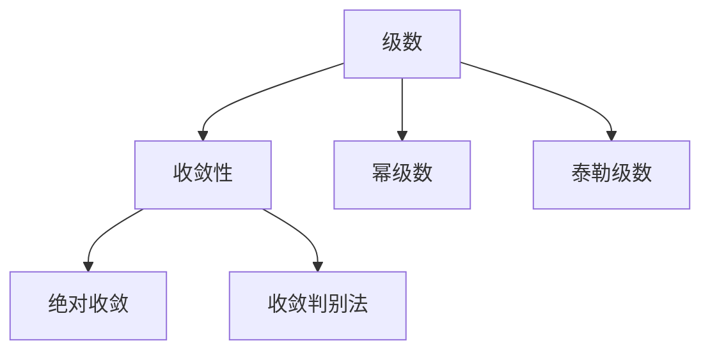

# 05. 无穷级数（Infinite Series）

## 05.1 目录

- [05. 无穷级数（Infinite Series）](#05-无穷级数infinite-series)
  - [05.1 目录](#051-目录)
  - [05.2 级数的定义与收敛性](#052-级数的定义与收敛性)
  - [05.3 幂级数与泰勒级数](#053-幂级数与泰勒级数)
  - [05.4 收敛判别法](#054-收敛判别法)
  - [05.5 典型定理与公式](#055-典型定理与公式)
  - [05.6 可视化与多表征](#056-可视化与多表征)
    - [05.6.1 结构关系图（Mermaid）](#0561-结构关系图mermaid)
    - [05.6.2 典型图示](#0562-典型图示)
  - [05.7 学习建议与资源](#057-学习建议与资源)

---

## 05.2 级数的定义与收敛性

- 数列、部分和、级数的定义
- 收敛与发散，收敛级数的和
- 绝对收敛与条件收敛

---

## 05.3 幂级数与泰勒级数

- 幂级数 $\sum a_n x^n$ 的收敛半径
- 泰勒级数、麦克劳林级数
- 典型函数的级数展开（如 $e^x, \sin x, \cos x$）

---

## 05.4 收敛判别法

- 比较判别法、比值判别法、根判别法、交错级数判别法
- 绝对收敛与条件收敛的判别

---

## 05.5 典型定理与公式

- $\sum_{n=1}^\infty \frac{1}{n^2} = \frac{\pi^2}{6}$
- $e^x = \sum_{n=0}^\infty \frac{x^n}{n!}$
- $\sin x = \sum_{n=0}^\infty \frac{(-1)^n}{(2n+1)!}x^{2n+1}$
- $\cos x = \sum_{n=0}^\infty \frac{(-1)^n}{(2n)!}x^{2n}$

---

## 05.6 可视化与多表征

### 05.6.1 结构关系图（Mermaid）

### 05.6.2 典型图示

- 
- 

---

## 05.7 学习建议与资源

- 推荐教材：《Calculus》（Stewart）、《Principles of Mathematical Analysis》（Rudin）
- 交互式工具：Desmos、GeoGebra、级数可视化工具
- 进阶阅读：傅里叶级数、函数空间中的级数、实分析中的级数理论

---

[返回目录](#051-目录)
