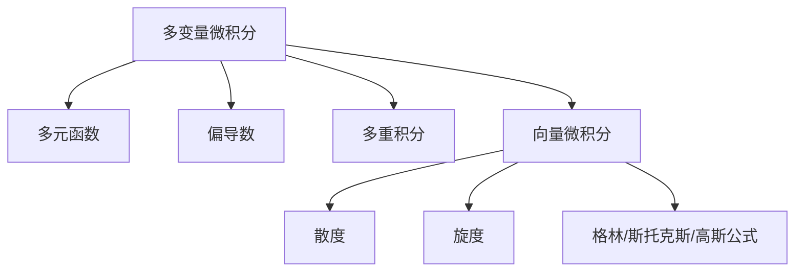

# 06. 多变量微积分（Multivariable Calculus）

## 06.1 目录

- [06. 多变量微积分（Multivariable Calculus）](#06-多变量微积分multivariable-calculus)
  - [06.1 目录](#061-目录)
  - [06.2 多元函数与极限](#062-多元函数与极限)
  - [06.3 偏导数与梯度](#063-偏导数与梯度)
  - [06.4 多重积分](#064-多重积分)
  - [06.5 向量微积分概要](#065-向量微积分概要)
  - [06.6 典型定理与公式](#066-典型定理与公式)
  - [06.7 可视化与多表征](#067-可视化与多表征)
    - [06.7.1 结构关系图（Mermaid）](#0671-结构关系图mermaid)
    - [06.7.2 典型图示](#0672-典型图示)
  - [06.8 学习建议与资源](#068-学习建议与资源)

---

## 06.2 多元函数与极限

- 多元函数的定义、图像与等高线
- 多元极限与连续性
- 路径依赖性、极限存在性判别

---

## 06.3 偏导数与梯度

- 偏导数定义 $\frac{\partial f}{\partial x}$
- 全微分、方向导数、梯度向量 $\nabla f$
- 隐函数定理、链式法则

---

## 06.4 多重积分

- 二重积分、三重积分的定义与计算
- 极坐标、柱面坐标、球坐标下的积分
- 面积、体积、质量、重心等应用

---

## 06.5 向量微积分概要

- 向量场、散度、旋度
- 曲线积分、曲面积分
- 格林公式、斯托克斯公式、高斯公式

---

## 06.6 典型定理与公式

- $\frac{\partial f}{\partial x}$、$\nabla f$
- $\iint_D f(x, y)dxdy$
- $\iiint_E f(x, y, z)dxdydz$
- 格林公式 $\oint_C Pdx + Qdy = \iint_D (\frac{\partial Q}{\partial x} - \frac{\partial P}{\partial y})dxdy$
- 斯托克斯公式、散度定理

---

## 06.7 可视化与多表征

### 06.7.1 结构关系图（Mermaid）

### 06.7.2 典型图示

- 
- 

---

## 06.8 学习建议与资源

- 推荐教材：《Calculus》（Stewart）、《Vector Calculus》（Marsden & Tromba）
- 交互式工具：GeoGebra、Desmos、三维可视化工具
- 进阶阅读：微分流形、张量分析、物理中的多变量微积分

---

[返回目录](#061-目录)
