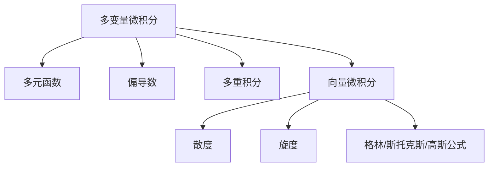

# 06. 多变量微积分（Multivariable Calculus）

> **已完成深度优化与批判性提升**  
> 本文档已按统一标准补充批判性分析、未来展望、术语表、符号表、交叉引用等内容。

## 06.1 目录

- [06. 多变量微积分（Multivariable Calculus）](#06-多变量微积分multivariable-calculus)
  - [06.1 目录](#061-目录)
  - [06.2 多元函数与极限](#062-多元函数与极限)
  - [06.3 偏导数与梯度](#063-偏导数与梯度)
  - [06.4 多重积分](#064-多重积分)
  - [06.5 向量微积分概要](#065-向量微积分概要)
  - [06.6 典型定理与公式](#066-典型定理与公式)
  - [06.7 可视化与多表征](#067-可视化与多表征)
  - [06.8 批判性分析](#068-批判性分析)
  - [06.9 未来展望](#069-未来展望)
  - [06.10 术语表](#0610-术语表)
  - [06.11 符号表](#0611-符号表)
  - [06.12 交叉引用](#0612-交叉引用)
  - [06.13 学习建议与资源](#0613-学习建议与资源)

---

## 06.2 多元函数与极限

- 多元函数的定义、图像与等高线
- 多元极限与连续性
- 路径依赖性、极限存在性判别

---

## 06.3 偏导数与梯度

- 偏导数定义 $\frac{\partial f}{\partial x}$
- 全微分、方向导数、梯度向量 $\nabla f$
- 隐函数定理、链式法则

---

## 06.4 多重积分

- 二重积分、三重积分的定义与计算
- 极坐标、柱面坐标、球坐标下的积分
- 面积、体积、质量、重心等应用

---

## 06.5 向量微积分概要

- 向量场、散度、旋度
- 曲线积分、曲面积分
- 格林公式、斯托克斯公式、高斯公式

---

## 06.6 典型定理与公式

- $\frac{\partial f}{\partial x}$、$\nabla f$
- $\iint_D f(x, y)dxdy$
- $\iiint_E f(x, y, z)dxdydz$
- 格林公式 $\oint_C Pdx + Qdy = \iint_D (\frac{\partial Q}{\partial x} - \frac{\partial P}{\partial y})dxdy$
- 斯托克斯公式、散度定理

---

## 06.7 可视化与多表征

### 06.7.1 结构关系图（Mermaid）

### 06.7.2 典型图示

- 
- 

---

## 06.8 批判性分析

- 多变量微积分极大拓展了一元微积分的理论与应用边界，但高维空间的直观理解与可视化仍是学习难点。
- 路径依赖性、变量间耦合等问题在实际建模中常被低估，需警惕“降维假设”带来的误差。
- 经典定理（如格林、斯托克斯、高斯）虽有统一美感，但其适用条件与边界情形在工程与物理中常被忽略。
- 多变量积分与向量场理论在AI、数据科学、物理建模等领域有广泛应用，但与现代数值方法、自动微分等结合仍有提升空间。

---

## 06.9 未来展望

- 推动多变量微积分与高维数据分析、机器学习、自动微分等领域的深度融合。
- 丰富高维空间的可视化、交互式教学与仿真工具，提升直观理解。
- 探索多变量积分、向量场理论在复杂系统、物理仿真、AI建模中的创新应用。
- 推动多变量微积分在泛函分析、微分流形、张量分析等前沿领域的推广与创新。

---

## 06.10 术语表

- **多元函数（Multivariable Function）**：定义域为多维空间的函数。
- **极限（Limit）**：变量趋于某点时函数值的行为。
- **偏导数（Partial Derivative）**：对某一变量求导，其他变量视为常数。
- **梯度（Gradient）**：多元函数偏导数组成的向量。
- **多重积分（Multiple Integral）**：对多元函数在多维区域上的积分。
- **向量场（Vector Field）**：每点赋一个向量的函数。
- **散度（Divergence）**：向量场的体积膨胀率。
- **旋度（Curl）**：向量场的旋转强度。
- **格林/斯托克斯/高斯公式**：多变量积分与微分的统一定理。

---

## 06.11 符号表

- $f(x, y, z)$：多元函数
- $\frac{\partial f}{\partial x}$：偏导数
- $\nabla f$：梯度
- $\iint, \iiint$：二重、三重积分
- $\oint$：曲线/曲面积分
- $\mathrm{div}, \mathrm{curl}$：散度、旋度
- $D, E$：积分区域

---

## 06.12 交叉引用

- [Matter/批判分析框架.md]
- [Matter/FormalLanguage/形式语言的多维批判性分析：从基础理论到应用实践.md]
- [Analysis/Mathematics/Calculus/05-Series.md]
- [Analysis/Mathematics/Calculus/07-DifferentialEquations.md]
- [Analysis/Mathematics/Algebra/07-CategoryTheory.md]

---

## 06.13 学习建议与资源

- 推荐教材：《Calculus》（Stewart）、《Vector Calculus》（Marsden & Tromba）
- 交互式工具：GeoGebra、Desmos、三维可视化工具
- 进阶阅读：微分流形、张量分析、物理中的多变量微积分

[返回目录](#061-目录)
