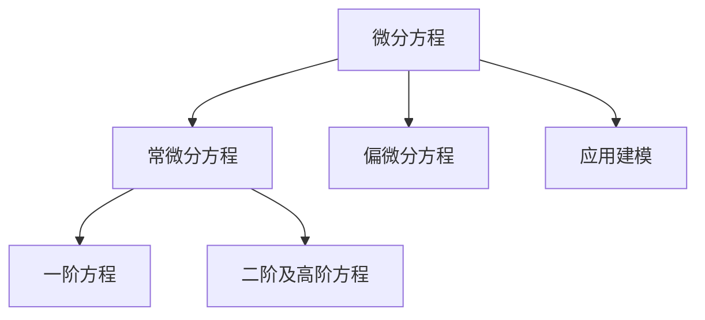

# 07. 微分方程（Differential Equations）

## 07.1 目录

- [07. 微分方程（Differential Equations）](#07-微分方程differential-equations)
  - [07.1 目录](#071-目录)
  - [07.2 微分方程的基本概念与分类](#072-微分方程的基本概念与分类)
  - [07.3 一阶微分方程](#073-一阶微分方程)
  - [07.4 二阶及高阶微分方程](#074-二阶及高阶微分方程)
  - [07.5 典型应用与建模](#075-典型应用与建模)
  - [07.6 典型定理与公式](#076-典型定理与公式)
  - [07.7 可视化与多表征](#077-可视化与多表征)
    - [07.7.1 结构关系图（Mermaid）](#0771-结构关系图mermaid)
    - [07.7.2 典型图示](#0772-典型图示)
  - [07.8 学习建议与资源](#078-学习建议与资源)

---

## 07.2 微分方程的基本概念与分类

- 微分方程的定义、阶数、线性与非线性
- 初值问题、边值问题
- 常微分方程（ODE）、偏微分方程（PDE）

---

## 07.3 一阶微分方程

- 可分离变量方程、齐次方程、线性方程、恰当方程
- 积分因子法、变量代换法
- 典型例题与解法

---

## 07.4 二阶及高阶微分方程

- 二阶常系数齐次与非齐次线性方程
- 特征方程法、常数变易法、降阶法
- 简单的高阶方程与系统

---

## 07.5 典型应用与建模

- 物理中的运动方程、谐振子、人口模型、放射性衰变
- 电路、流体、热传导等工程建模

---

## 07.6 典型定理与公式

- 一阶线性方程通解 $y' + p(x)y = q(x)$
- 二阶常系数齐次方程 $y'' + ay' + by = 0$
- 拉普拉斯变换、特解与通解

---

## 07.7 可视化与多表征

### 07.7.1 结构关系图（Mermaid）

### 07.7.2 典型图示

- 
- 

---

## 07.8 学习建议与资源

- 推荐教材：《微分方程教程》（丁同仁）、《Elementary Differential Equations》（Boyce & DiPrima）
- 交互式工具：Desmos、GeoGebra、微分方程数值解算器
- 进阶阅读：偏微分方程、动力系统、混沌理论、数值方法

---

[返回目录](#071-目录)
