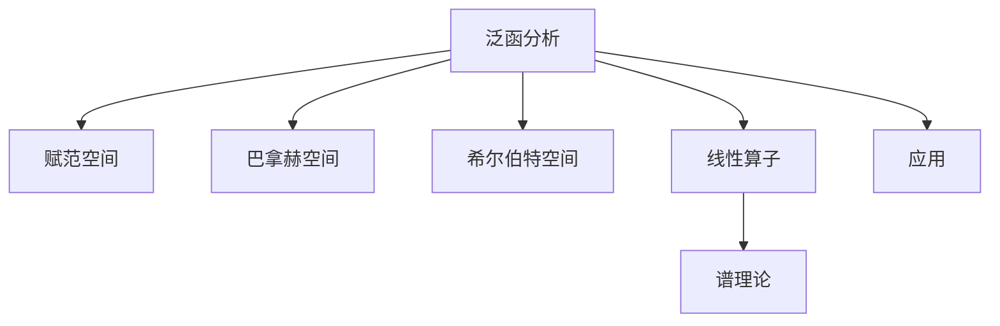

# 08. 泛函分析（Functional Analysis）

## 08.1 目录

- [08. 泛函分析（Functional Analysis）](#08-泛函分析functional-analysis)
  - [08.1 目录](#081-目录)
  - [08.2 基本概念与空间结构](#082-基本概念与空间结构)
  - [08.3 线性算子与谱理论](#083-线性算子与谱理论)
  - [08.4 典型定理与公式](#084-典型定理与公式)
  - [08.5 应用与建模](#085-应用与建模)
  - [08.6 可视化与多表征](#086-可视化与多表征)
    - [08.6.1 结构关系图（Mermaid）](#0861-结构关系图mermaid)
    - [08.6.2 典型图示](#0862-典型图示)
  - [08.7 学习建议与资源](#087-学习建议与资源)

---

## 08.2 基本概念与空间结构

- 赋范空间、巴拿赫空间、希尔伯特空间
- 线性泛函、内积、范数、完备性
- 典型例子：$L^p$ 空间、$C([a,b])$ 空间

---

## 08.3 线性算子与谱理论

- 有界线性算子、紧算子
- 谱、特征值、谱定理
- 对偶空间与泛函表示

---

## 08.4 典型定理与公式

- 巴拿赫不动点定理
- 哈恩-巴拿赫定理
- 开映射定理、闭图定理
- 希尔伯特空间正交分解

---

## 08.5 应用与建模

- 微分方程与泛函分析
- 量子力学中的希尔伯特空间
- 最优化与变分法

---

## 08.6 可视化与多表征

### 08.6.1 结构关系图（Mermaid）

### 08.6.2 典型图示

- 
- )

---

## 08.7 学习建议与资源

- 推荐教材：《泛函分析引论》（袁新意）、《Introductory Functional Analysis with Applications》（Kreyszig）
- 交互式工具：WolframAlpha、GeoGebra
- 进阶阅读：算子代数、谱理论、量子信息

---

[返回目录](#081-目录)
