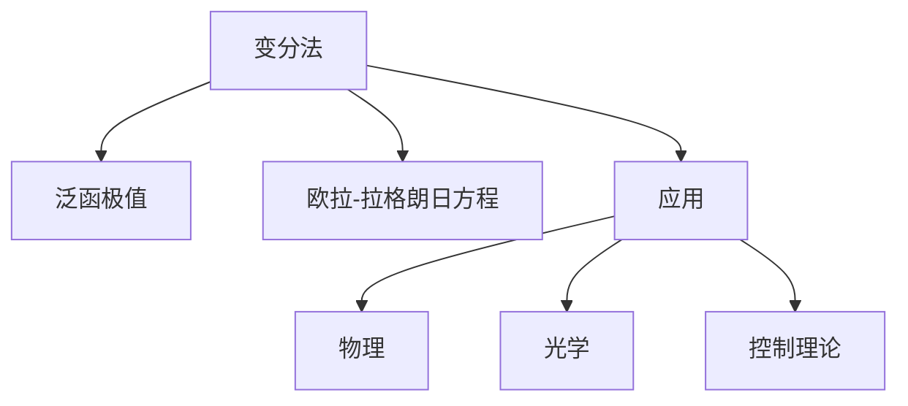

# 09. 变分法（Calculus of Variations）

## 09.1 目录

- [09. 变分法（Calculus of Variations）](#09-变分法calculus-of-variations)
  - [09.1 目录](#091-目录)
  - [09.2 基本概念与问题类型](#092-基本概念与问题类型)
  - [09.3 欧拉-拉格朗日方程](#093-欧拉-拉格朗日方程)
  - [09.4 典型定理与公式](#094-典型定理与公式)
  - [09.5 应用与建模](#095-应用与建模)
  - [09.6 可视化与多表征](#096-可视化与多表征)
    - [09.6.1 结构关系图（Mermaid）](#0961-结构关系图mermaid)
    - [09.6.2 典型图示](#0962-典型图示)
  - [09.7 学习建议与资源](#097-学习建议与资源)

---

## 09.2 基本概念与问题类型

- 泛函、极值、变分问题的定义
- 约束变分、等式与不等式约束
- 典型例子：最短路径、最小作用量

---

## 09.3 欧拉-拉格朗日方程

- 欧拉-拉格朗日方程的推导与形式
- 多变量与高阶推广
- 典型例题与解法

---

## 09.4 典型定理与公式

- 欧拉-拉格朗日方程：
  $$\frac{\partial F}{\partial y} - \frac{d}{dx} \frac{\partial F}{\partial y'} = 0$$
- 贝尔曼方程、Noether定理

---

## 09.5 应用与建模

- 物理中的最小作用量原理
- 光学中的费马原理
- 控制理论与最优控制

---

## 09.6 可视化与多表征

### 09.6.1 结构关系图（Mermaid）

### 09.6.2 典型图示

- 

---

## 09.7 学习建议与资源

- 推荐教材：《变分法与最优控制》（李承治）、《Calculus of Variations》（Gelfand & Fomin）
- 交互式工具：WolframAlpha、Symbolab
- 进阶阅读：最优控制、庞特里亚金极大值原理、Noether定理

---

[返回目录](#091-目录)
