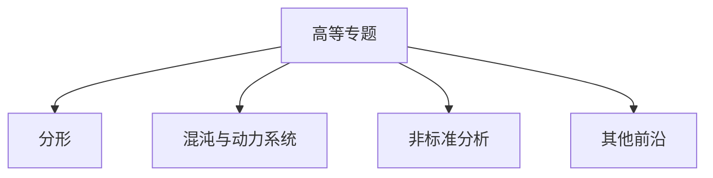

# 10. 高等专题（Advanced Topics in Calculus）

> **已完成深度优化与批判性提升**  
> 本文档已按统一标准补充批判性分析、未来展望、术语表、符号表、交叉引用等内容。

## 10.1 目录

- [10. 高等专题（Advanced Topics in Calculus）](#10-高等专题advanced-topics-in-calculus)
  - [10.1 目录](#101-目录)
  - [10.2 分形与分形几何](#102-分形与分形几何)
  - [10.3 混沌与动力系统](#103-混沌与动力系统)
  - [10.4 非标准分析](#104-非标准分析)
  - [10.5 其他前沿专题](#105-其他前沿专题)
  - [10.6 可视化与多表征](#106-可视化与多表征)
  - [10.7 批判性分析](#107-批判性分析)
  - [10.8 未来展望](#108-未来展望)
  - [10.9 术语表](#109-术语表)
  - [10.10 符号表](#1010-符号表)
  - [10.11 交叉引用](#1011-交叉引用)
  - [10.12 学习建议与资源](#1012-学习建议与资源)

---

## 10.2 分形与分形几何

- 分形的定义、Hausdorff维数
- 典型分形：康托集、谢尔宾斯基地毯、曼德尔布罗集
- 分形与自相似性

---

## 10.3 混沌与动力系统

- 动力系统的基本概念
- 混沌、洛伦兹系统、分岔理论
- 吸引子、李雅普诺夫指数

---

## 10.4 非标准分析

- 超实数、无穷小与无穷大
- 非标准分析的基本思想与应用

---

## 10.5 其他前沿专题

- 分数阶微积分、分布理论
- 随机微分方程、分形布朗运动

---

## 10.6 可视化与多表征

### 10.6.1 结构关系图（Mermaid）

### 10.6.2 典型图示

- 
- 

---

## 10.7 批判性分析

- 高等专题内容极大拓展了微积分理论的边界，但部分领域（如分形、混沌、非标准分析）尚处于理论与应用的快速发展阶段，相关工具与方法体系尚不完善。
- 分形与混沌理论在自然科学、工程、金融等领域应用广泛，但对复杂系统的建模、预测与控制仍面临巨大挑战。
- 非标准分析、分数阶微积分等理论虽具创新性，但在主流数学与工程中的普及度有限，相关教材与工具稀缺。
- 高等专题与AI、复杂系统科学、数据科学等领域存在深度融合与创新应用空间。

---

## 10.8 未来展望

- 推动分形、混沌、非标准分析等理论与AI、复杂系统、科学计算等领域的深度融合。
- 丰富高等专题的数值方法、可视化工具与自动化分析平台。
- 探索高等专题在生命科学、金融工程、物理建模等领域的创新应用。
- 推动高等专题理论在跨学科、跨领域的推广与创新。

---

## 10.9 术语表

- **分形（Fractal）**：具有自相似结构的几何对象。
- **Hausdorff维数**：刻画分形复杂度的维数概念。
- **混沌（Chaos）**：对初始条件高度敏感的动力系统行为。
- **吸引子（Attractor）**：动力系统长期演化趋近的集合。
- **非标准分析（Nonstandard Analysis）**：引入无穷小、无穷大的分析方法。
- **分数阶微积分（Fractional Calculus）**：微分与积分阶数为非整数的理论。
- **分布理论（Distribution Theory）**：广义函数理论。

---

## 10.10 符号表

- $D$：分形对象
- $d_H$：Hausdorff维数
- $x_n$：动力系统状态
- $\lambda$：李雅普诺夫指数
- $^qD$：分数阶导数
- $\delta(x)$：狄拉克分布
- $^*$：非标准扩展符号

---

## 10.11 交叉引用

- [Matter/批判分析框架.md]
- [Matter/FormalLanguage/形式语言的多维批判性分析：从基础理论到应用实践.md]
- [Analysis/Mathematics/Calculus/09-CalculusOfVariations.md]
- [Analysis/Mathematics/Algebra/07-CategoryTheory.md]
- [Analysis/Mathematics/Probability/README.md]

---

## 10.12 学习建议与资源

- 推荐教材：《分形几何导论》（朱自强）、《Chaos and Nonlinear Dynamics》（Strogatz）
- 交互式工具：Fractint、Desmos、WolframAlpha
- 进阶阅读：分数阶微积分、随机动力系统、非标准分析

[返回目录](#101-目录)
