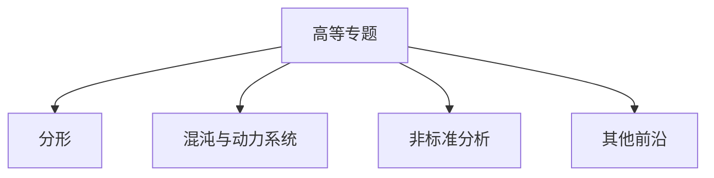

# 10. 高等专题（Advanced Topics in Calculus）

## 10.1 目录

- [10. 高等专题（Advanced Topics in Calculus）](#10-高等专题advanced-topics-in-calculus)
  - [10.1 目录](#101-目录)
  - [10.2 分形与分形几何](#102-分形与分形几何)
  - [10.3 混沌与动力系统](#103-混沌与动力系统)
  - [10.4 非标准分析](#104-非标准分析)
  - [10.5 其他前沿专题](#105-其他前沿专题)
  - [10.6 可视化与多表征](#106-可视化与多表征)
    - [10.6.1 结构关系图（Mermaid）](#1061-结构关系图mermaid)
    - [10.6.2 典型图示](#1062-典型图示)
  - [10.7 学习建议与资源](#107-学习建议与资源)

---

## 10.2 分形与分形几何

- 分形的定义、Hausdorff维数
- 典型分形：康托集、谢尔宾斯基地毯、曼德尔布罗集
- 分形与自相似性

---

## 10.3 混沌与动力系统

- 动力系统的基本概念
- 混沌、洛伦兹系统、分岔理论
- 吸引子、李雅普诺夫指数

---

## 10.4 非标准分析

- 超实数、无穷小与无穷大
- 非标准分析的基本思想与应用

---

## 10.5 其他前沿专题

- 分数阶微积分、分布理论
- 随机微分方程、分形布朗运动

---

## 10.6 可视化与多表征

### 10.6.1 结构关系图（Mermaid）

### 10.6.2 典型图示

- 
- 

---

## 10.7 学习建议与资源

- 推荐教材：《分形几何导论》（朱自强）、《Chaos and Nonlinear Dynamics》（Strogatz）
- 交互式工具：Fractint、Desmos、WolframAlpha
- 进阶阅读：分数阶微积分、随机动力系统、非标准分析

---

[返回目录](#101-目录)
