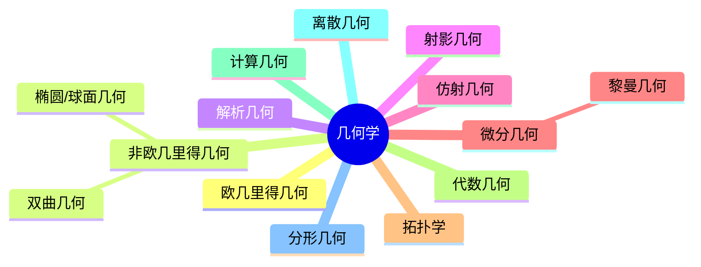

# 01. 几何学内容概览（Geometry Overview）

## 01.1 目录

- [01. 几何学内容概览（Geometry Overview）](#01-几何学内容概览geometry-overview)
  - [01.1 目录](#011-目录)
  - [01.2 引言与核心概念](#012-引言与核心概念)
  - [01.3 基本元素](#013-基本元素)
  - [01.4 基本关系](#014-基本关系)
  - [01.5 公理化方法与逻辑演绎](#015-公理化方法与逻辑演绎)
  - [01.6 几何学的主要分支](#016-几何学的主要分支)
    - [01.6.1 分支结构图（Mermaid）](#0161-分支结构图mermaid)
  - [01.7 多表征与可视化](#017-多表征与可视化)

---

## 01.2 引言与核心概念

- 几何学研究空间、形状、大小、位置及其关系，是数学最古老、最基础的分支之一。
- 研究对象包括点、线、面、体、曲线、曲面、高维流形、拓扑空间等。
- 关注空间变换下的不变性质，强调直观与逻辑推理的结合。

---

## 01.3 基本元素

- **点**：无大小，仅表示位置，0维。
- **直线**：无限延伸、无宽度，1维，由两点确定。
- **平面**：无限延伸的平坦表面，2维，由三点确定。
- **体/空间图形**：三维空间中的对象，如立方体、球体等。

---

## 01.4 基本关系

- **位置关系**：相交、平行、垂直、重合、异面等。
- **度量关系**：长度、角度、面积、体积、曲率。
- **变换关系**：刚体变换、相似变换、仿射变换、射影变换、拓扑变换。

---

## 01.5 公理化方法与逻辑演绎

- 基本术语（点、线、面）不加定义，通过公理间接刻画。
- 公理/公设为理论基础，定义用于引入新概念，定理通过逻辑推理证明。
- 欧几里得公理体系是经典范例，平行公设的研究催生非欧几何。

---

## 01.6 几何学的主要分支

- 欧几里得几何、非欧几里得几何、解析几何、射影几何、仿射几何、微分几何、黎曼几何、拓扑学、代数几何、计算几何、离散几何、分形几何等。

### 01.6.1 分支结构图（Mermaid）

---

## 01.7 多表征与可视化

- 结构关系图、分支树、经典定理的LaTeX公式
- 例：欧几里得距离公式 $d = \sqrt{(x_2 - x_1)^2 + (y_2 - y_1)^2}$
- 例：三角形面积 $S = \frac{1}{2}ab\sin C$

---

[返回目录](#011-目录)
