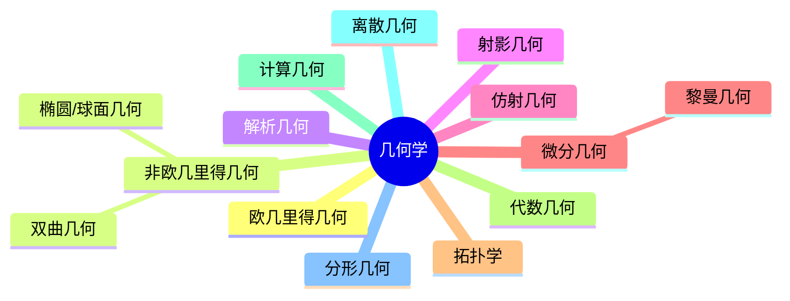

# 01. 几何学内容概览（Geometry Overview）

> **已完成深度优化与批判性提升**  
> 本文档已按统一标准补充批判性分析、未来展望、术语表、符号表、交叉引用等内容。

## 01.1 目录

- [01. 几何学内容概览（Geometry Overview）](#01-几何学内容概览geometry-overview)
  - [01.1 目录](#011-目录)
  - [01.2 引言与核心概念](#012-引言与核心概念)
  - [01.3 基本元素](#013-基本元素)
  - [01.4 基本关系](#014-基本关系)
  - [01.5 公理化方法与逻辑演绎](#015-公理化方法与逻辑演绎)
  - [01.6 几何学的主要分支](#016-几何学的主要分支)
    - [01.6.1 分支结构图（Mermaid）](#0161-分支结构图mermaid)
  - [01.7 多表征与可视化](#017-多表征与可视化)
  - [01.8 批判性分析](#018-批判性分析)
  - [01.9 未来展望](#019-未来展望)
  - [01.10 术语表](#0110-术语表)
  - [01.11 符号表](#0111-符号表)
  - [01.12 交叉引用](#0112-交叉引用)

---

## 01.2 引言与核心概念

- 几何学研究空间、形状、大小、位置及其关系，是数学最古老、最基础的分支之一。
- 研究对象包括点、线、面、体、曲线、曲面、高维流形、拓扑空间等。
- 关注空间变换下的不变性质，强调直观与逻辑推理的结合。

---

## 01.3 基本元素

- **点**：无大小，仅表示位置，0维。
- **直线**：无限延伸、无宽度，1维，由两点确定。
- **平面**：无限延伸的平坦表面，2维，由三点确定。
- **体/空间图形**：三维空间中的对象，如立方体、球体等。

---

## 01.4 基本关系

- **位置关系**：相交、平行、垂直、重合、异面等。
- **度量关系**：长度、角度、面积、体积、曲率。
- **变换关系**：刚体变换、相似变换、仿射变换、射影变换、拓扑变换。

---

## 01.5 公理化方法与逻辑演绎

- 基本术语（点、线、面）不加定义，通过公理间接刻画。
- 公理/公设为理论基础，定义用于引入新概念，定理通过逻辑推理证明。
- 欧几里得公理体系是经典范例，平行公设的研究催生非欧几何。

---

## 01.6 几何学的主要分支

- 欧几里得几何、非欧几里得几何、解析几何、射影几何、仿射几何、微分几何、黎曼几何、拓扑学、代数几何、计算几何、离散几何、分形几何等。

### 01.6.1 分支结构图（Mermaid）

---

## 01.7 多表征与可视化

- 结构关系图、分支树、经典定理的LaTeX公式
- 例：欧几里得距离公式 $d = \sqrt{(x_2 - x_1)^2 + (y_2 - y_1)^2}$
- 例：三角形面积 $S = \frac{1}{2}ab\sin C$

---

## 01.8 批判性分析

- 几何学理论体系庞大，分支众多，经典几何与现代几何（如拓扑、分形、代数几何）之间的联系与统一性仍在不断深化。
- 公理化方法虽提升了理论严密性，但部分基础概念（如点、线）本质上依赖直观，形式化与直观之间存在张力。
- 高维、抽象几何（如流形、同调、范畴几何）对初学者门槛较高，相关可视化与交互式工具有限。
- 几何学与物理、计算机科学、AI、建筑、艺术等领域的交叉日益紧密，但跨学科表达与应用体系尚需完善。

---

## 01.9 未来展望

- 推动几何学与AI、数据科学、物理建模、建筑设计等领域的深度融合。
- 丰富高维、抽象几何的可视化、交互式教学与仿真工具，降低学习门槛。
- 探索几何学在复杂系统、材料科学、生命科学等领域的创新应用。
- 推动几何学理论在范畴论、同调理论、量子几何等前沿方向的推广与创新。

---

## 01.10 术语表

- **点（Point）**：空间中的基本单位，无大小，仅有位置。
- **直线（Line）**：无限延伸的1维对象，由两点确定。
- **平面（Plane）**：无限延伸的2维对象，由三点确定。
- **体（Solid）**：三维空间中的对象。
- **曲线（Curve）**：空间中连续变化的1维对象。
- **曲面（Surface）**：空间中连续变化的2维对象。
- **流形（Manifold）**：局部类似欧几里得空间的空间。
- **拓扑空间（Topological Space）**：定义了开集结构的集合。

---

## 01.11 符号表

- $P$：点
- $l$：直线
- $\pi$：平面
- $d$：距离
- $\angle$：角度
- $S$：面积
- $V$：体积
- $\kappa$：曲率
- $M$：流形

---

## 01.12 交叉引用

- [Matter/批判分析框架.md]
- [Matter/FormalLanguage/形式语言的多维批判性分析：从基础理论到应用实践.md]
- [Analysis/Mathematics/Geometry/02-CoreConcepts.md]
- [Analysis/Mathematics/Algebra/07-CategoryTheory.md]
- [Analysis/Mathematics/Calculus/10-AdvancedTopics.md]

---

[返回目录](#011-目录)
