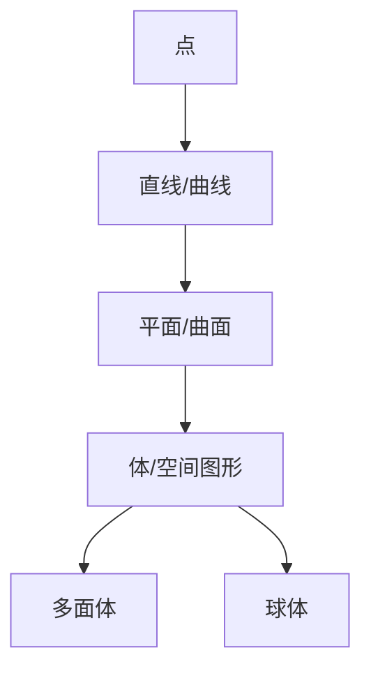

# 02. 几何学核心概念梳理（Core Concepts in Geometry）

## 02.1 目录

- [02. 几何学核心概念梳理（Core Concepts in Geometry）](#02-几何学核心概念梳理core-concepts-in-geometry)
  - [02.1 目录](#021-目录)
  - [02.2 基本元素与结构](#022-基本元素与结构)
  - [02.3 基本关系与变换](#023-基本关系与变换)
  - [02.4 典型定理与性质](#024-典型定理与性质)
  - [02.5 多表征与可视化](#025-多表征与可视化)
    - [02.5.1 结构关系图（Mermaid）](#0251-结构关系图mermaid)
    - [02.5.2 典型几何对象示意](#0252-典型几何对象示意)

---

## 02.2 基本元素与结构

- **点**：空间中的位置，无大小。
- **直线/曲线**：一维对象，直线无限延伸，曲线可有不同形状。
- **平面/曲面**：二维对象，平面无限延伸，曲面可弯曲。
- **体/空间图形**：三维对象，如立方体、球体、多面体。

---

## 02.3 基本关系与变换

- **位置关系**：相交、平行、垂直、重合、异面。
- **度量关系**：长度、角度、面积、体积、曲率。
- **变换类型**：
  - 刚体变换（平移、旋转、反射）
  - 相似变换（缩放）
  - 仿射变换、射影变换、拓扑变换

---

## 02.4 典型定理与性质

- **欧几里得距离公式**：$d = \sqrt{(x_2 - x_1)^2 + (y_2 - y_1)^2}$
- **三角形面积**：$S = \frac{1}{2}ab\sin C$
- **圆的周长与面积**：$C = 2\pi r$，$A = \pi r^2$
- **欧拉公式（多面体）**：$V - E + F = 2$
- **毕达哥拉斯定理**：$a^2 + b^2 = c^2$

---

## 02.5 多表征与可视化

### 02.5.1 结构关系图（Mermaid）

### 02.5.2 典型几何对象示意

- 
- 
- 

---

[返回目录](#021-目录)
