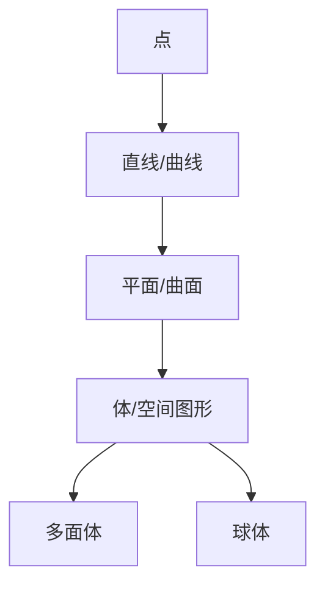

# 02. 几何学核心概念梳理（Core Concepts in Geometry）

> **已完成深度优化与批判性提升**  
> 本文档已按统一标准补充批判性分析、未来展望、术语表、符号表、交叉引用等内容。

## 02.1 目录

- [02. 几何学核心概念梳理（Core Concepts in Geometry）](#02-几何学核心概念梳理core-concepts-in-geometry)
  - [02.1 目录](#021-目录)
  - [02.2 基本元素与结构](#022-基本元素与结构)
  - [02.3 基本关系与变换](#023-基本关系与变换)
  - [02.4 典型定理与性质](#024-典型定理与性质)
  - [02.5 多表征与可视化](#025-多表征与可视化)
    - [02.5.1 结构关系图（Mermaid）](#0251-结构关系图mermaid)
    - [02.5.2 典型几何对象示意](#0252-典型几何对象示意)
  - [02.6 批判性分析](#026-批判性分析)
  - [02.7 未来展望](#027-未来展望)
  - [02.8 术语表](#028-术语表)
  - [02.9 符号表](#029-符号表)
  - [02.10 交叉引用](#0210-交叉引用)

---

## 02.2 基本元素与结构

- **点**：空间中的位置，无大小。
- **直线/曲线**：一维对象，直线无限延伸，曲线可有不同形状。
- **平面/曲面**：二维对象，平面无限延伸，曲面可弯曲。
- **体/空间图形**：三维对象，如立方体、球体、多面体。

---

## 02.3 基本关系与变换

- **位置关系**：相交、平行、垂直、重合、异面。
- **度量关系**：长度、角度、面积、体积、曲率。
- **变换类型**：
  - 刚体变换（平移、旋转、反射）
  - 相似变换（缩放）
  - 仿射变换、射影变换、拓扑变换

---

## 02.4 典型定理与性质

- **欧几里得距离公式**：$d = \sqrt{(x_2 - x_1)^2 + (y_2 - y_1)^2}$
- **三角形面积**：$S = \frac{1}{2}ab\sin C$
- **圆的周长与面积**：$C = 2\pi r$，$A = \pi r^2$
- **欧拉公式（多面体）**：$V - E + F = 2$
- **毕达哥拉斯定理**：$a^2 + b^2 = c^2$

---

## 02.5 多表征与可视化

### 02.5.1 结构关系图（Mermaid）

### 02.5.2 典型几何对象示意

- 
- 
- 

---

## 02.6 批判性分析

- 几何核心概念虽直观，但高维、抽象结构（如流形、同调、范畴几何）对初学者门槛较高，相关可视化与交互式工具有限。
- 经典定理多依赖欧几里得空间，非欧几何、拓扑、分形等现代分支的核心概念与性质需进一步系统化。
- 几何变换理论与物理、计算机图形、AI等领域的结合日益紧密，但跨学科表达与应用体系尚需完善。

---

## 02.7 未来展望

- 推动几何核心概念与AI、数据科学、物理建模等领域的深度融合。
- 丰富高维、抽象几何的可视化、交互式教学与仿真工具，降低学习门槛。
- 探索几何核心概念在复杂系统、材料科学、生命科学等领域的创新应用。
- 推动几何理论在范畴论、同调理论、量子几何等前沿方向的推广与创新。

---

## 02.8 术语表

- **点（Point）**：空间中的基本单位，无大小，仅有位置。
- **直线（Line）**：无限延伸的1维对象，由两点确定。
- **平面（Plane）**：无限延伸的2维对象，由三点确定。
- **体（Solid）**：三维空间中的对象。
- **曲线（Curve）**：空间中连续变化的1维对象。
- **曲面（Surface）**：空间中连续变化的2维对象。
- **多面体（Polyhedron）**：由多边形面围成的空间图形。
- **球体（Sphere）**：所有表面点到中心距离相等的体。

---

## 02.9 符号表

- $P$：点
- $l$：直线
- $\pi$：平面
- $d$：距离
- $\angle$：角度
- $S$：面积
- $V$：体积
- $r$：半径
- $F$：面数
- $E$：棱数
- $V$：顶点数

---

## 02.10 交叉引用

- [Matter/批判分析框架.md]
- [Matter/FormalLanguage/形式语言的多维批判性分析：从基础理论到应用实践.md]
- [Analysis/Mathematics/Geometry/01-Overview.md]
- [Analysis/Mathematics/Algebra/07-CategoryTheory.md]
- [Analysis/Mathematics/Calculus/10-AdvancedTopics.md]

---

[返回目录](#021-目录)
