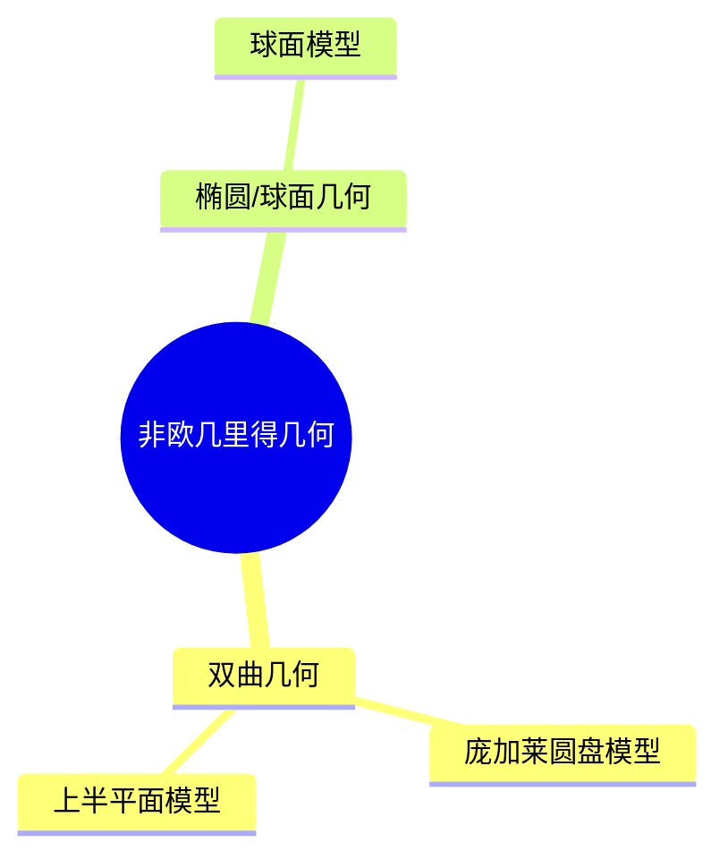

# 04. 非欧几里得几何（Non-Euclidean Geometry）

> **已完成深度优化与批判性提升**  
> 本文档已按统一标准补充批判性分析、未来展望、术语表、符号表、交叉引用等内容。

## 04.1 目录

- [04. 非欧几里得几何（Non-Euclidean Geometry）](#04-非欧几里得几何non-euclidean-geometry)
  - [04.1 目录](#041-目录)
  - [04.2 非欧几里得几何的起源与类型](#042-非欧几里得几何的起源与类型)
  - [04.3 双曲几何](#043-双曲几何)
  - [04.4 椭圆/球面几何](#044-椭圆球面几何)
  - [04.5 典型模型与性质](#045-典型模型与性质)
  - [04.6 典型定理与公式](#046-典型定理与公式)
  - [04.7 可视化与多表征](#047-可视化与多表征)
    - [04.7.1 结构关系图（Mermaid）](#0471-结构关系图mermaid)
    - [04.7.2 典型几何对象示意](#0472-典型几何对象示意)
  - [04.8 批判性分析](#048-批判性分析)
  - [04.9 未来展望](#049-未来展望)
  - [04.10 术语表](#0410-术语表)
  - [04.11 符号表](#0411-符号表)
  - [04.12 交叉引用](#0412-交叉引用)
  - [04.13 学习建议与资源](#0413-学习建议与资源)

---

## 04.2 非欧几里得几何的起源与类型

- 否定或修改欧几里得第五公设（平行公设）
- 主要类型：双曲几何、椭圆几何（球面几何）
- 历史人物：高斯、罗巴切夫斯基、波尔约、黎曼

---

## 04.3 双曲几何

- 平行线有无数条
- 角和小于180°的三角形
- 典型模型：庞加莱圆盘模型、上半平面模型

---

## 04.4 椭圆/球面几何

- 没有平行线，所有直线相交
- 角和大于180°的三角形
- 典型模型：球面、椭圆面

---

## 04.5 典型模型与性质

- 庞加莱圆盘模型、上半平面模型（双曲几何）
- 球面模型（椭圆几何）
- 距离、角度、面积等度量性质的变化

---

## 04.6 典型定理与公式

- 双曲三角形面积 $A = \pi - (\alpha + \beta + \gamma)$
- 球面三角形面积 $A = R^2 (\alpha + \beta + \gamma - \pi)$
- 球面距离公式 $d = R \arccos(\sin\varphi_1\sin\varphi_2 + \cos\varphi_1\cos\varphi_2\cos(\lambda_1-\lambda_2))$

---

## 04.7 可视化与多表征

### 04.7.1 结构关系图（Mermaid）

### 04.7.2 典型几何对象示意

- 
- 

---

## 04.8 批判性分析

- 非欧几里得几何突破了欧氏空间的直观限制，极大拓展了几何理论的边界，但高维、抽象模型的可视化与直观理解仍具挑战。
- 双曲、球面等几何的度量性质与欧氏几何差异显著，相关公式与直观经验常被误用。
- 非欧几何在物理（如广义相对论）、宇宙学、建筑等领域有重要应用，但跨学科表达与工程实现体系尚需完善。
- 非欧几何与拓扑、微分几何、代数几何等现代分支的融合日益紧密，但理论体系仍在发展中。

---

## 04.9 未来展望

- 推动非欧几里得几何与物理、宇宙学、AI、建筑等领域的深度融合。
- 丰富高维、抽象非欧几何的可视化、交互式教学与仿真工具，提升直观理解。
- 探索非欧几何在复杂系统、材料科学、生命科学等领域的创新应用。
- 推动非欧几何理论在范畴论、同调理论、量子几何等前沿方向的推广与创新。

---

## 04.10 术语表

- **双曲几何（Hyperbolic Geometry）**：否定平行公设，平行线有无数条的几何。
- **椭圆几何（Elliptic Geometry）/球面几何（Spherical Geometry）**：否定平行公设，所有直线相交的几何。
- **庞加莱圆盘模型（Poincaré Disk Model）**：双曲几何的典型模型。
- **球面模型（Spherical Model）**：椭圆几何的典型模型。
- **度量（Metric）**：距离、角度、面积等测度方式。

---

## 04.11 符号表

- $A$：面积
- $R$：球面半径
- $\alpha, \beta, \gamma$：三角形内角
- $d$：距离
- $\varphi, \lambda$：球面坐标（纬度、经度）

---

## 04.12 交叉引用

- [Matter/批判分析框架.md]
- [Matter/FormalLanguage/形式语言的多维批判性分析：从基础理论到应用实践.md]
- [Analysis/Mathematics/Geometry/01-Overview.md]
- [Analysis/Mathematics/Algebra/07-CategoryTheory.md]
- [Analysis/Mathematics/Calculus/10-AdvancedTopics.md]

---

## 04.13 学习建议与资源

- 推荐教材：《Non-Euclidean Geometry》（Marvin J. Greenberg）、《Geometry of Surfaces》（John Stillwell）
- 交互式工具：GeoGebra、球面几何可视化
- 进阶阅读：黎曼几何、广义相对论中的非欧几何

[返回目录](#041-目录)
