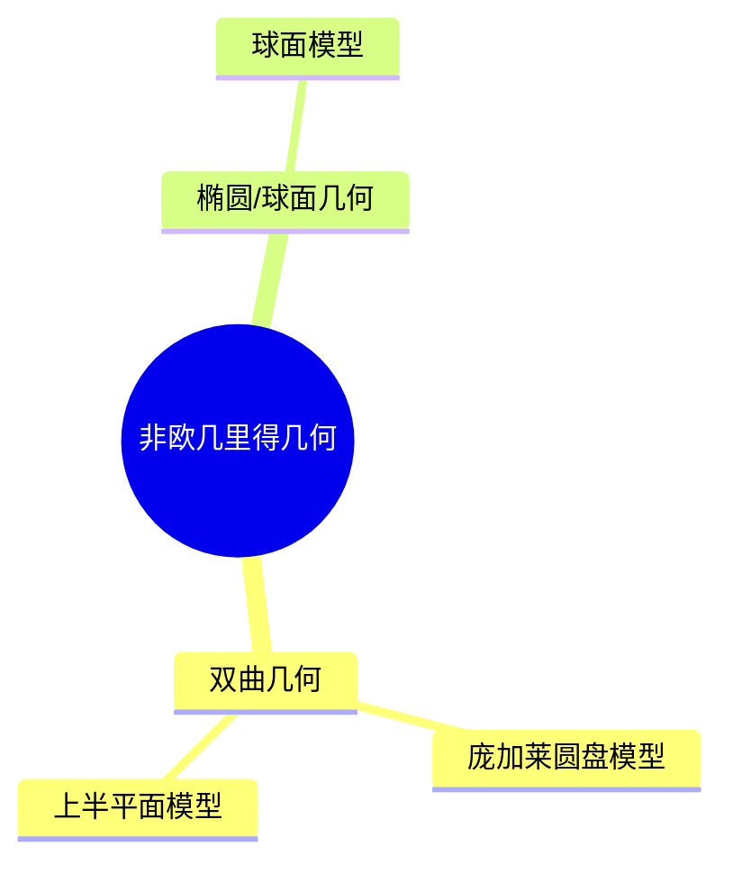

# 04. 非欧几里得几何（Non-Euclidean Geometry）

## 04.1 目录

- [04. 非欧几里得几何（Non-Euclidean Geometry）](#04-非欧几里得几何non-euclidean-geometry)
  - [04.1 目录](#041-目录)
  - [04.2 非欧几里得几何的起源与类型](#042-非欧几里得几何的起源与类型)
  - [04.3 双曲几何](#043-双曲几何)
  - [04.4 椭圆/球面几何](#044-椭圆球面几何)
  - [04.5 典型模型与性质](#045-典型模型与性质)
  - [04.6 典型定理与公式](#046-典型定理与公式)
  - [04.7 可视化与多表征](#047-可视化与多表征)
    - [04.7.1 结构关系图（Mermaid）](#0471-结构关系图mermaid)
    - [04.7.2 典型几何对象示意](#0472-典型几何对象示意)
  - [04.8 学习建议与资源](#048-学习建议与资源)

---

## 04.2 非欧几里得几何的起源与类型

- 否定或修改欧几里得第五公设（平行公设）
- 主要类型：双曲几何、椭圆几何（球面几何）
- 历史人物：高斯、罗巴切夫斯基、波尔约、黎曼

---

## 04.3 双曲几何

- 平行线有无数条
- 角和小于180°的三角形
- 典型模型：庞加莱圆盘模型、上半平面模型

---

## 04.4 椭圆/球面几何

- 没有平行线，所有直线相交
- 角和大于180°的三角形
- 典型模型：球面、椭圆面

---

## 04.5 典型模型与性质

- 庞加莱圆盘模型、上半平面模型（双曲几何）
- 球面模型（椭圆几何）
- 距离、角度、面积等度量性质的变化

---

## 04.6 典型定理与公式

- 双曲三角形面积 $A = \pi - (\alpha + \beta + \gamma)$
- 球面三角形面积 $A = R^2 (\alpha + \beta + \gamma - \pi)$
- 球面距离公式 $d = R \arccos(\sin\varphi_1\sin\varphi_2 + \cos\varphi_1\cos\varphi_2\cos(\lambda_1-\lambda_2))$

---

## 04.7 可视化与多表征

### 04.7.1 结构关系图（Mermaid）

### 04.7.2 典型几何对象示意

- 
- 

---

## 04.8 学习建议与资源

- 推荐教材：《Non-Euclidean Geometry》（Marvin J. Greenberg）、《Geometry of Surfaces》（John Stillwell）
- 交互式工具：GeoGebra、球面几何可视化
- 进阶阅读：黎曼几何、广义相对论中的非欧几何

---

[返回目录](#041-目录)
