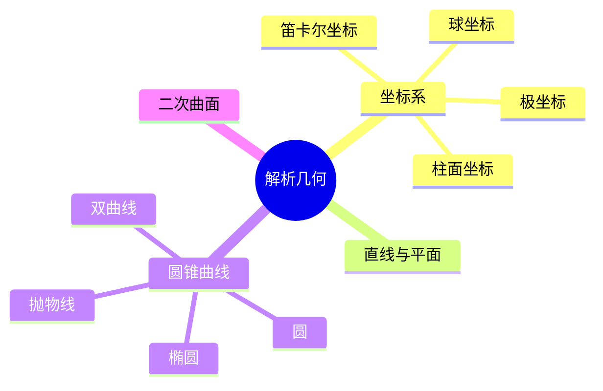

# 05. 解析几何（Analytic Geometry / Coordinate Geometry）

> **已完成深度优化与批判性提升**  
> 本文档已按统一标准补充批判性分析、未来展望、术语表、符号表、交叉引用等内容。

## 05.1 目录

- [05. 解析几何（Analytic Geometry / Coordinate Geometry）](#05-解析几何analytic-geometry--coordinate-geometry)
  - [05.1 目录](#051-目录)
  - [05.2 解析几何的基本思想与方法](#052-解析几何的基本思想与方法)
  - [05.3 坐标系与向量](#053-坐标系与向量)
  - [05.4 直线与平面方程](#054-直线与平面方程)
  - [05.5 圆锥曲线与二次曲面](#055-圆锥曲线与二次曲面)
  - [05.6 典型定理与公式](#056-典型定理与公式)
  - [05.7 可视化与多表征](#057-可视化与多表征)
    - [05.7.1 结构关系图（Mermaid）](#0571-结构关系图mermaid)
    - [05.7.2 典型几何对象示意](#0572-典型几何对象示意)
  - [05.8 批判性分析](#058-批判性分析)
  - [05.9 未来展望](#059-未来展望)
  - [05.10 术语表](#0510-术语表)
  - [05.11 符号表](#0511-符号表)
  - [05.12 交叉引用](#0512-交叉引用)
  - [05.13 学习建议与资源](#0513-学习建议与资源)

---

## 05.2 解析几何的基本思想与方法

- 用坐标和方程描述几何对象，将几何问题转化为代数问题
- 坐标系的引入（笛卡尔、费马）
- 代数方法与几何直观的结合

---

## 05.3 坐标系与向量

- 笛卡尔坐标系、极坐标系、柱面坐标系、球坐标系
- 向量的表示与运算
- 点的坐标、向量的长度与夹角

---

## 05.4 直线与平面方程

- 直线的点斜式、一般式、参数式
- 两直线的交点、平行、垂直条件
- 平面方程、空间直线方程

---

## 05.5 圆锥曲线与二次曲面

- 圆、椭圆、抛物线、双曲线的标准方程
- 二次曲面：椭球面、抛物面、双曲面等

---

## 05.6 典型定理与公式

- 距离公式 $d = \sqrt{(x_2 - x_1)^2 + (y_2 - y_1)^2}$
- 直线斜率 $k = \frac{y_2 - y_1}{x_2 - x_1}$
- 点到直线距离 $d = \frac{|Ax_0 + By_0 + C|}{\sqrt{A^2 + B^2}}$
- 椭圆标准方程 $\frac{x^2}{a^2} + \frac{y^2}{b^2} = 1$

---

## 05.7 可视化与多表征

### 05.7.1 结构关系图（Mermaid）

### 05.7.2 典型几何对象示意

- 
- 
- 

---

## 05.8 批判性分析

- 解析几何极大地推动了代数与几何的统一，但高维、抽象空间的表达与直观理解仍具挑战。
- 坐标方法虽简化了许多几何问题，但对几何本质的直观把握可能被代数运算所掩盖。
- 经典解析几何主要聚焦于欧氏空间，非欧空间、流形、代数几何等现代分支的坐标化理论需进一步系统化。
- 解析几何与物理、工程、计算机图形、AI等领域的结合日益紧密，但跨学科表达与应用体系尚需完善。

---

## 05.9 未来展望

- 推动解析几何与AI、数据科学、物理建模、计算机图形等领域的深度融合。
- 丰富高维、抽象空间的可视化、交互式教学与仿真工具，提升直观理解。
- 探索解析几何在复杂系统、材料科学、生命科学等领域的创新应用。
- 推动解析几何理论在代数几何、微分几何、范畴论等前沿方向的推广与创新。

---

## 05.10 术语表

- **坐标系（Coordinate System）**：用数对/数组描述空间位置的系统。
- **向量（Vector）**：具有大小和方向的量。
- **直线（Line）**：一维无限延伸的几何对象。
- **平面（Plane）**：二维无限延伸的几何对象。
- **圆锥曲线（Conic Section）**：圆、椭圆、抛物线、双曲线的统称。
- **二次曲面（Quadric Surface）**：二次方程描述的空间曲面。

---

## 05.11 符号表

- $P$：点
- $l$：直线
- $\pi$：平面
- $d$：距离
- $k$：斜率
- $S$：面积
- $V$：体积
- $r$：半径
- $a, b$：椭圆长、短轴
- $A, B, C$：直线方程系数

---

## 05.12 交叉引用

- [Matter/批判分析框架.md]
- [Matter/FormalLanguage/形式语言的多维批判性分析：从基础理论到应用实践.md]
- [Analysis/Mathematics/Geometry/01-Overview.md]
- [Analysis/Mathematics/Algebra/07-CategoryTheory.md]
- [Analysis/Mathematics/Calculus/10-AdvancedTopics.md]

---

## 05.13 学习建议与资源

- 推荐教材：《Analytic Geometry》（G. Birkhoff）、《Geometry and the Imagination》（Hilbert & Cohn-Vossen）
- 交互式工具：GeoGebra、Desmos
- 进阶阅读：高维空间解析几何、代数几何基础

[返回目录](#051-目录)
