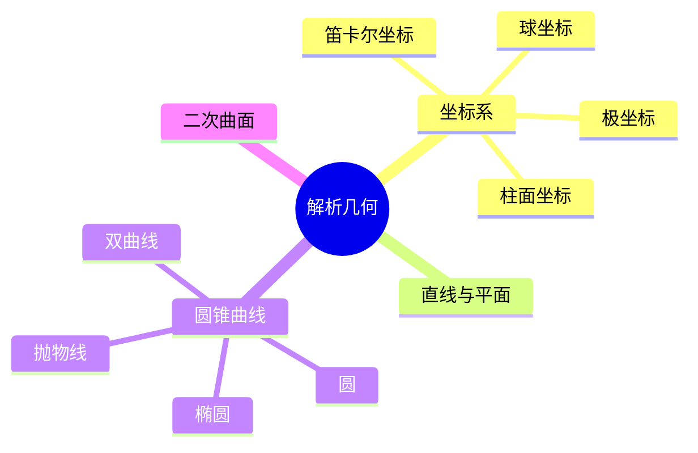

# 05. 解析几何（Analytic Geometry / Coordinate Geometry）

## 05.1 目录

- [05. 解析几何（Analytic Geometry / Coordinate Geometry）](#05-解析几何analytic-geometry--coordinate-geometry)
  - [05.1 目录](#051-目录)
  - [05.2 解析几何的基本思想与方法](#052-解析几何的基本思想与方法)
  - [05.3 坐标系与向量](#053-坐标系与向量)
  - [05.4 直线与平面方程](#054-直线与平面方程)
  - [05.5 圆锥曲线与二次曲面](#055-圆锥曲线与二次曲面)
  - [05.6 典型定理与公式](#056-典型定理与公式)
  - [05.7 可视化与多表征](#057-可视化与多表征)
    - [05.7.1 结构关系图（Mermaid）](#0571-结构关系图mermaid)
    - [05.7.2 典型几何对象示意](#0572-典型几何对象示意)
  - [05.8 学习建议与资源](#058-学习建议与资源)

---

## 05.2 解析几何的基本思想与方法

- 用坐标和方程描述几何对象，将几何问题转化为代数问题
- 坐标系的引入（笛卡尔、费马）
- 代数方法与几何直观的结合

---

## 05.3 坐标系与向量

- 笛卡尔坐标系、极坐标系、柱面坐标系、球坐标系
- 向量的表示与运算
- 点的坐标、向量的长度与夹角

---

## 05.4 直线与平面方程

- 直线的点斜式、一般式、参数式
- 两直线的交点、平行、垂直条件
- 平面方程、空间直线方程

---

## 05.5 圆锥曲线与二次曲面

- 圆、椭圆、抛物线、双曲线的标准方程
- 二次曲面：椭球面、抛物面、双曲面等

---

## 05.6 典型定理与公式

- 距离公式 $d = \sqrt{(x_2 - x_1)^2 + (y_2 - y_1)^2}$
- 直线斜率 $k = \frac{y_2 - y_1}{x_2 - x_1}$
- 点到直线距离 $d = \frac{|Ax_0 + By_0 + C|}{\sqrt{A^2 + B^2}}$
- 椭圆标准方程 $\frac{x^2}{a^2} + \frac{y^2}{b^2} = 1$

---

## 05.7 可视化与多表征

### 05.7.1 结构关系图（Mermaid）

### 05.7.2 典型几何对象示意

- 
- 
- 

---

## 05.8 学习建议与资源

- 推荐教材：《Analytic Geometry》（G. Birkhoff）、《Geometry and the Imagination》（Hilbert & Cohn-Vossen）
- 交互式工具：GeoGebra、Desmos
- 进阶阅读：高维空间解析几何、代数几何基础

---

[返回目录](#051-目录)
