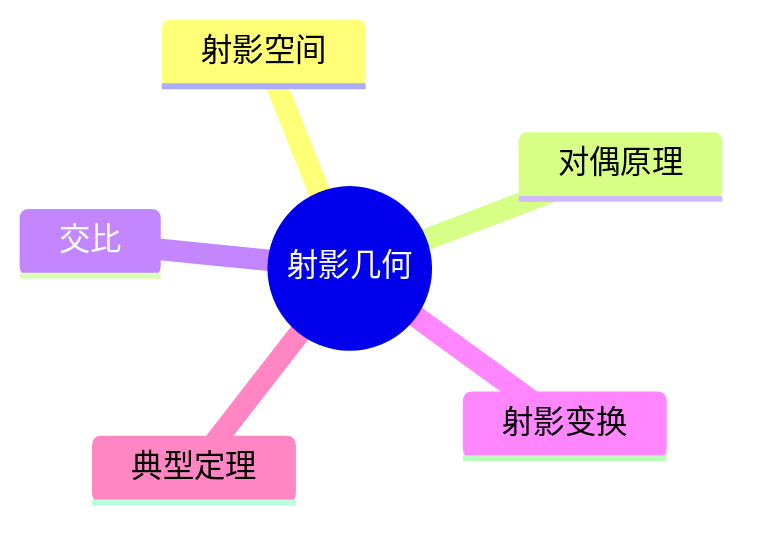

# 06. 射影几何（Projective Geometry）

> **已完成深度优化与批判性提升**  
> 本文档已按统一标准补充批判性分析、未来展望、术语表、符号表、交叉引用等内容。

## 06.1 目录

- [06. 射影几何（Projective Geometry）](#06-射影几何projective-geometry)
  - [06.1 目录](#061-目录)
  - [06.2 射影几何的基本思想与方法](#062-射影几何的基本思想与方法)
  - [06.3 基本概念与对偶原理](#063-基本概念与对偶原理)
  - [06.4 交比与射影变换](#064-交比与射影变换)
  - [06.5 典型定理与性质](#065-典型定理与性质)
  - [06.6 可视化与多表征](#066-可视化与多表征)
    - [06.6.1 结构关系图（Mermaid）](#0661-结构关系图mermaid)
    - [06.6.2 典型几何对象示意](#0662-典型几何对象示意)
  - [06.7 批判性分析](#067-批判性分析)
  - [06.8 未来展望](#068-未来展望)
  - [06.9 术语表](#069-术语表)
  - [06.10 符号表](#0610-符号表)
  - [06.11 交叉引用](#0611-交叉引用)
  - [06.12 学习建议与资源](#0612-学习建议与资源)

---

## 06.2 射影几何的基本思想与方法

- 研究在射影变换下不变的几何性质
- 引入无穷远点与无穷远线，统一平行与相交
- 不考虑度量（长度、角度），关注共线性、交比等

---

## 06.3 基本概念与对偶原理

- 点、直线、平面、无穷远点/线
- 对偶原理：点与线、线与面之间的对称关系
- 射影空间、齐次坐标

---

## 06.4 交比与射影变换

- 交比定义与不变量性
- 射影变换（投影、截割、中心投影）
- 透视投影在计算机图形学中的应用

---

## 06.5 典型定理与性质

- 德沙格（Desargues）定理、帕普斯（Pappus）定理
- 交比不变性、对偶定理
- 射影几何与仿射几何、欧几里得几何的关系

---

## 06.6 可视化与多表征

### 06.6.1 结构关系图（Mermaid）

### 06.6.2 典型几何对象示意

- 
- 

---

## 06.7 批判性分析

- 射影几何极大拓展了几何理论的统一性与抽象性，但对初学者而言无度量的空间直观难以把握。
- 对偶原理、交比等核心概念虽简洁优美，但与实际工程、物理建模的直接联系有限。
- 射影几何与代数几何、计算机视觉、图形学等领域的融合日益紧密，但跨学科表达与应用体系尚需完善。

---

## 06.8 未来展望

- 推动射影几何与AI、计算机视觉、图形学、代数几何等领域的深度融合。
- 丰富高维、抽象射影空间的可视化、交互式教学与仿真工具，提升直观理解。
- 探索射影几何在复杂系统、材料科学、生命科学等领域的创新应用。
- 推动射影几何理论在范畴论、同调理论、量子几何等前沿方向的推广与创新。

---

## 06.9 术语表

- **射影空间（Projective Space）**：引入无穷远点/线的空间。
- **对偶原理（Duality Principle）**：点与线、线与面之间的对称关系。
- **交比（Cross Ratio）**：四点共线时的射影不变量。
- **射影变换（Projective Transformation）**：保持交比的变换。
- **齐次坐标（Homogeneous Coordinates）**：射影空间中的坐标系统。

---

## 06.10 符号表

- $P$：点
- $l$：直线
- $\pi$：平面
- $CR$：交比
- $[x:y:z]$：齐次坐标
- $T$：射影变换

---

## 06.11 交叉引用

- [Matter/批判分析框架.md]
- [Matter/FormalLanguage/形式语言的多维批判性分析：从基础理论到应用实践.md]
- [Analysis/Mathematics/Geometry/01-Overview.md]
- [Analysis/Mathematics/Algebra/07-CategoryTheory.md]
- [Analysis/Mathematics/Calculus/10-AdvancedTopics.md]

---

## 06.12 学习建议与资源

- 推荐教材：《Projective Geometry》（H.S.M. Coxeter）、《Geometry Revisited》（Coxeter & Greitzer）
- 交互式工具：GeoGebra、射影变换可视化
- 进阶阅读：射影几何与代数几何、计算机视觉中的射影理论

[返回目录](#061-目录)
