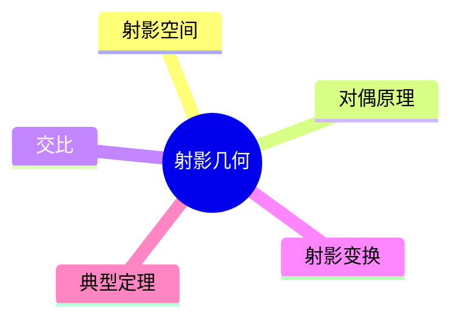

# 06. 射影几何（Projective Geometry）

## 06.1 目录

- [06. 射影几何（Projective Geometry）](#06-射影几何projective-geometry)
  - [06.1 目录](#061-目录)
  - [06.2 射影几何的基本思想与方法](#062-射影几何的基本思想与方法)
  - [06.3 基本概念与对偶原理](#063-基本概念与对偶原理)
  - [06.4 交比与射影变换](#064-交比与射影变换)
  - [06.5 典型定理与性质](#065-典型定理与性质)
  - [06.6 可视化与多表征](#066-可视化与多表征)
    - [06.6.1 结构关系图（Mermaid）](#0661-结构关系图mermaid)
    - [06.6.2 典型几何对象示意](#0662-典型几何对象示意)
  - [06.7 学习建议与资源](#067-学习建议与资源)

---

## 06.2 射影几何的基本思想与方法

- 研究在射影变换下不变的几何性质
- 引入无穷远点与无穷远线，统一平行与相交
- 不考虑度量（长度、角度），关注共线性、交比等

---

## 06.3 基本概念与对偶原理

- 点、直线、平面、无穷远点/线
- 对偶原理：点与线、线与面之间的对称关系
- 射影空间、齐次坐标

---

## 06.4 交比与射影变换

- 交比定义与不变量性
- 射影变换（投影、截割、中心投影）
- 透视投影在计算机图形学中的应用

---

## 06.5 典型定理与性质

- 德沙格（Desargues）定理、帕普斯（Pappus）定理
- 交比不变性、对偶定理
- 射影几何与仿射几何、欧几里得几何的关系

---

## 06.6 可视化与多表征

### 06.6.1 结构关系图（Mermaid）

### 06.6.2 典型几何对象示意

- 
- 

---

## 06.7 学习建议与资源

- 推荐教材：《Projective Geometry》（H.S.M. Coxeter）、《Geometry Revisited》（Coxeter & Greitzer）
- 交互式工具：GeoGebra、射影变换可视化
- 进阶阅读：射影几何与代数几何、计算机视觉中的射影理论

---

[返回目录](#061-目录)
