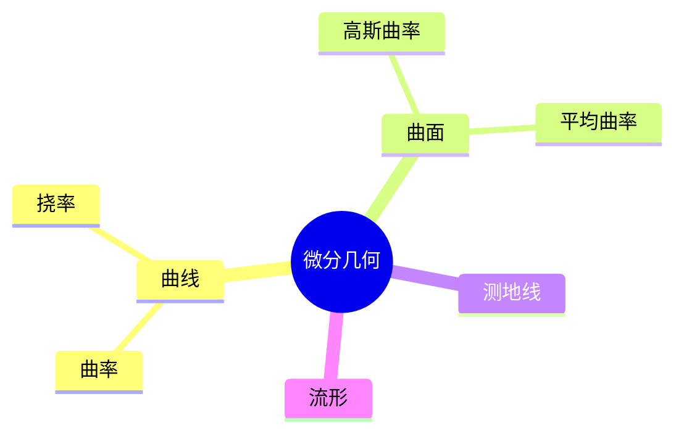

# 07. 微分几何（Differential Geometry）

## 07.1 目录

- [07. 微分几何（Differential Geometry）](#07-微分几何differential-geometry)
  - [07.1 目录](#071-目录)
  - [07.2 微分几何的基本思想与方法](#072-微分几何的基本思想与方法)
  - [07.3 曲线与曲面](#073-曲线与曲面)
  - [07.4 曲率、测地线与流形](#074-曲率测地线与流形)
  - [07.5 典型定理与公式](#075-典型定理与公式)
  - [07.6 可视化与多表征](#076-可视化与多表征)
    - [07.6.1 结构关系图（Mermaid）](#0761-结构关系图mermaid)
    - [07.6.2 典型几何对象示意](#0762-典型几何对象示意)
  - [07.7 学习建议与资源](#077-学习建议与资源)

---

## 07.2 微分几何的基本思想与方法

- 运用微积分方法研究光滑曲线、曲面和流形的几何性质
- 局部与全局性质的结合
- 典型问题：曲率、测地线、极小曲面

---

## 07.3 曲线与曲面

- 平面曲线、空间曲线的参数方程
- 曲面的参数化、法向量、切空间
- 典型对象：圆、螺旋线、球面、环面、抛物面

---

## 07.4 曲率、测地线与流形

- 曲线的曲率、挠率
- 曲面的高斯曲率、平均曲率
- 测地线的定义与性质
- 流形的基本概念

---

## 07.5 典型定理与公式

- Frenet-Serret 公式
- 高斯-博内定理 $\int_S K dA = 2\pi \chi(S)$
- 曲线曲率公式 $\kappa = \frac{|x'y'' - y'x''|}{(x'^2 + y'^2)^{3/2}}$
- 球面测地线为大圆

---

## 07.6 可视化与多表征

### 07.6.1 结构关系图（Mermaid）

### 07.6.2 典型几何对象示意

- 
- 
- 

---

## 07.7 学习建议与资源

- 推荐教材：《Elementary Differential Geometry》（Barrett O'Neill）、《Differential Geometry of Curves and Surfaces》（do Carmo）
- 交互式工具：SageMath、曲面可视化软件
- 进阶阅读：黎曼几何、广义相对论中的微分几何

---

[返回目录](#071-目录)
