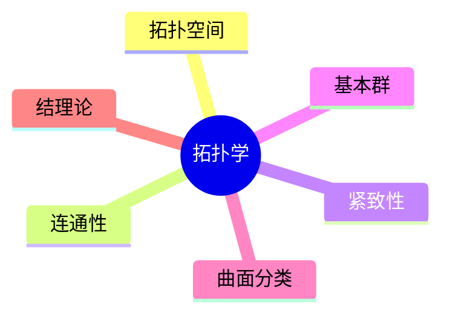

# 08. 拓扑学（Topology）

## 08.1 目录

- [08. 拓扑学（Topology）](#08-拓扑学topology)
  - [08.1 目录](#081-目录)
  - [08.2 拓扑学的基本思想与方法](#082-拓扑学的基本思想与方法)
  - [08.3 基本概念与对象](#083-基本概念与对象)
  - [08.4 拓扑性质与不变量](#084-拓扑性质与不变量)
  - [08.5 典型定理与公式](#085-典型定理与公式)
  - [08.6 可视化与多表征](#086-可视化与多表征)
    - [08.6.1 结构关系图（Mermaid）](#0861-结构关系图mermaid)
    - [08.6.2 典型对象示意](#0862-典型对象示意)
  - [08.7 学习建议与资源](#087-学习建议与资源)

---

## 08.2 拓扑学的基本思想与方法

- 研究在连续变形（拉伸、弯曲、不撕裂、不粘合）下保持不变的几何性质
- 关注连通性、紧致性、孔洞数等"橡皮泥几何"性质
- 典型问题：同胚、同伦、基本群、欧拉示性数

---

## 08.3 基本概念与对象

- 拓扑空间、开集、闭集、邻域、基、连续映射
- 典型对象：圆环、球面、环面、莫比乌斯带、克莱因瓶、结

---

## 08.4 拓扑性质与不变量

- 连通性、紧致性、可分性、可数性
- 基本群、同伦类型、欧拉示性数、Betti数
- 曲面分类、结的拓扑不变量

---

## 08.5 典型定理与公式

- 欧拉示性数 $\chi = V - E + F$
- 曲面分类定理
- 约旦曲线定理
- Brouwer 不动点定理

---

## 08.6 可视化与多表征

### 08.6.1 结构关系图（Mermaid）

### 08.6.2 典型对象示意

- 
- 
- 

---

## 08.7 学习建议与资源

- 推荐教材：《Topology》（James Munkres）、《A First Course in Topology》（John McCleary）
- 交互式工具：拓扑可视化软件、KnotPlot
- 进阶阅读：代数拓扑、同调与上同调、低维拓扑

---

[返回目录](#081-目录)
