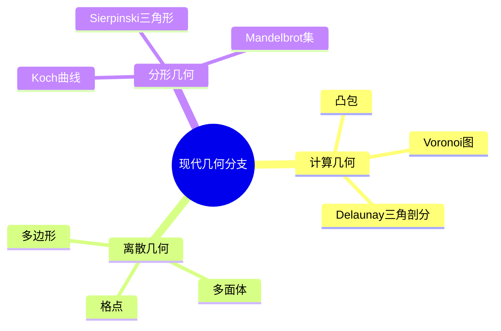

# 10. 计算几何、离散几何与分形几何（Computational, Discrete, and Fractal Geometry）

## 10.1 目录

- [10. 计算几何、离散几何与分形几何（Computational, Discrete, and Fractal Geometry）](#10-计算几何离散几何与分形几何computational-discrete-and-fractal-geometry)
  - [10.1 目录](#101-目录)
  - [10.2 计算几何](#102-计算几何)
  - [10.3 离散几何](#103-离散几何)
  - [10.4 分形几何](#104-分形几何)
  - [10.5 典型定理与算法](#105-典型定理与算法)
  - [10.6 可视化与多表征](#106-可视化与多表征)
    - [10.6.1 结构关系图（Mermaid）](#1061-结构关系图mermaid)
    - [10.6.2 典型对象示意](#1062-典型对象示意)
  - [10.7 学习建议与资源](#107-学习建议与资源)

---

## 10.2 计算几何

- 研究几何算法的设计与分析
- 典型问题：凸包、最近点对、Voronoi图、Delaunay三角剖分、线段相交
- 应用：计算机图形学、机器人学、地理信息系统

---

## 10.3 离散几何

- 研究有限或可数集合的几何性质
- 典型问题：点集覆盖、极值问题、组合结构、剖分、堆积
- 典型对象：多边形、多面体、格点、排列

---

## 10.4 分形几何

- 研究自相似、非整数维数的几何对象
- 典型对象：Koch曲线、Sierpinski三角形、Mandelbrot集
- 分形维数、迭代函数系统

---

## 10.5 典型定理与算法

- Jarvis步进法（凸包）、Graham扫描法
- Euler公式 $V - E + F = 2$（多面体）
- Hausdorff维数、分形维数公式

---

## 10.6 可视化与多表征

### 10.6.1 结构关系图（Mermaid）

### 10.6.2 典型对象示意

- 
- 
- 

---

## 10.7 学习建议与资源

- 推荐教材：《Computational Geometry: Algorithms and Applications》（de Berg et al.）、《Lectures on Discrete Geometry》（Jiri Matousek）、《The Fractal Geometry of Nature》（Benoit Mandelbrot）
- 交互式工具：GeoGebra、Fractint、分形生成器
- 进阶阅读：高维几何算法、组合几何、分形与混沌理论

---

[返回目录](#101-目录)
