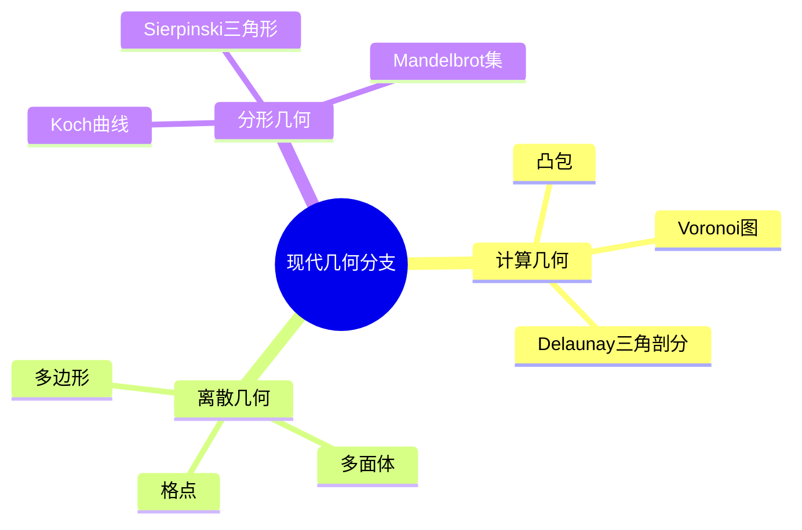

# 10. 计算几何、离散几何与分形几何（Computational, Discrete, and Fractal Geometry）

> **已完成深度优化与批判性提升**  
> 本文档已按统一标准补充批判性分析、未来展望、术语表、符号表、交叉引用等内容。

## 10.1 目录

- [10. 计算几何、离散几何与分形几何（Computational, Discrete, and Fractal Geometry）](#10-计算几何离散几何与分形几何computational-discrete-and-fractal-geometry)
  - [10.1 目录](#101-目录)
  - [10.2 计算几何](#102-计算几何)
  - [10.3 离散几何](#103-离散几何)
  - [10.4 分形几何](#104-分形几何)
  - [10.5 典型定理与算法](#105-典型定理与算法)
  - [10.6 可视化与多表征](#106-可视化与多表征)
    - [10.6.1 结构关系图（Mermaid）](#1061-结构关系图mermaid)
    - [10.6.2 典型对象示意](#1062-典型对象示意)
  - [10.7 批判性分析](#107-批判性分析)
  - [10.8 未来展望](#108-未来展望)
  - [10.9 术语表](#109-术语表)
  - [10.10 符号表](#1010-符号表)
  - [10.11 交叉引用](#1011-交叉引用)
  - [10.12 学习建议与资源](#1012-学习建议与资源)

---

## 10.2 计算几何

- 研究几何算法的设计与分析
- 典型问题：凸包、最近点对、Voronoi图、Delaunay三角剖分、线段相交
- 应用：计算机图形学、机器人学、地理信息系统

---

## 10.3 离散几何

- 研究有限或可数集合的几何性质
- 典型问题：点集覆盖、极值问题、组合结构、剖分、堆积
- 典型对象：多边形、多面体、格点、排列

---

## 10.4 分形几何

- 研究自相似、非整数维数的几何对象
- 典型对象：Koch曲线、Sierpinski三角形、Mandelbrot集
- 分形维数、迭代函数系统

---

## 10.5 典型定理与算法

- Jarvis步进法（凸包）、Graham扫描法
- Euler公式 $V - E + F = 2$（多面体）
- Hausdorff维数、分形维数公式

---

## 10.6 可视化与多表征

### 10.6.1 结构关系图（Mermaid）

### 10.6.2 典型对象示意

- 
- 
- 

---

## 10.7 批判性分析

- 计算几何、离散几何与分形几何极大拓展了几何理论的应用性与多样性，但高维、复杂结构的算法效率与可视化仍具挑战。
- 分形几何的非整数维数、迭代结构等理论虽具创新性，但与主流几何体系的融合尚需加强。
- 现代几何分支与AI、数据科学、物理等领域的结合日益紧密，但跨学科表达与应用体系尚需完善。

---

## 10.8 未来展望

- 推动现代几何分支与AI、数据科学、物理建模、材料科学等领域的深度融合。
- 丰富高维、复杂结构的可视化、交互式教学与仿真工具，提升直观理解。
- 探索分形几何、离散几何在复杂系统、生命科学、工程等领域的创新应用。
- 推动现代几何理论在算法优化、动力系统、量子信息等前沿方向的推广与创新。

---

## 10.9 术语表

- **计算几何（Computational Geometry）**：研究几何算法的分支。
- **离散几何（Discrete Geometry）**：研究有限或可数集合的几何性质。
- **分形几何（Fractal Geometry）**：研究自相似、非整数维数对象的分支。
- **凸包（Convex Hull）**：包含所有点的最小凸多边形。
- **Voronoi图（Voronoi Diagram）**：空间划分结构。
- **分形维数（Fractal Dimension）**：刻画分形复杂度的维数。

---

## 10.10 符号表

- $P$：点集
- $CH(P)$：点集$P$的凸包
- $V$：Voronoi图
- $D$：Delaunay三角剖分
- $F$：分形对象
- $d_H$：Hausdorff维数
- $V, E, F$：多面体的顶点、棱、面数

---

## 10.11 交叉引用

- [Matter/批判分析框架.md]
- [Matter/FormalLanguage/形式语言的多维批判性分析：从基础理论到应用实践.md]
- [Analysis/Mathematics/Geometry/01-Overview.md]
- [Analysis/Mathematics/Algebra/07-CategoryTheory.md]
- [Analysis/Mathematics/Calculus/10-AdvancedTopics.md]

---

## 10.12 学习建议与资源

- 推荐教材：《Computational Geometry: Algorithms and Applications》（de Berg et al.）、《Lectures on Discrete Geometry》（Jiri Matousek）、《The Fractal Geometry of Nature》（Benoit Mandelbrot）
- 交互式工具：GeoGebra、Fractint、分形生成器
- 进阶阅读：高维几何算法、组合几何、分形与混沌理论

[返回目录](#101-目录)
