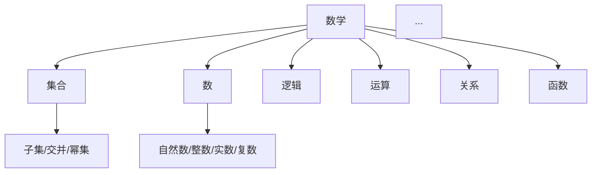

# 1. Mathematics 数学主题总览

> 本文档为 /Matter/Mathematics 及其子目录内容的规范化归纳与导航，包含分层次编号、主题目录、本地跳转，后续所有数学内容均以此为主入口。

## 1.1 数学核心概念与结构

- [1.1.1 数学核心概念梳理](#111-数学核心概念梳理)
- [1.1.2 数学内容与Wiki权威对比](#112-数学内容与wiki权威对比)
- [1.1.3 数学思维导图](#113-数学思维导图)
- [1.1.4 数学内容全面分析报告](#114-数学内容全面分析报告)

## 1.2 数学分支与专题

- [1.2.1 几何 Geometry](#121-几何-geometry)
- [1.2.2 微积分 Calculus](#122-微积分-calculus)
- [1.2.3 代数 Algebra](#123-代数-algebra)
- [1.2.4 元数学 MetaMath](#124-元数学-metamath)

## 1.3 多视角与模型

- [1.3.1 多视角分析](#131-多视角分析)
- [1.3.2 AI与数学的交叉视角](#132-ai与数学的交叉视角)
- [1.3.3 结构化模型与思维导图](#133-结构化模型与思维导图)

## 1.4 数学逻辑与联系

- [1.4.1 数学逻辑与证明](#141-数学逻辑与证明)
- [1.4.2 概念联系与综合](#142-概念联系与综合)
- [1.4.3 分支与联系分析](#143-分支与联系分析)

---

## 1.1.1 数学核心概念梳理

数学的核心概念是现代数学体系的基石，涵盖集合、数、逻辑、运算、关系、函数等。以下为主要内容梳理：

### 集合 (Set)

- **定义**：集合是由若干确定且互异的对象组成的整体，这些对象称为元素。
- **基本性质**：包含关系、子集、交并补、幂集、笛卡尔积等。
- **LaTeX 表达**：
  \[
  A = \{x \mid P(x)\}
  \]
- **相关性**：集合论是现代数学的基础，支撑数、函数、结构等概念。

### 数 (Number)

- **定义**：数是计量、排序和度量的基本对象，包括自然数 \(\mathbb{N}\)、整数 \(\mathbb{Z}\)、有理数 \(\mathbb{Q}\)、实数 \(\mathbb{R}\)、复数 \(\mathbb{C}\) 等。
- **结构层次**：数系的扩展与完备性。
- **Peano 公理**（自然数的公理化）：
  \[
  \begin{align*}
  & 0 \in \mathbb{N} \\
  & \forall n \in \mathbb{N},\ S(n) \in \mathbb{N} \\
  & \ldots
  \end{align*}
  \]

### 逻辑 (Logic)

- **定义**：逻辑是研究推理规则和证明方法的学科，包括命题逻辑、谓词逻辑等。
- **推理规则**：如 Modus Ponens、归纳法等。
- **LaTeX 表达**：
  \[
  (P \rightarrow Q) \wedge P \implies Q
  \]

### 运算 (Operation)

- **定义**：运算是将若干对象按一定规则组合成新对象的过程，如加法、乘法等。
- **结构**：交换律、结合律、分配律、单位元、逆元等。

### 关系 (Relation)

- **定义**：关系是集合间元素的对应，如等价关系、序关系等。
- **性质**：自反性、对称性、传递性等。

### 函数 (Function)

- **定义**：函数是集合间元素的确定对应，常记为 \( f: A \to B \)。
- **性质**：单射、满射、双射、复合、逆等。

---

> 以上为数学核心概念的精炼梳理，后续将对每一小节逐步展开详细内容、LaTeX 公式、行业前沿补充，并完善本地跳转与相关性链接。

## 1.1.2 数学内容与Wiki权威对比

数学知识体系的权威性与开放性并存。对比主流 Wiki（如 Wikipedia、MathWorld、百度百科等）与本地内容，有助于：

- 明确各核心概念的国际通用定义、主流分类与表达方式；
- 发现不同权威来源在细节、结构、深度上的异同，促进内容完善与规范化；
- 结合行业前沿与最新理论，补充 Wiki 体系中尚未覆盖的创新观点或交叉领域内容。

### 对比方法

- 以本地归纳的核心概念为主线，逐一查阅 Wiki 等权威条目，梳理其定义、结构、典型例子、应用场景；
- 对比条目间的分类体系、层次结构、符号规范、证明方法等；
- 归纳差异与互补之处，形成结构化对照表或归纳总结。

### 主要发现与建议

- **定义与分类**：Wiki 通常采用国际标准定义，分类体系清晰，适合作为本地内容的基础框架。
- **表达与符号**：Wiki 强调 LaTeX 规范、图表、示例，建议本地内容全面采用。
- **深度与广度**：Wiki 内容广泛但部分主题深度有限，本地可补充行业前沿、AI 交叉等新兴内容。
- **本地创新**：结合最新 AI 理论、行业突破，补充 Wiki 未覆盖的多层级、跨学科内容。

### 结构化对照示例

| 概念      | Wiki 定义/分类 | 本地补充/创新 |
|-----------|----------------|--------------|
| 集合      | ZFC 公理体系、符号、Venn 图 | 结合 AI 数据结构、知识图谱等应用 |
| 数        | 数系扩展、Peano 公理 | 数学与计算机数值系统的结合 |
| 逻辑      | 命题/谓词逻辑、推理规则 | 形式化证明、AI 自动推理 |
| ...       | ...            | ...          |

---

> 本节内容将持续更新，结合 Wiki 权威与本地创新，推动内容规范化、国际化与前沿化。

## 1.1.3 数学思维导图

数学思维导图是梳理和展现数学知识体系结构、核心概念及其关系的有效工具。其作用包括：

- 直观呈现各主题、分支、概念之间的层次与联系，便于全局把握与深入理解；
- 支持多视角、多层级的知识导航，促进跨领域、跨分支的综合分析；
- 便于归纳总结、查漏补缺、发现知识盲点。

### 常见类型

- **树状结构导图**：以主题为根节点，分层展开各分支、子概念。
- **网络关系图**：强调概念间的多对多关联，如知识图谱、关系网络。
- **流程/推理图**：展示定理、证明、推理链路等逻辑流程。
- **多模态导图**：结合图、表、LaTeX 公式、代码片段等多种表征方式。

### 结构化表达建议

- 推荐使用 Markdown 目录、Mermaid、Graphviz、LaTeX TikZ 等工具绘制结构化导图；
- 结合本地跳转、编号、分层目录，支持内容的递归导航与引用；
- 重要分支建议配套可视化图表，便于跨主题联动。

### 示例（Mermaid 语法）

---

> 后续将为各分支、专题补充详细思维导图与可视化结构，支持多表征、多层级的知识导航。

## 1.1.4 数学内容全面分析报告

数学内容全面分析报告旨在系统梳理、归纳和总结数学各分支、核心概念、结构及其相互关系，形成分层次、递进式的知识体系。其主要内容和方法包括：

- **全局视角**：以数学整体为对象，覆盖基础理论、主要分支、交叉领域、应用前沿等；
- **分层次归纳**：从基础概念、核心定理到高级理论，逐层递进，突出知识的系统性与层次性；
- **结构化表达**：采用编号、目录、表格、图示、LaTeX 公式等多种方式，提升内容的条理性与可读性；
- **行业前沿补充**：结合最新 AI 理论、行业突破、跨学科应用等，补充传统体系未覆盖的新内容；
- **批判性分析**：不仅总结已有知识，还关注理论的局限、发展趋势与未来展望。

### 报告结构建议

1. **引言与全局框架**：说明分析目标、方法与整体结构。
2. **基础层**：集合、数、逻辑、函数等基础概念与结构。
3. **分支层**：代数、几何、分析、离散数学、概率统计等主要分支的系统梳理。
4. **交叉与应用层**：AI 数学基础、计算数学、工程应用、数据科学等交叉领域。
5. **前沿与展望**：行业最新理论、未来发展趋势、未解难题等。
6. **多表征与可视化**：配套思维导图、结构图、LaTeX 公式、代码片段等多模态表达。

---

> 本节将持续补充各分支、专题的详细分析报告，支持分层次、递归式的内容导航与知识整合。

## 1.2.1 几何 Geometry

几何是研究空间结构、形状、位置及其性质的数学分支。它既是最古老的数学领域之一，也是现代数学与科学技术的重要基础。

- **核心内容**：
  - 欧几里得几何（平面与立体几何）
  - 非欧几里得几何（球面、双曲、黎曼等）
  - 解析几何（坐标系、方程与图形的对应）
  - 微分几何（流形、曲率、测地线等）
  - 拓扑学（连续变形、连通性、同伦等）
  - 代数几何（多项式方程与几何对象的关系）

- **结构化主题建议**：
  1. 基础概念：点、线、面、体、角、距离、度量等
  2. 主要分支：欧氏、非欧、解析、微分、拓扑、代数几何等
  3. 典型定理：勾股定理、欧拉公式、高斯-博内定理等
  4. 可视化与模型：几何作图、三维建模、图形软件

- **行业前沿与应用**：
  - 计算机图形学、机器人路径规划、物理空间建模、AI 视觉等领域广泛应用几何理论
  - 现代几何与拓扑在数据分析、量子计算、材料科学等新兴领域有重要作用

- **多表征建议**：
  - 结合 LaTeX 公式、结构图、三维模型、交互式可视化等多种方式表达几何结构
  - 推荐使用 GeoGebra、Mermaid、TikZ 等工具辅助展示

---

> 后续将补充各分支详细内容、典型定理证明、行业案例与可视化示例。

## 1.2.2 微积分 Calculus

微积分是研究连续变化、极限、导数、积分及其应用的数学分支。它是现代科学、工程、经济学等众多领域的基础工具。

- **核心内容**：
  - 极限理论（数列极限、函数极限、连续性）
  - 微分学（导数、微分、泰勒展开、极值问题）
  - 积分学（定积分、不定积分、多重积分、曲线积分、曲面积分）
  - 级数理论（数项级数、幂级数、傅里叶级数）
  - 微分方程（常微分方程、偏微分方程、边值问题）

- **结构化主题建议**：
  1. 基础概念：极限、连续、导数、积分、级数等
  2. 主要分支：单变量、多变量、向量微积分等
  3. 典型定理：中值定理、微积分基本定理、泰勒定理等
  4. 应用领域：物理建模、优化问题、信号处理、机器学习等

- **行业前沿与应用**：
  - 机器学习中的梯度下降、反向传播、优化算法等核心方法基于微积分
  - 深度学习中的自动微分、神经网络训练等大量使用微积分工具
  - 科学计算、数值分析、金融建模等领域广泛应用微积分理论

- **多表征建议**：
  - 结合 LaTeX 公式、函数图像、数值计算、动画演示等多种方式
  - 推荐使用 Python（SymPy、NumPy）、Mathematica、GeoGebra 等工具辅助计算与可视化

---

> 后续将补充各分支详细内容、典型定理证明、数值方法、行业案例与可视化示例。

## 1.2.3 代数 Algebra

代数是研究代数结构、运算规律及其性质的数学分支。它从解方程发展而来，现已成为现代数学的核心基础之一。

- **核心内容**：
  - 线性代数（向量空间、线性变换、矩阵理论、特征值理论）
  - 抽象代数（群、环、域、模、格等代数结构）
  - 多项式代数（多项式理论、代数方程、伽罗瓦理论）
  - 表示论（群表示、李代数表示、范畴论）
  - 同调代数（链复形、上同调、导出函子）

- **结构化主题建议**：
  1. 基础概念：运算、代数结构、同态、同构等
  2. 主要分支：线性代数、抽象代数、多项式代数等
  3. 典型定理：线性代数基本定理、伽罗瓦理论、诺特定理等
  4. 应用领域：密码学、编码理论、量子计算、AI 算法等

- **行业前沿与应用**：
  - 密码学中的椭圆曲线、格密码、后量子密码等大量使用代数理论
  - 机器学习中的矩阵分解、张量运算、图神经网络等基于代数结构
  - 量子计算中的量子门、量子算法等与李代数、表示论密切相关
  - 编码理论、信号处理、计算机图形学等领域广泛应用代数方法

- **多表征建议**：
  - 结合 LaTeX 公式、矩阵表示、结构图、计算示例等多种方式
  - 推荐使用 Python（NumPy、SymPy）、SageMath、GAP 等工具辅助计算与验证

---

> 后续将补充各分支详细内容、典型定理证明、算法实现、行业案例与可视化示例。

## 1.2.4 元数学 MetaMath

元数学是研究数学理论本身的形式属性、结构性质和逻辑基础的数学分支。它站在更高的层次审视数学活动，为数学的严谨性和可靠性提供理论基础。

- **核心内容**：
  - 集合论（ZFC公理系统、基数、序数、选择公理）
  - 数理逻辑（命题逻辑、谓词逻辑、模型论、证明论）
  - 范畴论（范畴、函子、自然变换、极限、伴随）
  - 类型论（简单类型论、依赖类型论、同伦类型论HoTT）
  - 可计算性理论（递归函数、图灵机、丘奇-图灵论题）
  - 证明论（形式证明、一致性、完备性、可判定性）

- **结构化主题建议**：
  1. 基础概念：公理、形式系统、模型、可计算性等
  2. 主要分支：集合论、逻辑、范畴论、类型论等
  3. 典型定理：哥德尔不完备定理、康托对角线法、丘奇-图灵论题等
  4. 应用领域：形式化验证、程序语言理论、AI 推理等

- **行业前沿与应用**：
  - 形式化验证中的证明助理（Coq、Lean、Isabelle）基于类型论和证明论
  - 程序语言理论中的类型系统、语义学等大量使用范畴论和类型论
  - AI 推理中的逻辑编程、知识表示、自动定理证明等基于数理逻辑
  - 数据库理论、编译器设计、软件工程等领域广泛应用元数学理论

- **多表征建议**：
  - 结合 LaTeX 公式、形式化证明、结构图、代码示例等多种方式
  - 推荐使用 Coq、Lean、Isabelle、Agda 等证明助理工具辅助形式化验证

---

> 后续将补充各分支详细内容、典型定理证明、形式化验证、行业案例与可视化示例。

## 1.3.1 多视角分析

多视角分析是从不同角度、层次、维度审视数学概念、理论和应用的方法。它有助于全面理解数学的本质，发现不同分支间的联系，促进创新思维和跨领域应用。

- **核心意义**：
  - 避免单一视角的局限性，获得更全面、深入的理解
  - 发现不同数学分支间的内在联系和统一性
  - 促进跨学科思维，推动数学在新技术领域的应用
  - 培养批判性思维，提高数学素养和创新能力

- **主要视角类型**：
  - **历史视角**：数学概念的发展历程、重要人物、关键突破
  - **哲学视角**：数学的本质、真理观、认识论基础
  - **应用视角**：在科学、工程、技术、社会等领域的实际应用
  - **计算视角**：算法实现、数值方法、计算复杂性
  - **可视化视角**：几何直观、图形表示、动态演示
  - **形式化视角**：公理化、逻辑推理、证明方法

- **结构化方法建议**：
  1. 确定分析对象：概念、定理、理论、应用等
  2. 选择相关视角：根据对象特点选择合适的视角组合
  3. 系统分析：从各视角深入分析，记录发现和洞见
  4. 综合归纳：整合各视角的发现，形成全面认识
  5. 创新应用：基于多视角分析，提出新的应用或研究方向

- **行业前沿与应用**：
  - AI 领域中的多模态学习、知识图谱、跨领域迁移等基于多视角思维
  - 数据科学中的多维度分析、特征工程、模型解释等需要多视角方法
  - 复杂系统研究中的多尺度分析、涌现现象、自组织等体现多视角思想

- **多表征建议**：
  - 结合文字描述、图表、公式、代码、动画等多种表征方式
  - 推荐使用思维导图、概念图、知识图谱等工具组织多视角内容
  - 采用对比表格、矩阵分析等方法突出不同视角的异同

---

> 后续将补充各视角的详细分析、典型案例、行业应用与可视化示例。

## 1.3.2 AI与数学的交叉视角

AI与数学的交叉是现代科技发展的重要趋势，两者相互促进、深度融合，推动着理论创新和技术突破。数学为AI提供理论基础和工具方法，AI为数学带来新的研究方向和计算能力。

- **核心意义**：
  - 数学为AI提供严谨的理论基础和算法设计方法
  - AI为数学研究提供强大的计算工具和新的研究范式
  - 交叉融合推动两个领域的共同发展和创新突破
  - 培养跨学科人才，适应未来科技发展需求

- **主要交叉领域**：
  - **机器学习数学基础**：概率论、统计学、优化理论、线性代数
  - **深度学习理论**：神经网络数学、梯度下降、反向传播、正则化
  - **计算机视觉数学**：几何学、拓扑学、图像处理、计算机图形学
  - **自然语言处理数学**：形式语言理论、图论、信息论、语义学
  - **强化学习数学**：动态规划、马尔可夫决策过程、博弈论
  - **AI推理与逻辑**：数理逻辑、自动定理证明、知识表示

- **结构化内容建议**：
  1. 理论基础：概率统计、优化理论、线性代数、微积分等
  2. 算法设计：机器学习算法、深度学习架构、优化方法等
  3. 应用领域：计算机视觉、NLP、推荐系统、自动驾驶等
  4. 前沿发展：大模型理论、多模态AI、可解释AI、AI安全等

- **行业前沿与应用**：
  - 大语言模型中的注意力机制、Transformer架构等基于数学理论
  - 计算机视觉中的卷积神经网络、几何深度学习等结合几何学
  - 推荐系统中的矩阵分解、图神经网络等应用代数理论
  - 自动驾驶中的SLAM算法、路径规划等使用几何和优化理论
  - 金融科技中的风险管理、量化交易等基于概率统计和优化

- **多表征建议**：
  - 结合数学公式、算法伪代码、Python代码、可视化图表等多种方式
  - 推荐使用Jupyter Notebook、TensorFlow/PyTorch、可视化工具等
  - 采用对比分析、案例研究、实验验证等方法展示交叉应用

---

> 后续将补充各交叉领域的详细理论、算法实现、行业案例与实验验证。

## 1.3.3 结构化模型与思维导图

结构化模型与思维导图是组织和表达复杂数学知识体系的有效工具。它们通过层次化、网络化、可视化的方式，将抽象的数学概念转化为直观、可理解的结构，促进知识的系统化学习和创新应用。

- **核心意义**：
  - 将复杂的数学知识体系转化为清晰、有序的结构
  - 揭示概念间的层次关系和内在联系
  - 支持多维度、多层级的知识导航和探索
  - 促进跨领域知识的整合和创新思维

- **主要类型**：
  - **层次结构模型**：树状结构、金字塔结构、分类体系等
  - **网络关系模型**：知识图谱、概念网络、关系图等
  - **流程模型**：推理链、算法流程、证明过程等
  - **矩阵模型**：对比矩阵、特征矩阵、关联矩阵等
  - **多维模型**：雷达图、散点图、热力图等多维可视化

- **设计方法建议**：
  1. 确定建模目标：知识组织、关系分析、流程梳理等
  2. 选择模型类型：根据内容特点选择合适的结构化方式
  3. 构建基础框架：建立主要节点、层次、关系等基础结构
  4. 细化内容填充：逐步完善各节点的详细内容和子结构
  5. 优化与迭代：根据使用反馈不断优化模型结构

- **行业前沿与应用**：
  - 知识图谱技术中的实体关系建模、语义网络构建等
  - 教育科技中的自适应学习、个性化推荐等基于结构化模型
  - 科研管理中的文献分析、研究热点发现等使用网络模型
  - 商业智能中的决策树、关联规则挖掘等应用结构化方法

- **多表征建议**：
  - 结合文字描述、图形符号、颜色编码、动画效果等多种表征方式
  - 推荐使用Mermaid、Draw.io、XMind、Obsidian等工具
  - 采用交互式设计，支持动态展开、筛选、搜索等功能
  - 结合LaTeX公式、代码片段、数据可视化等增强表达效果

---

> 后续将补充各类模型的详细设计方法、工具使用、行业案例与最佳实践。

## 1.4.1 数学逻辑与证明

数学逻辑是研究数学推理规则、证明方法和形式系统的学科。它为数学的严谨性提供理论基础，确保数学结论的可靠性和有效性，是现代数学和计算机科学的重要基础。

- **核心内容**：
  - **命题逻辑**：命题、逻辑联结词、真值表、推理规则
  - **谓词逻辑**：量词、谓词、个体变元、形式化语言
  - **证明论**：形式证明、公理系统、一致性、完备性
  - **模型论**：模型、解释、满足关系、紧致性定理
  - **递归论**：可计算性、图灵机、丘奇-图灵论题
  - **集合论**：ZFC公理系统、基数、序数、选择公理

- **主要证明方法**：
  - **直接证明**：从已知条件直接推导结论
  - **反证法**：假设结论不成立，推导矛盾
  - **数学归纳法**：证明关于自然数的命题
  - **构造性证明**：给出具体构造方法
  - **存在性证明**：证明对象存在但不给出构造

- **结构化主题建议**：
  1. 基础概念：命题、谓词、量词、推理规则等
  2. 形式系统：公理、定理、证明、模型等
  3. 重要定理：哥德尔不完备定理、康托对角线法等
  4. 应用领域：自动定理证明、程序验证、AI推理等

- **行业前沿与应用**：
  - **形式化验证**：Coq、Lean、Isabelle等证明助理工具
  - **程序语言理论**：类型系统、语义学、程序逻辑
  - **AI推理**：逻辑编程、知识表示、自动定理证明
  - **数据库理论**：查询语言、约束、完整性
  - **编译器设计**：类型检查、优化、程序分析

- **多表征建议**：
  - 结合LaTeX公式、形式化证明、真值表、推理树等多种方式
  - 推荐使用证明助理工具、逻辑可视化软件等
  - 采用对比分析、案例研究、实验验证等方法

---

> 后续将补充各分支详细内容、典型定理证明、形式化验证、行业案例与可视化示例。

## 1.4.2 概念联系与综合

概念联系与综合是理解数学知识体系整体性和内在统一性的关键。通过分析不同数学概念间的关联关系，可以发现数学的深层结构和统一模式，促进知识的整合和创新应用。

- **核心意义**：
  - 揭示数学概念间的内在联系和统一性
  - 促进跨分支、跨领域的知识整合
  - 发现新的研究方向和理论突破点
  - 提高数学素养和创新能力

- **主要联系类型**：
  - **层次联系**：抽象与具体、一般与特殊、基础与高级
  - **结构联系**：同构、同态、等价、包含等结构关系
  - **应用联系**：在不同领域中的共同应用和相互支撑
  - **历史联系**：概念发展的历史脉络和相互影响
  - **方法联系**：共同的研究方法和证明技巧

- **综合方法建议**：
  1. **对比分析**：比较不同概念的异同点
  2. **类比推理**：发现概念间的相似模式
  3. **归纳总结**：从具体实例中抽象出一般规律
  4. **演绎推理**：从一般原理推导出具体结论
  5. **系统整合**：构建统一的理论框架

- **典型概念联系**：
  - **集合与函数**：函数是集合间的特殊关系
  - **代数与几何**：代数方程与几何图形的对应
  - **分析与发展**：极限、连续、可微等概念的层次关系
  - **逻辑与计算**：形式逻辑与可计算性的内在联系
  - **概率与统计**：随机性与规律性的辩证统一

- **行业前沿与应用**：
  - **知识图谱**：构建数学概念间的语义网络
  - **推荐系统**：基于概念相似性的内容推荐
  - **教育科技**：个性化学习路径设计
  - **科研管理**：跨领域研究热点发现
  - **AI推理**：基于概念关系的智能推理

- **多表征建议**：
  - 结合概念图、关系图、层次图、网络图等多种可视化方式
  - 使用对比表格、矩阵分析、流程图等结构化表达
  - 推荐使用思维导图、知识图谱、语义网络等工具
  - 结合LaTeX公式、代码示例、案例分析等增强表达效果

---

> 后续将补充各类概念联系的详细分析、典型案例、应用场景与可视化展示。

## 1.4.3 分支与联系分析

数学分支与联系分析旨在揭示数学各主要分支间的内在关联和统一性。虽然数学分支众多且各有特色，但它们之间存在着深刻的联系，共同构成了数学的有机整体。

- **核心意义**：
  - 揭示数学分支间的深层联系和统一模式
  - 促进跨分支的交叉融合和创新突破
  - 为数学教育和研究提供整体性视角
  - 推动数学在新兴领域的综合应用

- **主要分支关系**：
  - **基础支撑关系**：集合论、逻辑学为其他分支提供基础
  - **交叉融合关系**：代数几何、微分拓扑等交叉领域
  - **方法迁移关系**：不同分支间的思想方法和技巧迁移
  - **应用协同关系**：在解决实际问题中的协同作用
  - **历史发展关系**：分支发展的历史脉络和相互影响

- **分析方法建议**：
  1. **结构分析**：分析各分支的核心概念和理论结构
  2. **方法对比**：比较不同分支的研究方法和证明技巧
  3. **应用整合**：考察分支在具体应用中的协同作用
  4. **历史梳理**：梳理分支发展的历史脉络和相互影响
  5. **前沿探索**：探索分支交叉的新兴领域和发展方向

- **典型分支联系**：
  - **代数与几何**：代数几何、李群李代数、表示论等
  - **分析与拓扑**：微分拓扑、代数拓扑、同调论等
  - **代数与分析**：代数数论、解析数论、调和分析等
  - **几何与分析**：微分几何、复几何、几何分析等
  - **逻辑与计算**：可计算性理论、程序语义、类型论等

- **行业前沿与应用**：
  - **AI与机器学习**：线性代数、概率统计、优化理论等分支的综合应用
  - **密码学与安全**：数论、代数、概率论等分支的协同作用
  - **计算机图形学**：几何学、线性代数、数值分析等分支的整合
  - **量子计算**：线性代数、群论、表示论等分支的交叉应用
  - **数据科学**：统计学、线性代数、优化理论等分支的综合运用

- **多表征建议**：
  - 使用分支关系图、交叉领域图、应用网络图等可视化方式
  - 采用对比矩阵、关联分析、层次结构等结构化表达
  - 推荐使用知识图谱、概念地图、思维导图等工具
  - 结合案例分析、历史梳理、前沿展望等多种表达方式

---

> 后续将补充各分支联系的详细分析、交叉领域研究、应用案例与可视化展示。

## 数学分支（Mathematics Branch）

## 分支结构

- [Algebra/README.md](./Algebra/README.md) 代数分支
- [Geometry/README.md](./Geometry/README.md) 几何分支
- [Calculus/README.md](./Calculus/README.md) 微积分分支
- views/ 分析分支（在建）

## 进度说明

- 代数分支：已完成主要结构与内容
- 几何分支：已完成主要结构与内容
- 微积分分支：已完成主要结构与内容
- 分析分支：待系统整理

## 交叉引用与联系

- 代数、几何、微积分、分析等分支内容高度交叉，建议结合阅读
- 相关内容与[AI理论](../../AI/Analysis/00-backup/04-AITheory/README.md)、[物理建模](../../Matter/AI/)等有机结合

## 学习建议

- 建议先通读各分支概览与核心概念，再深入专题
- 善用本地跳转、目录与交叉引用，系统梳理知识体系

---

[返回上级目录](../README.md)
