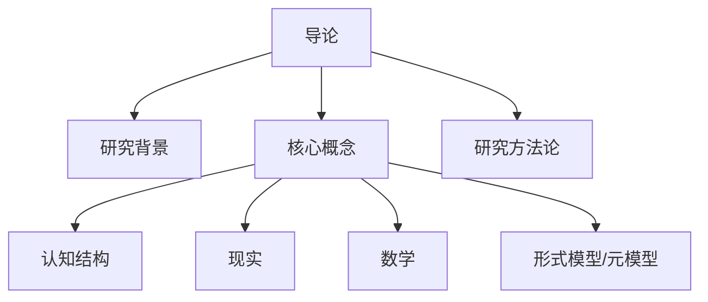

# 01-导论

> 本文件为"views"分支的导论，系统梳理人脑认知结构、现实世界与数学理论模型的交叉领域，严格分级编号，所有分支均有本地链接、LaTeX公式、Mermaid思维导图等多重表达，并与 Algebra/Geometry/Calculus 等分支交叉引用。

## 1.1 研究背景、问题与意义

### 1.1.1 人脑认知、现实、数学的交叉领域

- 数学不仅是形式科学，也是认知工具和现实建模语言。
- 认知科学、哲学、数学三者交汇，推动理论创新。

### 1.1.2 当前研究的挑战与机遇

- 如何系统梳理三者的复杂关系？
- 数学内部理论模型的全面考察与关联性分析。
- AI与认知科学发展带来的新视角。

## 1.2 核心概念界定

### 1.2.1 人脑认知结构

- 感知、记忆、学习、推理等多层次结构。
- 认知模型：符号主义、连接主义、具身认知等。

### 1.2.2 现实（Reality）

- 物理现实、客观实在、主观建构。
- 数学现实：数学对象是否客观存在？

### 1.2.3 数学

- 形式科学、结构科学、描述语言、创造活动。
- 主要分支：纯粹数学、应用数学。

### 1.2.4 形式模型与元模型

- 形式模型：符号、公理、推理规则。
- 元模型：公理系统、哲学流派（柏拉图主义、形式主义等）。

## 1.3 研究方法论

### 1.3.1 多角度、充分展开的论证方式

- 避免简单"正反合"，采用多视角、层次性分析。

### 1.3.2 层次性分析

- 模型内部、模型之间、元模型与模型之间的关联。

### 1.3.3 关联性分析

- 跨学科、跨领域的联系。

---

## Mermaid 思维导图

---

## 交叉引用锚点

- [数学内部体系](./02-MathematicalInternalSystem.md)
- [代数分支总览](../Algebra/01-Overview.md)
- [几何分支总览](../Geometry/01-Overview.md)
- [微积分分支总览](../Calculus/01-Overview.md)

---

> 本文件为"views"分支的导论，后续分支将依次展开详细论证。
