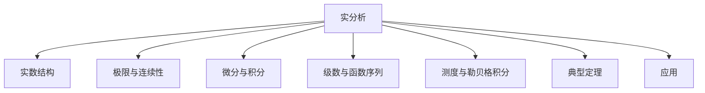

# 02. 实分析（Real Analysis）

## 02.1 目录

- [02. 实分析（Real Analysis）](#02-实分析real-analysis)
  - [02.1 目录](#021-目录)
  - [02.2 实数与序结构](#022-实数与序结构)
  - [02.3 极限与连续性](#023-极限与连续性)
  - [02.4 微分与积分](#024-微分与积分)
  - [02.5 级数与函数序列](#025-级数与函数序列)
  - [02.6 测度与勒贝格积分](#026-测度与勒贝格积分)
  - [02.7 典型定理与公式](#027-典型定理与公式)
  - [02.8 可视化与多表征](#028-可视化与多表征)
    - [02.8.1 结构关系图（Mermaid）](#0281-结构关系图mermaid)
    - [02.8.2 典型图示](#0282-典型图示)
  - [02.9 应用与建模](#029-应用与建模)
  - [02.10 学习建议与资源](#0210-学习建议与资源)

---

## 02.2 实数与序结构

- 实数的完备性、公理化定义（戴德金分割、柯西列）
- 有理数与无理数、稠密性
- 序、上确界、下确界

---

## 02.3 极限与连续性

- 数列极限、函数极限、收敛与发散
- $\forall-\varepsilon$ 语言、柯西收敛准则
- 连续函数、间断点、闭区间上连续函数性质

---

## 02.4 微分与积分

- 可微性、导数、微分中值定理
- 黎曼积分、可积性判据
- 微积分基本定理

---

## 02.5 级数与函数序列

- 数项级数、收敛判别法
- 幂级数、函数项级数、一致收敛
- 泰勒级数、傅里叶级数简介

---

## 02.6 测度与勒贝格积分

- 测度的定义、可测集
- 勒贝格积分与黎曼积分的比较
- $L^p$ 空间、豪斯多夫测度简介

---

## 02.7 典型定理与公式

- 实数完备性定理
- 介值定理、最大值定理、连续函数性质
- 博雷尔-坎托尔引理、巴拿赫不动点定理
- 黎曼-勒贝格定理、勒贝格收敛定理

---

## 02.8 可视化与多表征

### 02.8.1 结构关系图（Mermaid）

### 02.8.2 典型图示

- 
- 

---

## 02.9 应用与建模

- 数学建模、信号处理、概率论基础
- 物理中的连续介质、热传导、波动方程

---

## 02.10 学习建议与资源

- 推荐教材：《数学分析原理》（Rudin）、《实变函数与泛函分析》（袁新意）
- 交互式工具：WolframAlpha、Desmos、GeoGebra
- 进阶阅读：测度论、泛函分析、调和分析

---

[返回总览](./01-Overview.md)
