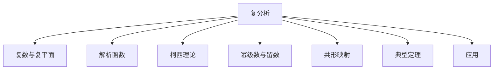

# 03. 复分析（Complex Analysis）

## 03.1 目录

- [03. 复分析（Complex Analysis）](#03-复分析complex-analysis)
  - [03.1 目录](#031-目录)
  - [03.2 复数与复平面](#032-复数与复平面)
  - [03.3 解析函数与柯西理论](#033-解析函数与柯西理论)
  - [03.4 幂级数与留数定理](#034-幂级数与留数定理)
  - [03.5 共形映射与应用](#035-共形映射与应用)
  - [03.6 典型定理与公式](#036-典型定理与公式)
  - [03.7 可视化与多表征](#037-可视化与多表征)
    - [03.7.1 结构关系图（Mermaid）](#0371-结构关系图mermaid)
    - [03.7.2 典型图示](#0372-典型图示)
  - [03.8 应用与建模](#038-应用与建模)
  - [03.9 学习建议与资源](#039-学习建议与资源)

---

## 03.2 复数与复平面

- 复数的代数与几何表示
- 复平面、模与幅角、极坐标表示
- 欧拉公式、单位圆

---

## 03.3 解析函数与柯西理论

- 解析函数定义、柯西-黎曼方程
- 复可微、全纯性
- 柯西积分定理、柯西积分公式

---

## 03.4 幂级数与留数定理

- 幂级数展开、收敛半径
- 留数定理、孤立奇点、极点
- 典型积分计算

---

## 03.5 共形映射与应用

- 共形映射定义、性质
- 典型映射（如指数、对数、分式变换）
- 物理与工程中的应用

---

## 03.6 典型定理与公式

- 柯西-黎曼方程
- 柯西积分定理与公式
- 留数定理、最大模原理
- 刘维尔定理、莫比乌斯变换

---

## 03.7 可视化与多表征

### 03.7.1 结构关系图（Mermaid）

### 03.7.2 典型图示

- 
- %20=%20\frac{1}{2\pi%20i}\int_{C}\frac{f(\xi)}{\xi-z}d\xi)

---

## 03.8 应用与建模

- 信号处理、流体力学、电磁学中的复分析
- 物理中的势函数、调和函数

---

## 03.9 学习建议与资源

- 推荐教材：《Complex Analysis》（Ahlfors）、《复变函数》（冯祖荀）
- 交互式工具：WolframAlpha、Desmos、GeoGebra
- 进阶阅读：黎曼曲面、多复变函数、调和分析

---

[返回总览](./01-Overview.md)
