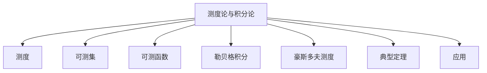

# 04. 测度论与积分论（Measure Theory and Integration）

## 04.1 目录

- [04. 测度论与积分论（Measure Theory and Integration）](#04-测度论与积分论measure-theory-and-integration)
  - [04.1 目录](#041-目录)
  - [04.2 测度的基本概念](#042-测度的基本概念)
  - [04.3 可测集与可测函数](#043-可测集与可测函数)
  - [04.4 勒贝格积分与性质](#044-勒贝格积分与性质)
  - [04.5 豪斯多夫测度与分形](#045-豪斯多夫测度与分形)
  - [04.6 典型定理与公式](#046-典型定理与公式)
  - [04.7 可视化与多表征](#047-可视化与多表征)
    - [04.7.1 结构关系图（Mermaid）](#0471-结构关系图mermaid)
    - [04.7.2 典型图示](#0472-典型图示)
  - [04.8 应用与建模](#048-应用与建模)
  - [04.9 学习建议与资源](#049-学习建议与资源)

---

## 04.2 测度的基本概念

- 测度的定义、公理化体系
- 外测度、测度空间、σ-代数
- 典型测度：勒贝格测度、概率测度

---

## 04.3 可测集与可测函数

- 可测集的定义与性质
- 可测函数、简单函数
- 可测性的判据

---

## 04.4 勒贝格积分与性质

- 勒贝格积分的定义、与黎曼积分的比较
- 单调收敛定理、主收敛定理
- $L^p$ 空间、积分不等式

---

## 04.5 豪斯多夫测度与分形

- 豪斯多夫测度的定义与应用
- 分形维数、典型分形集

---

## 04.6 典型定理与公式

- 勒贝格测度存在定理
- 埃格罗夫定理、卢津定理
- 单调收敛定理、主收敛定理
- 豪斯多夫维数公式

---

## 04.7 可视化与多表征

### 04.7.1 结构关系图（Mermaid）

### 04.7.2 典型图示

- 
- )

---

## 04.8 应用与建模

- 概率论基础、统计物理、分形几何
- 信号处理、图像分析中的测度方法

---

## 04.9 学习建议与资源

- 推荐教材：《Real and Complex Analysis》（Rudin）、《Measure Theory》（Halmos）
- 交互式工具：WolframAlpha、Desmos
- 进阶阅读：概率测度、分形测度、现代分析专题

---

[返回总览](./01-Overview.md)
