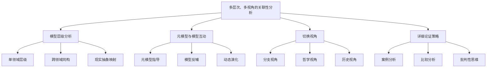

# 04-多层次、多视角的关联性分析与论证

> 本文件为"views"分支的多层次、多视角关联性分析详解，系统梳理模型层级、元模型互动、视角切换与详细论证策略，严格分级编号，所有分支均有本地链接、LaTeX公式、Mermaid思维导图等多重表达，并与 Algebra/Geometry/Calculus 等分支交叉引用。

## 4.1 模型的多层次结构分析

### 4.1.1 单一数学领域内模型的层级

- 例：欧氏几何从基本公理到复杂定理的层次

### 4.1.2 不同数学领域间模型的关联与同构

- 例：群论在几何、物理等领域的应用

### 4.1.3 现实问题模型的不同抽象层次及其数学对应

- 现实问题的多层抽象与数学映射

## 4.2 元模型与模型的互动关系

### 4.2.1 元模型对模型构建的指导、约束与评价

- 元模型为具体模型提供理论基础与评价标准

### 4.2.2 具体模型的实践对元模型理论的验证、修正与拓展

- 实践中的模型反作用于元模型理论

### 4.2.3 动态与演化

- 模型与元模型间的动态互动与演化

## 4.3 切换视角的必要性与实践

### 4.3.1 不同数学分支视角审视同一问题

- 代数、几何、分析等多视角互补

### 4.3.2 不同哲学立场理解数学地位

- 实在论、反实在论等哲学视角

### 4.3.3 历史发展视角

- 数学概念和理论的历史演变

## 4.4 详细展开与充分论证的策略

### 4.4.1 案例分析

- 选取具体数学理论/模型进行深入剖析

### 4.4.2 比较分析

- 不同模型、理论之间的异同与联系

### 4.4.3 批判性思维

- 审视现有理论的假设、边界与未解决问题

---

## Mermaid 思维导图

---

## 交叉引用锚点

- [导论](./01-Introduction.md)
- [数学的内部体系](./02-MathematicalInternalSystem.md)
- [数学、现实与认知结构的映射](./03-MappingInteraction.md)
- [数学内部理论模型的全面考察](./05-TheoreticalModels.md)
- [代数分支总览](../Algebra/01-Overview.md)
- [几何分支总览](../Geometry/01-Overview.md)
- [微积分分支总览](../Calculus/01-Overview.md)

---

> 本文件为"views"分支的多层次、多视角关联性分析详解，后续分支将依次展开详细论证。
