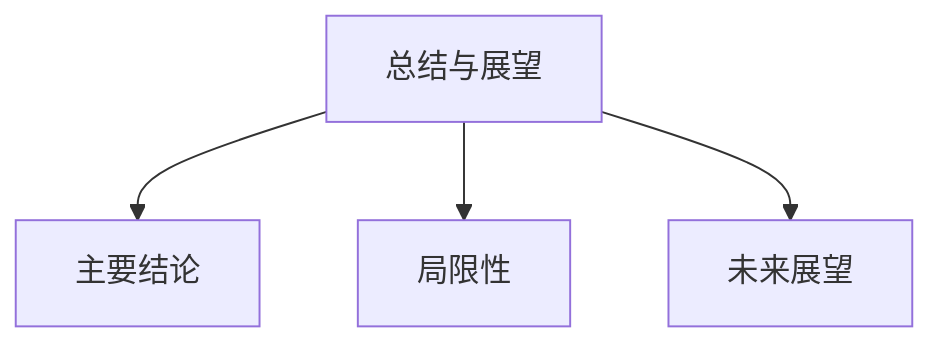

# 06-总结与展望

> 本文件为"views"分支的总结与展望，系统归纳前述各分支的主要结论、局限性与未来研究方向，严格分级编号，所有分支均有本地链接、LaTeX公式、Mermaid思维导图等多重表达，并与 Algebra/Geometry/Calculus 等分支交叉引用。

## 6.1 主要结论与洞见

- 数学、认知、现实三者间存在多层次、多视角的复杂互动。
- 数学内部理论模型的系统性、统一性与跨领域联系日益突出。
- 认知结构与现实问题不断推动数学理论创新。

## 6.2 研究的局限性

- 受限于篇幅与资料，部分理论模型未能详尽展开。
- 数学与认知、现实的深层机制仍有待进一步实证与理论突破。
- 交叉学科的系统性整合尚需持续推进。

## 6.3 未来研究方向与开放性问题

- 数学理论模型与AI认知机制的深度融合。
- 数学统一性与多样性的进一步理论探索。
- 数学、认知、现实三者间映射机制的实证研究。
- 新兴领域（如复杂系统、数据科学等）对传统数学理论的挑战与机遇。

---

## Mermaid 思维导图

---

## 交叉引用锚点

- [导论](./01-Introduction.md)
- [数学的内部体系](./02-MathematicalInternalSystem.md)
- [数学、现实与认知结构的映射](./03-MappingInteraction.md)
- [多层次、多视角的关联性分析](./04-MultilevelAnalysis.md)
- [数学内部理论模型的全面考察](./05-TheoreticalModels.md)
- [代数分支总览](../Algebra/01-Overview.md)
- [几何分支总览](../Geometry/01-Overview.md)
- [微积分分支总览](../Calculus/01-Overview.md)

---

> 本文件为"views"分支的总结与展望，至此本分支结构化整理阶段完成，后续可根据需要持续补充与深化。
