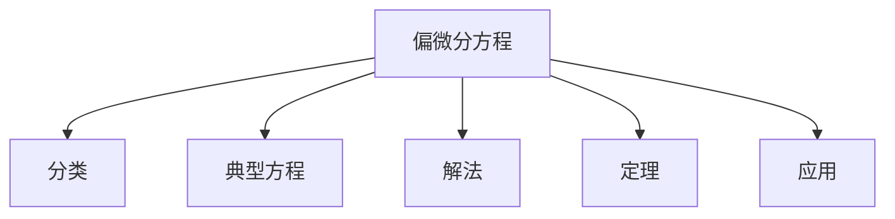

# 07. 偏微分方程（Partial Differential Equations, PDEs）

## 07.1 目录

- [07. 偏微分方程（Partial Differential Equations, PDEs）](#07-偏微分方程partial-differential-equations-pdes)
  - [07.1 目录](#071-目录)
  - [07.2 基本概念与分类](#072-基本概念与分类)
  - [07.3 典型方程与解法](#073-典型方程与解法)
  - [07.4 存在性、唯一性与正则性](#074-存在性唯一性与正则性)
  - [07.5 典型定理与公式](#075-典型定理与公式)
  - [07.6 可视化与多表征](#076-可视化与多表征)
    - [07.6.1 结构关系图（Mermaid）](#0761-结构关系图mermaid)
    - [07.6.2 典型图示](#0762-典型图示)
  - [07.7 应用与建模](#077-应用与建模)
  - [07.8 学习建议与资源](#078-学习建议与资源)

---

## 07.2 基本概念与分类

- 偏微分方程的定义、阶数、线性与非线性
- 初值问题、边值问题
- 典型分类：椭圆型、抛物型、双曲型

---

## 07.3 典型方程与解法

- 拉普拉斯方程、热方程、波动方程
- 分离变量法、傅里叶法、特征线法
- 基本解、格林函数

---

## 07.4 存在性、唯一性与正则性

- 解的存在性与唯一性定理
- 正则性、奇异性、弱解
- 能量估计与最大值原理

---

## 07.5 典型定理与公式

- 达朗贝尔公式、傅里叶级数解
- 最大值原理、能量不等式
- 索博列夫空间嵌入定理

---

## 07.6 可视化与多表征

### 07.6.1 结构关系图（Mermaid）

### 07.6.2 典型图示

- 
- 
- 

---

## 07.7 应用与建模

- 物理中的热传导、波动、电磁场
- 金融中的Black-Scholes方程
- 工程中的结构力学、流体力学

---

## 07.8 学习建议与资源

- 推荐教材：《Partial Differential Equations》（Evans）、《偏微分方程》（李承治）
- 交互式工具：WolframAlpha、Matlab、Python（SymPy, NumPy）
- 进阶阅读：非线性PDE、奇异性、数值方法

---

[返回总览](./01-Overview.md)
