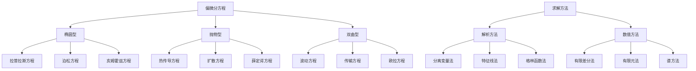

# 07. 偏微分方程（Partial Differential Equations, PDEs）

## 07.1 目录

- [07. 偏微分方程（Partial Differential Equations, PDEs）](#07-偏微分方程partial-differential-equations-pdes)
  - [07.1 目录](#071-目录)
  - [07.2 基本概念与分类](#072-基本概念与分类)
  - [07.3 典型方程与解法](#073-典型方程与解法)
  - [07.4 存在性、唯一性与正则性](#074-存在性唯一性与正则性)
  - [07.5 典型定理与公式](#075-典型定理与公式)
    - [07.5.1 基本定理](#0751-基本定理)
    - [07.5.2 重要公式](#0752-重要公式)
  - [07.6 可视化与多表征](#076-可视化与多表征)
    - [07.6.1 结构关系图（Mermaid）](#0761-结构关系图mermaid)
    - [07.6.2 典型图示](#0762-典型图示)
  - [07.7 应用与建模](#077-应用与建模)
    - [07.7.1 物理建模](#0771-物理建模)
    - [07.7.2 工程应用](#0772-工程应用)
    - [07.7.3 金融建模](#0773-金融建模)
  - [07.8 学习建议与资源](#078-学习建议与资源)
    - [07.8.1 学习路径](#0781-学习路径)
    - [07.8.2 推荐资源](#0782-推荐资源)
    - [07.8.3 实践项目](#0783-实践项目)

---

## 07.2 基本概念与分类

- 偏微分方程的定义、阶数、线性与非线性
- 初值问题、边值问题
- 典型分类：椭圆型、抛物型、双曲型

---

## 07.3 典型方程与解法

- 拉普拉斯方程、热方程、波动方程
- 分离变量法、傅里叶法、特征线法
- 基本解、格林函数

---

## 07.4 存在性、唯一性与正则性

- 解的存在性与唯一性定理
- 正则性、奇异性、弱解
- 能量估计与最大值原理

---

## 07.5 典型定理与公式

### 07.5.1 基本定理

**分离变量法**:

```latex
u(x,t) = X(x)T(t) \Rightarrow \frac{X''(x)}{X(x)} = \frac{T'(t)}{c^2T(t)} = -\lambda
```

**特征线法**:

```latex
\frac{dx}{dt} = a(x,t), \quad \frac{du}{dt} = f(x,t,u)
```

**格林函数法**:

```latex
u(x) = \int G(x,\xi)f(\xi)d\xi
```

### 07.5.2 重要公式

**热传导方程**:

```latex
\frac{\partial u}{\partial t} = \alpha \nabla^2 u
```

**波动方程**:

```latex
\frac{\partial^2 u}{\partial t^2} = c^2 \nabla^2 u
```

**拉普拉斯方程**:

```latex
\nabla^2 u = 0
```

---

## 07.6 可视化与多表征

### 07.6.1 结构关系图（Mermaid）



### 07.6.2 典型图示

**波动方程解的可视化**:

```haskell
-- 一维波动方程可视化
import Graphics.Gnuplot.Simple

waveEquation :: Double -> Double -> Double
waveEquation x t = sin (pi * x) * cos (pi * t)

plotWave :: IO ()
plotWave = plotList [] [(x, waveEquation x 0.5) | x <- [0, 0.1..1]]
```

**热传导方程数值解**:

```rust
// 有限差分法求解热传导方程
fn heat_equation_fd(n: usize, dt: f64, dx: f64, alpha: f64) -> Vec<Vec<f64>> {
    let mut u = vec![vec![0.0; n]; n];
    
    // 初始条件
    for i in 0..n {
        u[0][i] = (i as f64 * dx).sin();
    }
    
    // 时间迭代
    for t in 1..n {
        for i in 1..n-1 {
            u[t][i] = u[t-1][i] + alpha * dt / (dx * dx) * 
                     (u[t-1][i+1] - 2.0 * u[t-1][i] + u[t-1][i-1]);
        }
    }
    u
}
```

---

## 07.7 应用与建模

### 07.7.1 物理建模

**流体力学**:

- 纳维-斯托克斯方程
- 欧拉方程
- 边界层理论

**电磁学**:

- 麦克斯韦方程组
- 波动方程
- 亥姆霍兹方程

**量子力学**:

- 薛定谔方程
- 狄拉克方程
- 克莱因-戈登方程

### 07.7.2 工程应用

**结构分析**:

```scala
// 有限元法求解弹性力学问题
case class Element(nodes: List[Node], material: Material) {
  def stiffnessMatrix(): Matrix = {
    // 计算单元刚度矩阵
    val B = strainDisplacementMatrix()
    val D = material.elasticityMatrix()
    B.transpose * D * B * volume
  }
}
```

**传热分析**:

- 热传导
- 对流换热
- 辐射换热

### 07.7.3 金融建模

**期权定价**:

```python
# Black-Scholes偏微分方程
def black_scholes_pde(S, t, sigma, r):
    return (sigma**2/2) * S**2 * d2V_dS2 + r*S * dV_dS + dV_dt - r*V
```

---

## 07.8 学习建议与资源

### 07.8.1 学习路径

1. **基础阶段**
   - 常微分方程基础
   - 偏导数与多变量微积分
   - 线性代数基础

2. **进阶阶段**
   - 数学物理方法
   - 特殊函数
   - 变分法

3. **高级阶段**
   - 泛函分析
   - 分布理论
   - 现代偏微分方程理论

### 07.8.2 推荐资源

**经典教材**:

- 《Partial Differential Equations》- Lawrence C. Evans
- 《Applied Partial Differential Equations》- Richard Haberman
- 《Numerical Solution of Partial Differential Equations》- K.W. Morton

**在线资源**:

- MIT OpenCourseWare: 18.303 Linear Partial Differential Equations
- Coursera: Partial Differential Equations for Scientists and Engineers

**软件工具**:

- MATLAB PDE Toolbox
- COMSOL Multiphysics
- FEniCS (Python)

### 07.8.3 实践项目

1. **数值求解器开发**
   - 实现有限差分法
   - 实现有限元法
   - 可视化求解结果

2. **物理问题建模**
   - 热传导问题
   - 波动传播
   - 流体流动

3. **工程应用**
   - 结构分析
   - 电磁场计算
   - 传热分析

---

**相关链接**:

- [06. 常微分方程](./06-OrdinaryDifferentialEquations.md) - 常微分方程基础理论
- [08. 变分法](./08-CalculusOfVariations.md)
- [数学概览](../01-Overview.md)
